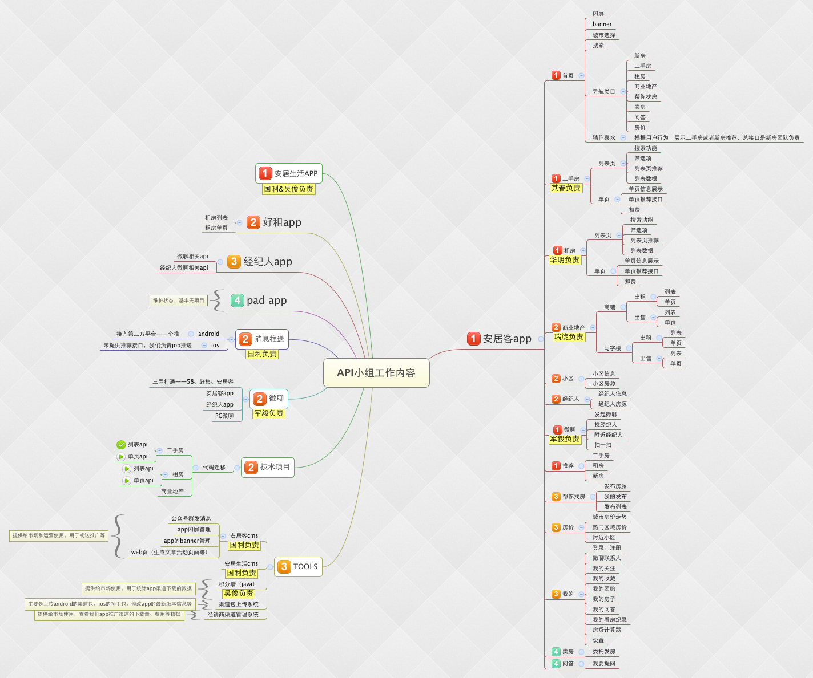

## 关于API开发

### 首先，来熟悉下我们小组负责的业务吧


### 开发前，你需要有一套web开发环境
* 需要开通权限的代码仓库（找@智哥 开通）

    > 整个mobile_api组的仓库，这里只要是原来api组自己的仓库
    
    ```
    http://gitlab.corp.anjuke.com/groups/_mobile-api
    ```
    > 整个site组的仓库，这里主要是原来pc组自己的仓库
    
    ```
    http://gitlab.corp.anjuke.com/groups/_site
    ```
    > 现在pc和api是一家啦～关于api各个代码仓库的说明如下：
    
    ```
    http://gitlab.corp.anjuke.com/_site/docs/blob/master/API/%E5%AE%89%E5%B1%85%E5%AE%A2/README.md
    ```
    
* 有了代码，你需要搭建一套web环境

    > 我们有一套现成的dev环境 @倪建强 搭建的
    
    ```
    http://gitlab.corp.anjuke.com/_site/docs/blob/master/Ops/user-dev.md
    ```

    > 或者 你可以自己搭建一套
    
    ```
    ubuntu/mac操作系统
    nginx
    mysql
    php
    ide
    git

    ……
    ```
* nginx或者外城配置可参考dev环境

### 在你熟悉了代码结构之后，可以有了开发任务
* 开发呢，主要是找对代码仓库，这就需要你对上面👆👆提到的仓库有充分的认识
* 其实呢，调试，也是开发的一个重要环节，那么来讲一下调试吧

    > 你要有一台调试机
    
    ```
    自己的手机
    或者
    找测试妹纸拿一台测试机
    ```

    > 抓包神奇charles
    
    ```
    下载地址：
    	http://www.charlesproxy.com/download/
    3.10以上都需要收费、破解，所以我装了一个3.9的，很稳定😁
    ```
    > 调试
    
    ```
    通过设置手机的代码到自己的电脑上
    并且自己的电脑上安卓了抓包神器
    我们可以轻松看到每一次的打开、点击等操作发送的请求
    拿到了接口地址，那么后面的开发、修改就可以轻松搞定了
    ```
    
### 项目开发流程，搞懂了可以轻松和大家一起合作
* 开发流程

    > 项目评审
    
    ```
    参加人员：产品、开发（测试）
    目的：讨论项目的可行性
    ```
    > 项目移交
    
    ```
    参加人员：产品、开发、测试（市场、BI等）
    目的：移交项目需求
    ```
    > 项目设计
    
    ```
    参加人员：开发
    目的：更加清晰的设计项目开发思路，分为概要设计和详细设计，做到什么程度，根据项目而定
    ```
    > 开发
    
    ```
    参加人员：开发
    目的：coding
    ```
    > 提测
    
    ```
    参加人员：开发
    目的：移交自己的开发结果给测试人员
    ```
    > 测试
    
    ```
    参加人员：测试（开发协助修复bug、完成上线前的todo list）
    ```
    > 上线
    
    ```
    参加人员：测试
    ```
* 项目开发过程中，你会遇到各种环境

    > dev环境
    
    ```
    开发用的环境，开发维护，在项目的分支上开发
    ```
    > pg环境
    
    ```
    测试用的环境，测试维护，在项目的分支上测试
    ```
    > cookie环境
    
    ```
    测试用的环境
    跟pg不同的是，cookie的环境同线上
    相同的是，仍然是在项目的分支上测试
    ```
    > beta环境
    
    ```
    内网的线上环境，项目分支已经被合并进了master，分支不可再用
    内网默认访问beta环境
    ```
    > ga环境
    
    ```
    外网的线上环境，内网需要访问ga的话，需要手动切换
    外网用户都是访问ga环境
    ```
    
### 常用的几个站点
* 项目管理PMT：http://p.corp.anjuke.com/
* 开发流程deploy：http://deploy.corp.anjuke.com/
* 项目跟踪ibug：http://ibug.corp.anjuke.com/home/index
* job平台：http://drone.corp.anjuke.com/login
* db查询dbo：http://drone.corp.anjuke.com/login
* 运维平台：http://ops.corp.anjuke.com/
* 业务监控：http://knowing.corp.anjuke.com/
* 速度监控：http://speed.qa.anjuke.com/login


未完待续……
