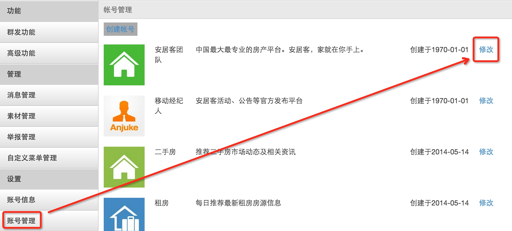
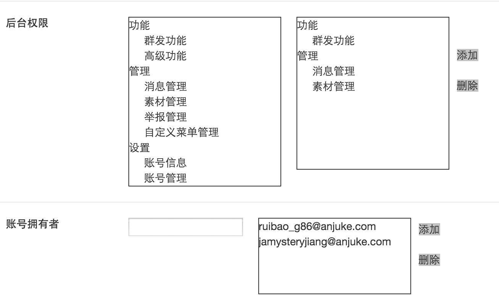
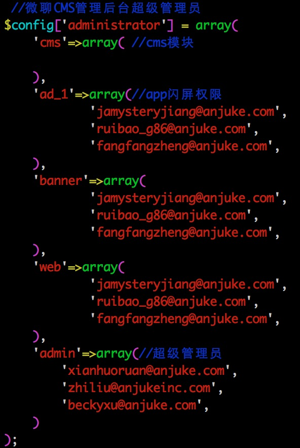

## CMS-帮助手册

### 如何添加权限？

* 设置`功能``管理`和`设置`三大功能

    ```
    账号管理 -> 修改账号 -> 添加后台权限／账号拥有者 -> 提交
    ```
    
    

* 设置`闪屏``banner`和`web页`三大功能／添加`超级管理员`

    ```
    需要提SART修改线上的外层配置
    线上示例；
    	机器：app10-125
		路径：/home/www/config/v2/cms/chat-cms/config/common.php
		代码：$config['administrator'] 
		说明：
			cms和admin是超级管理员账号
			ad_1是闪屏账号
			banner是banner权限
			web是web页权限
    SART示例：
    	http://ibug.corp.anjuke.com/ticket/detail?ticket_id=55315
    ``` 
    