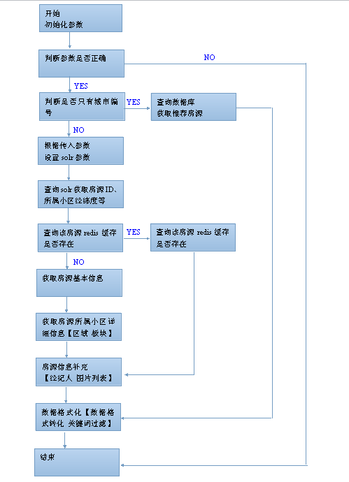

### 1.项目背景
#### 由于app租房列表页在老的仓库(haozu)中,和现有的pc,touch的租房列表页搜索逻辑不在同一仓库中,导致维护成本增加,所以需要迁移.

### 2.项目设计

### 2.1 APP租房列表页URL

#### http://api.haozu.com/mobile/2.0/prop/search

#### 2.2 参数
#### 2.2.1 APP租房列表页输入参数
##### 以下的参数是除去[公共参数](http://gitlab.corp.anjuke.com/Beckyxu/api/blob/master/common/app%E5%85%AC%E5%85%B1%E5%8F%82%E6%95%B0%E8%AF%B4%E6%98%8E.md)之外的参数

|参数名     |参数类型  |是否必须|意义    |
|:--------|:---:|:---:|:----|
|city_id|int|YES|城市id|
|cityid|int|NO|城市id|
|distance|int|NO|附近搜索的距离|
|lat|double|NO|纬度,在按照距离搜索的时候使用|
|lng|double|NO|经度,在按照距离搜索的时候使用|
|map_type|string|NO|地图类型,只有google g和baidu b 两种值,默认为b|
|page|int|NO|当前第几页 默认为1|
|page_size|int|NO|每页显示条数 默认为15|
|sort|int|NO|排序规则 1金额正序2金额倒序4按距离分段排序段内按价格排序升序5按距离分段排序，段内按Rank排序|
|ajk_broker_id|int|NO|安居客经纪人ID|
|broker_id|int|NO|好租经纪人ID|
|black_comm_id|string|NO|不包含小区房源|
|block_id|string|NO|版块ID|
|area_id|string|NO|区域ID|
|min_price|int|NO|最低价格|
|max_price|int|NO|最高价格|
|metro_station_id|int|NO|地铁站点|
|metro_id|int|NO|地铁线路|
|min_lng|string|NO|最小经度|
|max_lng|string|NO|最大经度|
|min_lat|string|NO|最小纬度|
|max_lat|string|NO|最大纬度|
|roomnum|string|NO|卧室数|
|from|int|NO|房源来源|
|fitment|int|NO|装修情况|
|renttype|int|NO|租赁方式|
|housetype|int|NO|房屋类型 如公寓 老公房等|
|kw|string|NO|关键词|
|uid|string|NO||
|app|string|NO|调用该接口的APP i-haozu好租APP i-ajk安居客APP|

#### 2.2.2 APP租房列表页输出参数
##### 成功时返回参数说明
| 参数名     | 参数类型 | 意义   |
| :-------  | :---: | :--- |
| status    | string |状态,成功状态是”ok”|
|results     | Array of Object   |房源列表等|
| request_time| string   |  接口执行时间  |
#### 以下是results包含的元素
|参数名    |参数类型|意义|
|:------|:---:|:---  |
|properties|Array of Object|房源列表|
|total|int|数据总条数|
|search_type|int|搜索类型 1推荐2周边搜索3rank|
|ad|Array of Object|添加的58房源包|

#### 以下是properties包含的元素
|参数名    |参数类型|意义|
|:------|:---:|:---  |
|id|int|房源ID|
|type|int|经纪人的来源标志3好租13安居客租房|
|isauction|int|0 套餐1定价2竞价|
|title|string|标题|
|city|Array of Object|id:城市ID,name:城市名称|
|area|Array of Object|id:区域ID,name:区域名称|
|block|Array of Object|id:版块ID,name:版块名称|
|price|int|每月租金|
|paytype|string|租金支付方式 如付三押一 付一押一等|
|roomnum|int|卧室个数|
|hallnum|int|大厅个数|
|talletnum|int|卫生间个数|
|renttype|string|租赁方式 如整租 合租等|
|fitment|string|装修情况 如精装 毛坯等|
|areanum|string|房屋面积|
|floor|int|在第几层|
|totalfloor|int|所在的建筑物一共几层|
|housetype|string|房屋类型 公寓 老公房 洋房等|
|faclng|string|房屋朝向 如朝南 朝北|
|posted|string|发布时间 如1431171009|
|updated|string|修改时间 如1431171009|
|deployment|string|房间配置|
|description|string|描述|
|photo|string|列表展示图|
|photos|Array of Object|房屋的图片信息|
|ishq|int|房源类型0非竞价房源1竞价房源且竞价成功2竞价房源但竞价失败|
|distance|string|附近搜索的距离|
||||
|metro_distance|object|地铁附近搜索的距离
|distance|string|距地铁距离
|id|int|地铁ID
|name|string|地铁名称 如1号线8号线等
||||
|broker|object|经纪人详细信息
|id|string|经纪人id
|type|int|经纪人类型
|name|string|经纪人名字
|company|string|经纪人所在公司
|photo|string|经纪人图片
|mobile|string|经纪人手机号
|is_grab|string|是否是抓取房源,如果是,那么经纪人图片不存在,
||||
|Community|Object|小区详细信息
|id|string|小区id
|name|string|小区名称
|address|string|小区地址
|lat|string|小区位置的纬度
|lng|string|小区位置的经度
||||
|mobile_pub|string|获取是否是手机发送|
|source_type|string|房屋类型:1:安居客经纪人,3:安居客抓取,5:58经纪人,6:58抓取房源|
|is_act|int|58房源季标签|
|tracker|string|Trace_id字段，用于追踪触发展现房源的初始位置|
##### 失败时返回参数说明
| 参数名     | 参数类型 | 意义   |
| :-------  | :---: | :--- |
| status    | string |调用失败,值是“error”
|msg|string|失败提示语|
#### 2.3 api使用分类
* 筛选
    * 小区筛选
    * 区域筛选
    * 板块筛选
    * 价格
    * 地铁线路
    * 经纬度+可视区域
    * 卧室数
    * 房源来源
    * 装修
    * 租赁方式
    * 房屋类型
    * 关键词
    * 经纪人

#### 2.4 项目流程图
##### 
#### 2.5 调用数据库及表说明
| 数据库名|表名     | 作用 |
| :-------  | :---: |:---|
|rent_db|prop|获取房源基本信息|
|rent_db|area|根据区域ID获取区域 版块信息|
|rent_db|users_search|获取经纪人信息|
|rent_db|map_metros_baid|根据城市获取该城市的地铁线路|
|rent_db|map_metro_stations_baidu|获取城市地铁站点信息|
|rent_db|broker_mapping|根据好租broker_id获得对应的ajk_broker_id|
|anjuke_db[host:10.10.8.80]|ajk_commextend|获取小区开展信息|
|anjuke_db[host:10.10.8.80]|ajk_attachments_comm|获取小区图片列表|
|anjuke_db[host:10.10.8.80]|ajk_merge_comm|获取合并小区新ID|
|anjuke_db[host:10.10.8.80]|ajk_communitys|获取小区基本信息|
|anjuke_db[host:10.10.8.80]|ajk_usetype|获取物业类型|
|anjuke_db[host:10.10.8.80]|ajk_listptab_rent|获取房源默认图|
|anjuke_db[host:10.10.8.80]|ajk_swrent|获取捉取房源经纪人姓名及手机号|
|anjuke_db[host:10.10.8.80]|ajk_brokerextend|获取网站发布房源经纪人信息|
|anjuke_db[host:10.10.8.80]|ajk_commtype|获取版块信息|
|anjuke_db[host:10.10.8.80]|ajk_fitmenttype|装修类型|
|anjuke_db[host:10.10.8.94]|ajk_propertyrent|取安居客指定房源扩展信息|
|anjuke_db[host:10.10.8.80]|map_communities|小区谷歌地图信息|
|anjuke_db[host:10.10.8.80]|map_communities_baidu|小区百度地图信息|
|anjuke_db[host:10.10.8.80]|anjuke_db[host:10.10.8.80]|房屋类型|
|anjuke_db[host:10.10.8.80]|cst_company|获取经纪人中介公司信息|
|anjuke_db[host:10.10.8.80]|cst_broker_company|获取经纪人直营店/加盟店信息|
|user_prop_sh_db|sbulessor_pro_11|批量查询大业主房源信息|
|user_prop_sh_db|zf_wuba_prop_11|获取58租房房源|
|propertys_sh_db|ajk_propertys|根据房源id获取房源信息|
|image_db|t_attachment_[xxx]|取得中介房源的室内图、小区图、房型图|

#### 2.6 solr参数和传入参数的对应关系
##### solr的搜索参数
| 入参     | solr查询参数 |
| :-------  | :--- |
|comm_id   |fq->commid|
|block_id  |fq->block_id|
|area_id   |fq->area_id|
|min_price |fq->min_price|
|max_price |fq->max_price|
|metro_station_id|fq->metro_station_id|
|metro_id  |fq->metro_id|
|roomnum   |fq->room_num|
|broker_id |fq->broker_id|
|from      |fq->from|
|fitment   |fq->fitment_id|
|renttype  |fq->is_shared|
|housetype |q->usetype|
|distance  |d|
|lat lng   |pt|
|map_type  |sfield|
|sort      |sort|
