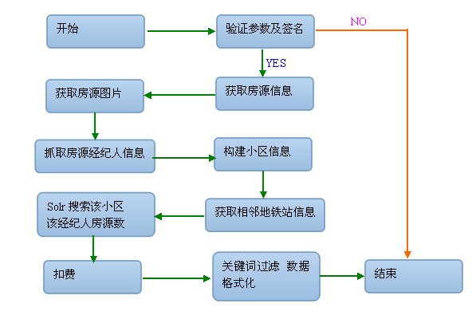

### 1.项目背景
#### 由于app租房单页在老的仓库（app-haozu-api）中,和现有的pc,touch的租房列表页搜索逻辑不在同一仓库中,导致维护成本增加,所以需要迁移.
### 2.项目设计
#### 2.1 APP 租房单页URL
##### http://app.haozu.com/mobile/2.0/property.get

#### 2.2参数
#### 2.2.1 APP租房单页输入参数
##### 以下的参数是除去[公共参数](http://gitlab.corp.anjuke.com/Beckyxu/api/blob/master/common/app%E5%85%AC%E5%85%B1%E5%8F%82%E6%95%B0%E8%AF%B4%E6%98%8E.md)之外的参数
| 参数名     | 参数类型 | 是否必须   |意义 |
| :-------  | :---: | :---: | :-----| 
|api_key|string|YES|验证key|
|cityId_forapilog|int|NO|城市ID|
|id|int|YES|房源ID|
|type|int|NO|房源类型 type 1安居客经纪人 2个人房源 3好租经纪人房源 4 大业主房源|
|isauction|int|NO|房源竞价类型0 套餐1定价2竞价|
|sig|string|YES|签名|
|app|string|NO|接口掉取方 a-haozu 好租 i-ajk安居客租房|
#### 2.2.2 APP租房单页输出参数
##### 成功时返回参数说明
| 参数名     | 参数类型 | 意义   |
| :-------  | :---: | :--- |
|status|string|状态|
|property|object of array|返回数据内容|
|request_time|string|接口执行时间|
##### 以下是property包含的元素
| 参数名     | 参数类型 | 意义   |
| :-------  | :---: | :--- |
|id|int|房源ID|
|shortLink|string|房源链接的短链接|
|type|int|房源类型|
|online|int|房源状态1在线2待上线3删除等|
|title|string|房源标题|
|city|array|id:房源所属城市id,name:城市名称|
|area|array|id:房源所属区域id,name:区域名称，py:区域拼音|
|block|array|id:房源所属版块id,name:版块名称，py:版块拼音|
|price|int|租金|
|paytype|string|租金支付方式 如付三押一 付一押一等|
|roomnum|int|卧室个数|
|hallnum|int|厅的个数|
|tolletnum|int|卫生间个数|
|renttype|string|租赁方式 如整租 合租等|
|fitment|string|装修情况|
|areanum|int |房源面积|
|floor|int|房源所属楼层|
|totalfloor|int|房源所属楼最高楼层|
|faclng|string|朝向|
|posted|int|发布时间|
|updated|int|修改时间|
|deployment|string|房屋配置|
|description|string|描述|
|def_photo|string|默认图|
|photos|array|desc:图片描述，url:图片地址|
|photo|string|房源小图图片|
|ishq|int|是否是优质房源|
||||
|broker|array|经纪人信息|
|id|int|经纪人ID|
|type|int|经纪人类型|
|name|string|经纪人姓名|
|company|string|经纪人所属公司|
|mobile|string|经纪人手机号|
|photo|string|经纪人头像|
|is_grab|int|是否是抓取房源经纪人信息1是0否|
|is_active|int|经纪人是否开通微聊|
|charId|int|微聊ID|
||||
|community|arary|房源所属小区信息|
|id|int|小区ID|
|name|string|小区名称|
|address|string|小区所在地址|
|lng|string|小区经度|
|lat|string|小区纬度|
|props|int|该小区房源数|
||||
|nearby_metros|string|附近地铁信息|
|plan_type|int|之前房源推广类型 如好盘..|
|url|string|房源URL|
is_act|int|58房源季标签|

##### 失败时返回参数说明
| 参数名     | 参数类型 | 意义   |
| :-------  | :---: | :--- |
| status    | string |调用失败,值是“error”
|msg|array|code:状态值，message:提示语|

#### 2.3 项目流程图
##### 

#### 2.4 调用数据库及表说明
| 数据库名|表名     | 作用 |
| :-------  | :---: |:---|
|rent_db |prop |获取好租中介房源|
|rent_db |prop_images |获取房源的图片|
|rent_db |broker_account |取得经纪人帐务信息|
|rent_db |users |根据用户的id判断经纪人帐号信息|
|rent_db |users_search |取得经纪人查询信息|
|rent_db |broker_profile |取得经纪人资料信息[公司信息 身份证信息]|
|rent_db |area |获取区域及模块信息|
|rent_db |map_metro_station_community_distances |根据小区id获取临近地铁信息||
|rent_db |promotion_prop_planning |获取好租的经纪人房源推广信息|
|rent_db |broker_mapping |获取安居客经纪人ID及好租经纪人ID对应关系|
|anjuke_db[host:10.10.8.80] |cst_company |获取经纪人公司名称|
|anjuke_db[host:10.10.8.80] |ajk_commextend |根据小区编号取得小区扩展信息|
|anjuke_db[host:10.10.8.80] |ajk_merge_comm |获取合并小区ID|
|anjuke_db[host:10.10.8.80] |ajk_communitys |根据小区ID获取小区信息|
|anjuke_db[host:10.10.8.80] |ap_communities_baidu |获取小区坐标|
|anjuke_db[host:10.10.8.80] |ak_brokerextend |获取安居客经纪人信息|
|anjuke_db[host:10.10.8.80] |cst_broker_company |非独立经纪人，则取门店信息`|
|anjuke_db[host:10.10.8.80] |map_communities |小区Google地图信息|
|anjuke_db[host:10.10.8.80] |map_communities_baidu |小区baidu地图信息|

#### 2.5 solr参数和传入参数的对应关系
##### solr的搜索参数
| 入参     | solr查询参数 |
| :-------  | :--- |
|cityId_forapilog |fq->city_id|

