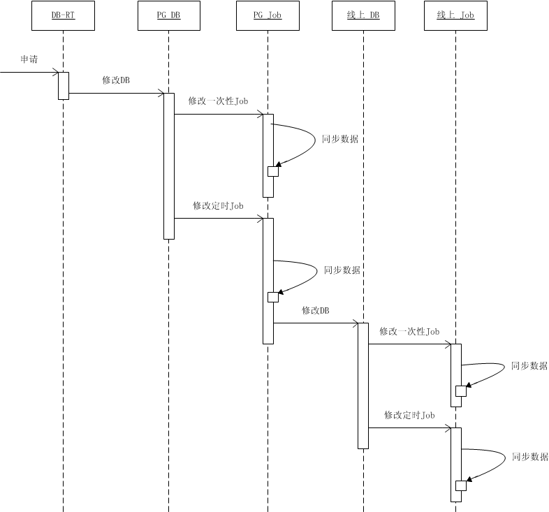
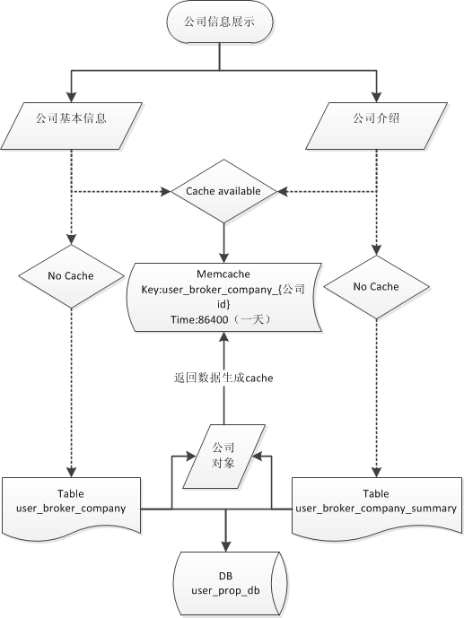
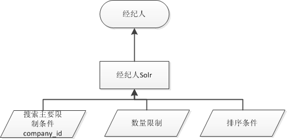
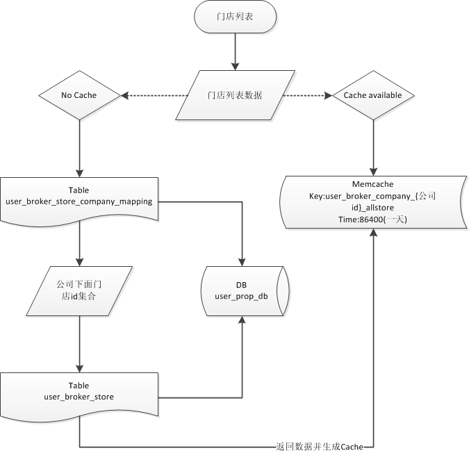
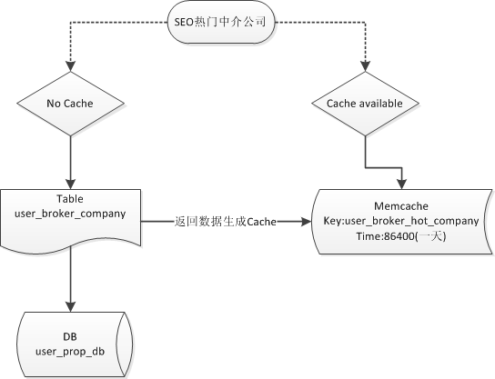

# 合作伙伴及网上门店优化设计文档

### 文档版本1.0 唐聪 <congtang@anjuke.com> 2015-07-03

## PMT

* [合作伙伴](http://p.corp.anjuke.com/project/detail?id=27965)

* [网上门店](http://p.corp.anjuke.com/project/detail?id=28090)

## 项目配置

### 1. nginx配置

- zanjuke.conf添加
    
            location ~ ^/company/ {
                rewrite . /ajkuser-index.php last;
            }
        
            location ~ ^/agency/store/ {
                rewrite . /ajkuser-index.php last;
            }
    
### 2. 表结构修改

[表结构修改](broker-company-database.md)

### 3. 经纪人隔离修改

### 4. 隔离体系DB访问API层的设计

[API设计方案](http://gitlab.corp.anjuke.com/_site/docs/blob/master/DesignDoc/Broker/broker-split/broker-api.md)

## 项目任务模块

### 1. 合作伙伴-公司信息

> image使用anjukestatic.com构造，以后图片服务迁移后再修改，已设计host_id。

### 2. 合作伙伴-二手房

通过Solr和Uesearch实现，并可无缝切换，Solr与现有二手房一致，Uesearch搜索基于现有二手房改造了筛选参数构造和返回数据处理。

### 3. 合作伙伴-租房

通过Solr获取房源信息，使用现有搜索底层获取租房数据

### 4. 合作伙伴-经纪人

### 7. 合作伙伴-门店

### 8. 合作伙伴-SEO

- URL优化

- TDK优化

- 底部面包屑导航

- 底部文字描述

- 底部SEO热门中介公司

- 底部SEO热门门店

    参考获取公司门店

- 区域二手房
    与PC端底部二手房一致

- URL跳转部分
    > 原页面保留，将公司主页原URL 301跳转到新URL
    
     
## Todo

- 公司logo图片迁移
- 二手房搜索拆分，各数据组件化，形成公共服务