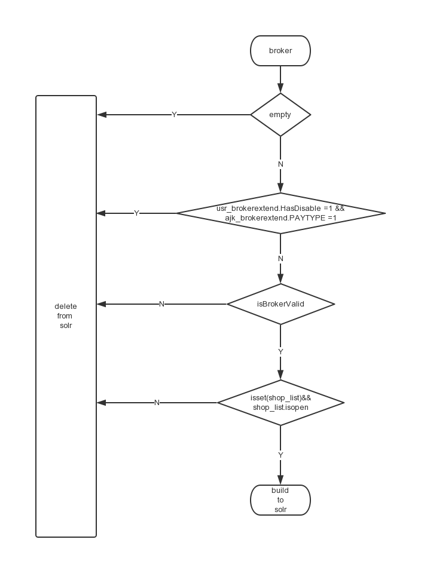
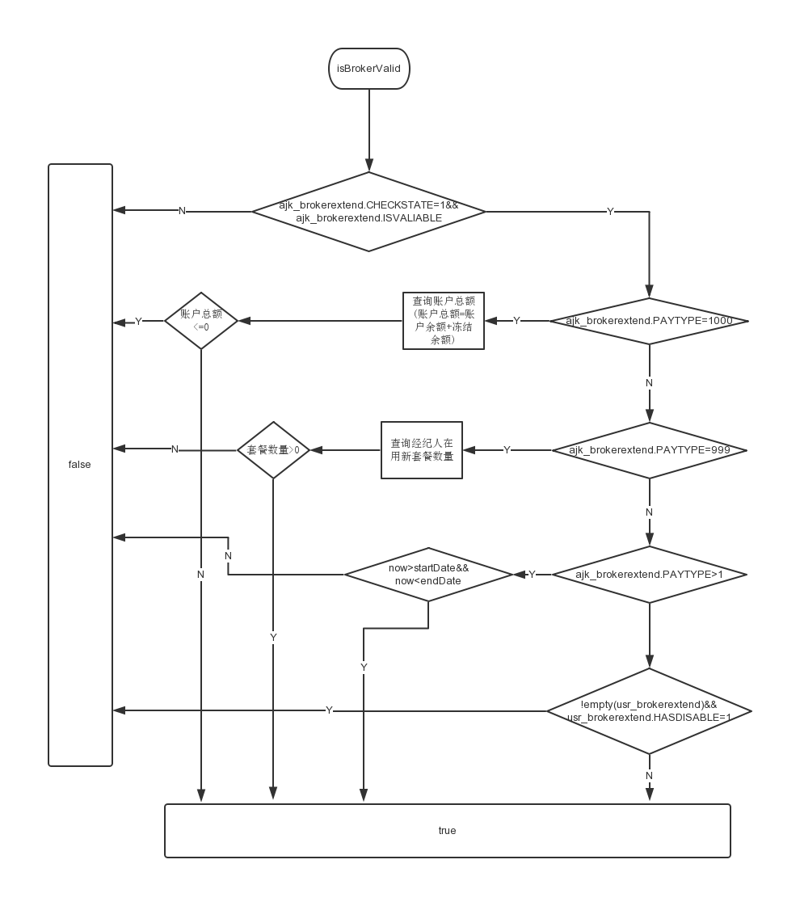

# 经纪人solr

## solr地址

pg
```
    http://solr.anjuke.test/service_detail.php?service_id=296
    
    Select Url: http://solr.anjuke.test:8983/ajk-broker/select/?q=*:* 
    
    Update Url: http://solr.anjuke.test:8983/ajk-broker/update/
```
online 
```
   http://search.corp.anjuke.com/service_detail.php?service_id=202
   
   Select Url: http://10.10.6.51:8983/ajk-broker/select/?q=*:*
   
   Update Url: http://10.10.6.51:8983/ajk-broker/update/
```

## solr字段

Field_name|Type|indexed|  Stored|  Required|    MultiValued| Default| Edit| Field
---|---|---|---|---|---|---|---|---|
_version_|   long|               
_root_ | string|       
id | int|              
cityid | int|            
maincommunityname |  text  |                
areacode |      string   |              
gradelevel  |   int    |         
companystore    |   text     |           
companyid   |   int    |            
storeid |   int |                
truename   |    text   |               
activestate  |  string  |      
activestateorder   |    int  |         
businesscardstate   |   int |      
businesscardfile    |   string |       
certificatestate    |   int   |             
communityexpertstate   |    int   |              
dealcommissioncnt   |   int |      
userphoto   |   string |       
lastlogintime |     tint  |                  
commissionprocessrate   |   tint   |              
regtime  |  tint   |             
commissionrentrange |   tint   |               
commissionsalerange |   tint   |                
companyflag  |  int  |            
isactive    |   int  |            
honestmedal |   int   |              
certifymedal  |     int   |             
highqualitymedal   |    int   |             
longevitymedal  |   int   |              
blat  |     tfloat  |             
blng   |    tfloat  |            
usergender |    int   |             
brokertype  |   int    |             
brokervalid  |  int    |             
logineveryday  |    int              
propcommunity  |    text                      
propcommunityroad   |   text                     
familiarcommunity   |   text                      
familiararea   |    text                      
shortintro  |   text              
professionalskill  |    text                    
favoritebook  |     string                  
favoritefood    |   string                   
leisureactivities |     string                 
birthprovince   |   string                
birthcity   |    string            
birthanimal  |  string             
constellation  |    string              
nocomplaint |   int             
userprofilephoto  |     int             
propsale   |    int    
proprent    |   int           
exactkeys   |   string              
profiledatanum  |   sint             
usermobile |    string               
order   |   sint                  
brokerdiarynum  |   int      
qamanagermedal  |   int            
answernum   |   int             
updatetime  |   tint                 
allcommissioncnt    |   int                
star     |  sint               
goodrate    |   sfloat              
evaluatecount  |    int            
proneedcommunity   |    text                     
proneedarea |   text                    
areablock  |    string              
ufsscore   |    sfloat           
ufscityorder   |    sint              
proneedcommexact  |     string               
familiarcommexact  |    string                
ufstotal   |    sfloat           
servicescore   |    float           
feedbackscore  |    float         
brokerRank  |   int            
isstar  |   sint   

## build-Solr Job

### solr-build生产者

* job地址 http://drone.corp.anjuke.com/scheduler/job/220/view
* job名称 Ershou_Job_Broker_BrokerSolrUpdate
* job流程


* job子流程-经纪人是否有效


### solr-build消费者

* job名称 Ershou_Job_Broker_BuildBrokerSolrAMQP
* job地址 http://drone.corp.anjuke.com/daemon/job/98/view
  
都在我们这里，这个最好让产品定好展示罗辑，交给经纪人端处理 ,我们只负责往solr中推送数据   

### TODO 单个经纪人job更新

如果有经纪人信息没有在solr中
* job名称 Ershou_Job_Broker_BrokerEventUpdate
* job地址 http://drone.corp.anjuke.com/daemon/job/104/view 

