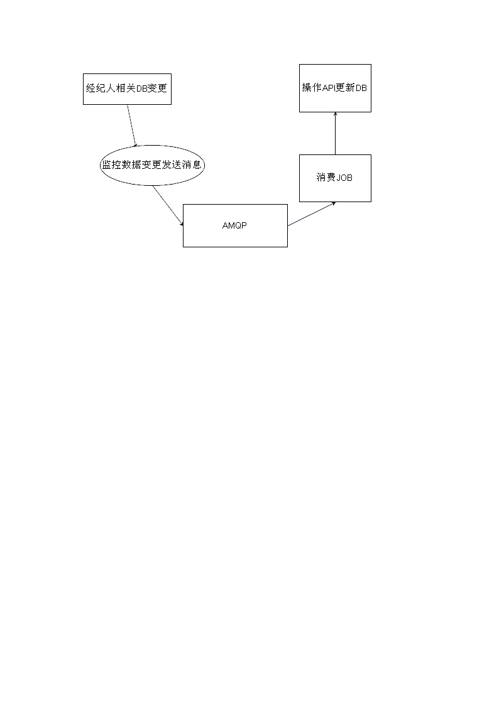

# 经纪人数据隔离API设计方案

### 文档版本1.0 唐聪 <congtang@anjuke.com> 2015-07-05

## 现有隔离体系

## 现有隔离体系缺点

- 更新数据都是在JOB里面直接操作DB
- 数据变更无消息通知

## 修改方案

### 设计概述

根据原有的体系，分离Job里直接操作DB的部分，分离的部分封装成API服务进行调用，再对API里的数据变更操作监控和发送消息

### 隔离API流程图

### 开发计划

#### 负责人

焦成礼

#### 对接项目及安排
    
合作伙伴及网上门店项目

由于API开发时间滞后，预计七月底或八月初，因此合作伙伴项目先使用原有隔离系统并为网上门店迁移完善好数据库，待API完成上线，网上门店迁移项目将使用新的隔离系统提供数据支持，合作伙伴页将迁移使用新的API
