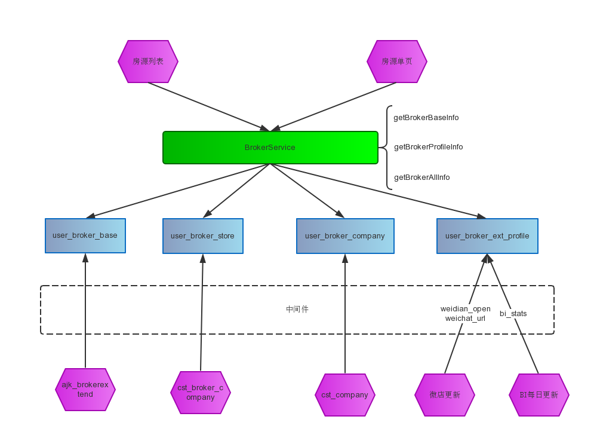

# 经纪人数据表

## 经纪人后台 — 用户端隔离数据的对应关系



## 经纪人端经纪人数据表

* 基本：anjuke_db.ajk_brokerextend
* 公司：anjuke_db.ajk_broker_company
* 所属门店：anjuke_db.cst_broker_company
* 所属公司：anjuke_db.cst_company


## 经纪人隔离数据表

### database 

user_prop_db

### table 

## user_broker_base 基本信息表
```
CREATE TABLE `user_broker_base` (
  `broker_id` int(11) NOT NULL COMMENT '二手房经纪人id',
  `user_id` int(11) NOT NULL default '0' COMMENT '对应的用户中心id',
  `city_id` int(11) NOT NULL default '0' COMMENT '所在城市',
  `area_id` int(11) NOT NULL default '0' COMMENT '板块id',
  `broker_photo` varchar(100) NOT NULL default '',
  `sex` tinyint(4) NOT NULL default '0' COMMENT '0表示男 ,1表示女',
  `name` varchar(70) NOT NULL default '' COMMENT '真实姓名',
  `mobile` varchar(15) NOT NULL default '' COMMENT '手机号',
  `store_id` int(11) NOT NULL default '0' COMMENT '门店id',
  `company_id` int(11) NOT NULL default '0' COMMENT '公司id',
  `update_time` timestamp NOT NULL default CURRENT_TIMESTAMP on update CURRENT_TIMESTAMP COMMENT '更新时间',
  `status` tinyint(4) NOT NULL default '0' COMMENT '1表示删除',
  PRIMARY KEY  (`broker_id`)
)
```


## user_broker_store 门店信息

```
CREATE TABLE `user_broker_store` (
  `store_id` int(11) NOT NULL,
  `city_id` int(11) NOT NULL default '0',
  `store_name` varchar(100) NOT NULL default '' COMMENT '门店名称',
  `address` varchar(100) NOT NULL default '' COMMENT '门店地址',
  `short_store_name:q` varchar(100) NOT NULL default '' COMMENT '门店简称',
  `update_time` timestamp NOT NULL default CURRENT_TIMESTAMP on update CURRENT_TIMESTAMP COMMENT '更新时间',
  `status` tinyint(4) NOT NULL default '0' COMMENT '1表示删除',
  PRIMARY KEY  (`store_id`)
)
```

## user_broker_company 公司信息  同一公司在不同的城市时，表中是作为不同的公司看待
```
CREATE TABLE `user_broker_company` (
  `company_id` int(11) NOT NULL,
  `company_name` varchar(100) NOT NULL default '' COMMENT '公司名称',
  `address` varchar(50) NOT NULL default '' COMMENT '地址',
  `city_id` int(11) NOT NULL default '0',
  `update_time` timestamp NOT NULL default CURRENT_TIMESTAMP on update CURRENT_TIMESTAMP COMMENT '更新时间',
  `status` tinyint(4) NOT NULL default '0' COMMENT '1表示删除',
  PRIMARY KEY  (`company_id`)
) 
```


## user_broker_ext_profile 经纪人扩展表
json串中存储从BI表获取的经纪人的状态,
其他字段是客户端获取的状态
```
CREATE TABLE `user_broker_ext_profile` (
  `broker_id` int(11) NOT NULL,
  `has_weidian` tinyint(4) NOT NULL default '0' COMMENT '1表示开通',
  `chat_host_id` tinyint(4) NOT NULL default '0' COMMENT '微店图片host_id',
  `chat_image_id` varchar(100) NOT NULL default '' COMMENT '微店图片名',
  `is_talent` tinyint(4) NOT NULL default '0' COMMENT '1表示微聊达人',
  `is_star` tinyint(4) NOT NULL default '0' COMMENT '1表示明星中介',
  PRIMARY KEY  (`broker_id`)
) 

```


### TODO

二手房可以直接使用，租房需要把broker_id转成公共的经纪人id

租房做数据隔离时，考虑存储的经纪人id用公共的id

租房现在的经纪人信息获取逻辑

二手房现在的经纪人获取逻辑

经纪人不需要隔离的数据


