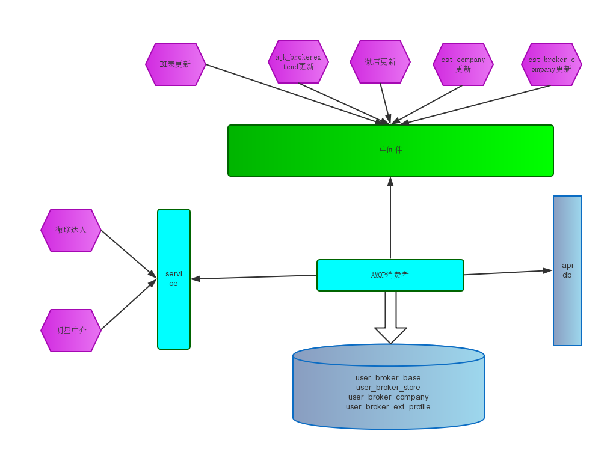
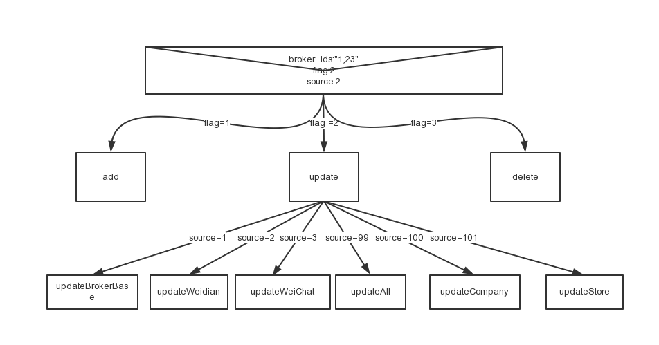

# 用户端经纪人信息更新

## 更新流程



## ampq消息来源

### 消息生产者　定时JOB

1)同步基本信息
Ershou_Job_Broker_Separate_BrokerBaseModifyProducer
http://drone.corp.anjuke.com/scheduler/job/268/view

2)同步经纪人扩展信息
Ershou_Job_Broker_BrokerExtProfileSync
http://drone.corp.anjuke.com/scheduler/job/273/view


3)同步公司信息
Ershou_Job_Broker_Separate_BrokerCompanyModifyProducer
http://drone.corp.anjuke.com/scheduler/job/272/view

4)同步门店信息
Ershou_Job_Broker_Separate_BrokerStoreModifyProducer
http://drone.corp.anjuke.com/scheduler/job/269/view

### 消息生产者　一次性JOB 

1)更新全部公司信息
Ershou_Job_Broker_Separate_BrokerCompanyProducer
http://drone.corp.anjuke.com/scheduler/job/271/view
  
2)更新全部门店信息
Ershou_Job_Broker_Separate_BrokerStoreProducer
http://drone.corp.anjuke.com/scheduler/job/270/view   

3)更新基本信息
Ershou_Job_Broker_Separate_BrokerBaseProducer
http://drone.corp.anjuke.com/scheduler/job/266/view

## 用户端经纪人信息更新

### 信息更新中间件 

```
http://nydus.dev.anjuke.com/publish?tunnel=broker_event
POST_data: {"broker_ids”:string,"flag”:int,"source":int}

broker_ids: 多个broker_id，以“,”隔开
flag: 2更新
source_type: 
      0/1/空 更新基本信息； 
      2 更新微店信息；
        $config['broker_weidian_api'] = "http://api.anjuke.test/mobile-ajk-broker/1.0/weshop/wechatNameInfo/";
      3 微聊达人，明星中介更新；
      99 信息全部更新；
      100 门店更新；
      101公司更新
```
todo: 中间件配置

## job

1. 代码       Ershou_Job_Broker_BrokerEventUpdate
2. online-job http://drone.corp.anjuke.com/daemon/job/104/view
3. pg-job     http://drone.dev.anjuke.com/daemon/job/95/view
4. job的详细流程 
   


## TODO
      1.有些表已经存在了，默认是不跳过缓存的，实际上是在使用的时候先清除，然后再查询的，所以不能直接添加skip_cache，需要把removecache的语句去掉，不然job会挂掉
      2.公司名称我只是取的简称
      3.delete的时候 也需要通过source来区分，不然company和store是没法逻辑删除的
      4.经纪人明星中介会读一张状态表判断当天有没有更新，但是脚本中不应该去判断这个逻辑，这个应该是发送方去判定的，所以如果伪装生产者去发送消息，那么你需要先去读状态表，然后去执行发送消息
      5.相关job
      1)Ershou_Job_Broker_BrokerEventUpdate 消息的消费者  因为存在并发问题，所以只启用一个
      2)Ershou_Job_Broker_BrokerExtProfileSync 全量同步的生产者，发送微店信息和微聊达人及明星中介同步消息
      分为3种，一种只生产微店消息，一种只更新明星中介(特殊原因),一种更新微聊及明星中介，和消费者的source相对应

