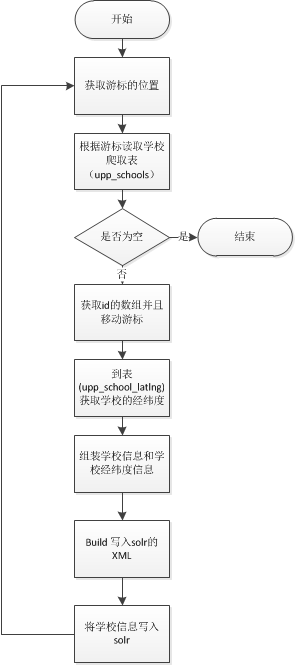
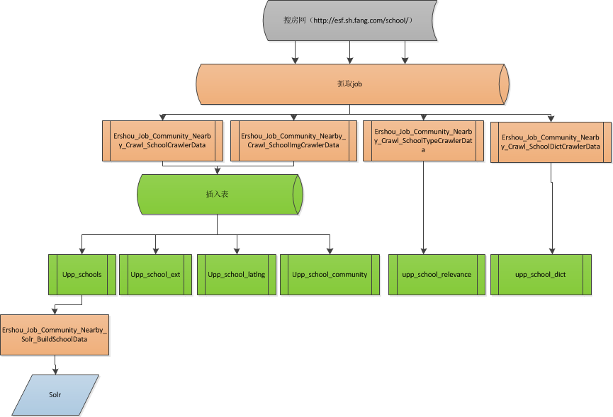
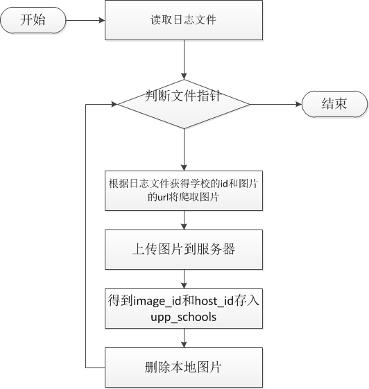
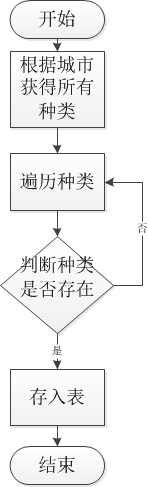
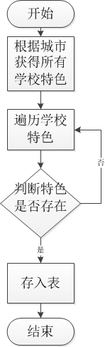

# 小区周边（学校、地铁、公交站）设计

## 背景

   目前现在小区周边的信息太久未更新，现有的job已经好久都没有执行，并且相应的job也没有人去维护，又由于小区信息比较重要，全站各个频道
都在用，所以需要重新去实现整个小区周边信息的获取流程，保证数据能够及时更新。

## 现状

### 学校信息相关

#### 一 .数据库表

```
  user_prop_db.upp_schools (爬取数据存表  is_del 0:正常 1:删除)
  
  CREATE TABLE `upp_schools` (
  `id` int(11) NOT NULL AUTO_INCREMENT COMMENT '学校ID',
  `sf_id` int(11) NOT NULL COMMENT 'soufunID',
  `city_id` smallint(6) NOT NULL COMMENT '城市ID',
  `area_id` int(11) DEFAULT NULL COMMENT '区域或板块ID',
  `name` varchar(80) DEFAULT NULL COMMENT '学校名称',
  `category` int(11) DEFAULT NULL COMMENT '学校类别',
  `level` int(11) DEFAULT NULL COMMENT '学校级别',
  `nature` int(11) DEFAULT NULL COMMENT '学校性质',
  `feature` varchar(50) DEFAULT NULL COMMENT '学校特色,多个特色以|隔开',
  `host_id` int(1) DEFAULT '1' COMMENT '学校照片hostID',
  `image_id` char(32) DEFAULT NULL COMMENT '学校照片ID',
  `address` varchar(150) DEFAULT NULL COMMENT '学校地址',
  `is_del` tinyint(1) DEFAULT '0' COMMENT '操作类型 0:正常，1：删除',
  `update_time` int(11) DEFAULT NULL COMMENT '更新时间',
  PRIMARY KEY (`id`),
  KEY `city_id` (`city_id`),
  KEY `area_id` (`area_id`),
  KEY `sf_id` (`sf_id`)
) ENGINE=MyISAM AUTO_INCREMENT=11164 DEFAULT CHARSET=utf8 COMMENT='学校基本信息'  

CREATE TABLE `upp_school_ext` (
  `school_id` int(11) NOT NULL COMMENT '学校ID',
  `phone_number` varchar(50) DEFAULT NULL COMMENT '联系电话',
  `about` varchar(500) DEFAULT NULL COMMENT '学校简介',
  `zip_code` int(6) DEFAULT NULL COMMENT '邮编',
  `condition` varchar(500) DEFAULT NULL COMMENT '入学条件',
  `admissions` text COMMENT '招生简单',
  `detail` text COMMENT '学校详情',
  `update_time` int(11) DEFAULT NULL COMMENT '更新时间',
  PRIMARY KEY (`school_id`)
) ENGINE=MyISAM DEFAULT CHARSET=utf8 COMMENT='学校扩展信息'

  user_prop_db.upp_school_relevance(学校字典关联表)
  CREATE TABLE `upp_school_relevance` (
  `id` int(11) NOT NULL AUTO_INCREMENT,
  `a_id` int(11) NOT NULL COMMENT 'aID',
  `type` tinyint(1) NOT NULL COMMENT '1:城市和类别,2:类别和级别,3:类别和性质',
  `b_id` int(11) NOT NULL COMMENT 'bID',
  `update_time` int(11) DEFAULT NULL COMMENT '更新时间',
  PRIMARY KEY (`id`),
  UNIQUE KEY `a_id_type_b_id` (`a_id`,`type`,`b_id`)
) ENGINE=MyISAM AUTO_INCREMENT=3162 DEFAULT CHARSET=utf8 COMMENT='城市学校类型级别性质关联'
  
  user_prop_db.upp_school_dict(学校字典表)
  CREATE TABLE `upp_school_dict` (
  `id` int(11) NOT NULL AUTO_INCREMENT,
  `type` tinyint(1) NOT NULL COMMENT '1:类型,2:级别,3:性质,4:特色',
  `name` varchar(80) DEFAULT NULL COMMENT '名称',
  `is_del` tinyint(1) DEFAULT '0' COMMENT '操作类型 0:正常，1：删除',
  `update_time` int(11) DEFAULT NULL COMMENT '更新时间',
  PRIMARY KEY (`id`)
) ENGINE=MyISAM AUTO_INCREMENT=80 DEFAULT CHARSET=utf8 COMMENT='学校字典'

CREATE TABLE `upp_school_latlng` (
  `school_id` int(11) NOT NULL COMMENT '学校ID',
  `type` tinyint(1) NOT NULL COMMENT '1:baidu,2:google',
  `lat` double NOT NULL COMMENT '纬度',
  `lng` double NOT NULL COMMENT '经度',
  `zoom` tinyint(3) unsigned NOT NULL COMMENT '地图级别',
  `update_time` int(11) DEFAULT NULL COMMENT '更新时间',
  PRIMARY KEY (`school_id`)
) ENGINE=MyISAM DEFAULT CHARSET=utf8 COMMENT='学校经纬度' 

upp_school_community | CREATE TABLE `upp_school_community` (
  `id` int(11) NOT NULL AUTO_INCREMENT,
  `school_id` int(11) NOT NULL COMMENT '学校ID',
  `community_id` int(11) NOT NULL COMMENT '小区ID',
  `city_id` smallint(6) NOT NULL COMMENT '城市ID',
  `update_time` int(11) DEFAULT NULL COMMENT '更新时间',
  PRIMARY KEY (`id`),
  UNIQUE KEY `school_community_id` (`school_id`,`community_id`),
  KEY `community_id` (`community_id`),
  KEY `city_id` (`city_id`)
) ENGINE=MyISAM AUTO_INCREMENT=58775 DEFAULT CHARSET=utf8 COMMENT='学校小区关联' 
  
  
```

#### 小区周边类映射

```

目录：user-site/app-community-core/classes/community/core/const/NearbyType.php
class Community_Core_Const_NearbyType{
    /**
     * 医院
     */
    const NEARBY_TYPE_HOSPITAL = 1;
        
        .
        .
        .
        
        
    /**
     * 学校
     */
    const NEARBY_TYPE_SCHOOL = 20;
        
        .
        .
        .
        
    /**
     * 商业综合
     */
    const NEARBY_TYPE_BUSINESS = 234;
}

```

#### 二.相应的job 

#### 1.学校信息爬取job 

【0】.School_SoufunSchoolProp

【1】.路径：anjuke-site/app-jobs/classes/school/SoufunSchoolProp.php。

【2】.线上没有部署。

【3】.作用：
    从搜房网站爬取学校的数据，存到user_prop_db.upp_schools表中

【4】.执行流程：

    （1）.先获取搜房网二手房页面的 总页数（http://esf.{city_pinyin}.fang.com/）

    （2）.根据分页获取学校信息（http://esf.sh.fang.com/school/ 第一页   http://esf.sh.fang.com/school/i3{页数}/）

    （3）.解析html

    （4）.获得学校的（id，name，学校区域、板块、地址，学校区域、板块、地址，学校区域、板块、地址，双语、艺术、电话）

    （5）.将学校的信息插入user_prop_db.upp_schools 中

【5】.存入表中的字段


    Field_Name | comments  
    --- | ---  
    sf_id | soufunID
    city_id | 城市ID
    area_id | 区域或板块ID
    name | 学校名称
    category | 学校类别
    level | 学校级别
    nature | 学校性质
    feature | 学校特色,多个特色以|隔
    address | 学校地址
    


#### 2.学校类型信息爬去job

【0】.job名称 School_SchoolRelevance

【1】.路径：anjuke-site/app-jobs/classes/school/School_SchoolRelevance.php

【2】.线上没有部署。

【3】.作用：从搜房网站爬取学校的（1:城市和类别,2:类别和级别,3:类别和性质），存到user_prop_db.upp_school_relevance表中

【4】.执行流程：

    （1）.先获取搜房网学校信息（http://esf.{city_pinyin}.fang.com/school/）

    （2）.解析html

    （3）.获得学校的（a_id,type,b_id）。

    （4）.将学校的信息插入user_prop_db.upp_school_relevance 中

【5】.存入表中的字段

    Field_Name | comments  
    --- | ---  
    a_id | aID
    type | 1:城市和类别,2:类别和级别,3:类别和性质
    b_id | 'bID'


#### 3.学校图片信息爬去job 

【0】job 名称：SchoolImage 

【1】 日志文件路径：$this->city_id . '/prop_image.log'

【2】.路径：anjuke-site/app-jobs/classes/school/SchoolImage.php

【3】.线上没有部署。

【4】.作用：从搜房网站爬取学校的（图片），存到user_prop_db.upp_schools表中

【5】.执行流程：
    
    （1）.根据日志获得学校id 和学校图片的url
    
    （2）.爬取图片信息
    
    （3）.将图片上传到图片服务（$config['upload_dfs_server'] = 'http://upd1.ajkimg.com/upload-anjuke'），得到host_id和image_id
     
    （4）.无论上传成功与否删掉图片
    
    （5）.将图片host_id和image_id 存入 user_prop_db.upp_schools中
    
【6】.存入表中的字段
    
    Field_Name | comments  
     --- | ---  
    host_id | 图片的HOSTID
    image_id | 图片的ID
    
   
    
#### 4.  (级别类别性质的爬取)

【0】.Job 名称： School_DictInfo

【1】.路径：anjuke-site/app-jobs/classes/school/School_DictInfo.php

【2】.线上没有部署。

【3】.作用：从搜房网站爬取学校的（1:类型,2:级别,3:性质,4:特色），存到user_prop_db.upp_school_dict表中

【4】.执行流程：

    （1）.先获取搜房网学校信息（http://esf.{city_pinyin}.fang.com/school/）

    （2）.解析html

    （3）.获得学校的（type,和类型名称）。

    （4）.将学校的信息插入user_prop_db.upp_school_dict 中

【5】.存入表中的字段

    Field_Name | comments  |
    --- | ---  
    type | 1:类型,2:级别,3:性质,4:特色|
    name | 名称|

#### 5.学校信息更新到solr的Job
【1】.job名称：Ershou_Job_Community_Nearby_Solr_BuildSchoolData

【2】.路径：user-site/app-ershou-job/classes/ershou/job/community/nearby/solr/BuildSchoolData.php

【3】.线上没有部署

【4】.job的入参：

Field_Name | comments  |
    --- | ---  
    city_id | 城市id|
    type | 类型|
    
【5】问题：
  完全没必要传入type，因为job执行的时候会指定是学校（$this->type = Community_Core_Const_NearbyType::NEARBY_TYPE_SCHOOL;）
    
【6】.solr地址：
    pg环境：http://solr.anjuke.test:8983/ajk-commnearby/

【7】.job执行的流程图




【8】.写入solr的数据

 Field_Name | comments  |
    --- | ---  
    id | id|
    name | 名称|
    type | 类型(Community_Core_Const_NearbyType::NEARBY_TYPE_SCHOOL)|
    city_id|城市id|
    lat |维度 |
    lng |经度 |
    latlng | 经纬度拼接 |
    

## 可以沿用

* 所有的表都可以继续沿用。

* 学校信息更新到solr的job可以继续使用。


## 需要做

* 爬取学校信息job（Ershou_Job_Community_Nearby_Crawl_SchoolCrawlerData）

* 爬取学校图片信息job (Ershou_Job_Community_Nearby_Crawl_SchoolImgCrawlerData)

* 爬取学校类型信息job (Ershou_Job_Community_Nearby_Crawl_SchoolTypeCrawlerData)

* 爬取学校字典信息job (Ershou_Job_Community_Nearby_Crawl_SchoolDictCrawlerData)


## 问题


## 总体设计


## 模块说明：

### 爬取学校信息job

1.名称：Ershou_Job_Community_Nearby_Crawl_SchoolCrawlerData
    
2. 流程:


    

### 爬取学校图片信息job

1.名称：Ershou_Job_Community_Nearby_Crawl_SchoolImgCrawlerData
    
2. 流程:




### 爬取学校类型信息job

1.名称：Ershou_Job_Community_Nearby_Crawl_SchoolTypeCrawlerData
    
2. 流程:





### 爬取学校字典信息job

1.名称：Ershou_Job_Community_Nearby_Crawl_SchoolDictCrawlerData
    
2. 流程:



### 写入solrjob继续用以前的


