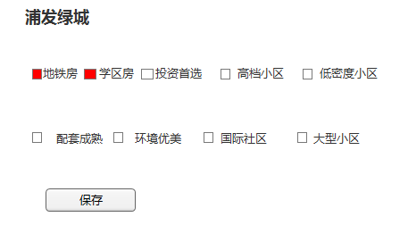

小区标签设计文档
=============
项目背景
-------------
在小区单页能让用户对本小区有一个整体的快速了解.

涉及到的功能模块
-------------
### 小区单页:
展示该小区的标签.
### 运营维护工具(后续):
维护没有标签的小区或者错误的数据,保证数据的准确性
##### 功能:
* 查询没有标签的小区
* 查询某个小区的标签
    *   
* 增加|删除小区的标签
    *   

DB设计
-------------
配置文件:
````
community_label_const = array(
    1=>'地铁房',(周边1公里内有地铁)
    2=>'学区房',(线上学区房小区)
    3=>'配套成熟',(周边4个维度指数均达到4星以上)
    4=>'环境优美',(绿化率达到40%以上)
    5=>'品牌开发商',(中海、万科、保利、绿城、招商地产、恒大、阳光100、远洋、华洋、万达、绿地、富力、碧桂园、
                    雅居乐、龙湖、世茂、中信、金地、华润置地、SOHO中国、金科、合生创展、复地)
    6=>'金牌物业',(中海、万科、保利、绿城、招商地产、恒大、阳光100、远洋、华洋、万达、绿地、富力、碧桂园、
                    雅居乐、龙湖、世茂、中信、金地、华润置地、SOHO中国、金科、合生创展、复地)
    7=>'次新小区',(建造5年内的)
    8=>'生活便利',(商业指数5星)
    9=>'交通便利',(如已经有地铁房这标签不需要，没有地铁房标签的小区取交通指数4.5星和5星的)
    10=>'投资首选',
    11=>'住户素质高',
    12=>'安全性高',
    13=>'繁华地段',
    14=>'高品质小区',(物业费高于3元)
    15=>'低密度小区',(容积率小于0.5)
    16=>'停车位充足',(充足；停车位/总户数 大于等于0.5)
    17=>'大型社区',(总建筑面积≥100000㎡)
    18=>'中型社区',(总建筑面积在3000~100000㎡（包含3000，不包含100000）)
    19=>'纯别墅社区',(物业类型为别墅)
    20=>'自住率高',(出租率为0)
    21=>'文明小区',
    22=>'国际社区',
    23=>'园林小区',
    24=>'风水宝地',
    //ADD MORE
)
````
````
表结构:
小区标签关系:
CREATE  TABLE IF NOT EXISTS `community_label_relation` (
    `id` INT NOT NULL AUTO_INCREMENT ,
    `comm_id` INT NOT NULL DEFAULT 0 COMMENT '小区id' ,
    `city_id` SMALLINT NOT NULL DEFAULT 0 COMMENT 'city id' ,
    `label_id` TINYINT NOT NULL DEFAULT 0 COMMENT '小区标签id' ,
    `valid` TINYINT NOT NULL DEFAULT 0 COMMENT '0:无效 2:有效',
    `action_flag` TINYINT NOT NULL DEFAULT 0 COMMENT '1:JOB写入 2:运营写入' ,
    `create_time` TIMESTAMP NOT NULL DEFAULT '0000-00-00 00:00:00' ,
    `update_time` TIMESTAMP NOT NULL DEFAULT CURRENT_TIMESTAMP ON UPDATE CURRENT_TIMESTAMP ,
    PRIMARY KEY (`id`) ,
    INDEX `comm_label_idx` (`city_id` ASC, `label_id` ASC) 
)
用到的查询语句
小区单页展示.
select * from community_label_relation where comm_id = ? and valid=1;
运营后台操作
select * from community_label_relation where comm_id = ? and valid=1;
INSERT INTO community_label_relation (`comm_id`, `label_id`, `valid`, `action_flag`) VALUES (...); 
update community_label_relation set valid=0 where comm_id = ? and label_id=?;
JOB操作:
INSERT INTO community_label_relation (`comm_id`, `label_id`, `valid`, `action_flag`) VALUES (...);
````
````
小区标签统计数量表:
CREATE  TABLE IF NOT EXISTS `community_label_count` (
    `comm_id` INT NOT NULL DEFAULT 0 COMMENT '小区id' ,
    `city_id` SMALLINT NOT NULL DEFAULT 0 COMMENT 'city id' ,
    `label_num` TINYINT NOT NULL DEFAULT 0 COMMENT '标签数量' ,
    `create_time` TIMESTAMP NOT NULL DEFAULT '0000-00-00 00:00:00' ,
    `update_time` TIMESTAMP NOT NULL DEFAULT CURRENT_TIMESTAMP ON UPDATE CURRENT_TIMESTAMP ,
    PRIMARY KEY (`comm_id`) ,
    INDEX `city_num_idx` (`city_id` ASC, `label_num` ASC) 
)
用到的查询语句
运营后台操作显示
select * from community_label_count where comm_id > ? and label_num=0 order by comm_id asc;
````


JOB设计
-------------
1.根据规则跑出小区标签写入表community_label_relation(每周)
    

2.从xls导入运营或产品处理好的数据.(一次性job)


3.(后续)统计每个小区标签的数量,放入数据库 (每天)


4.(后续)小区基本信息变更,实时更新标签数据,在小区通知队列job中处理.

流程图:


