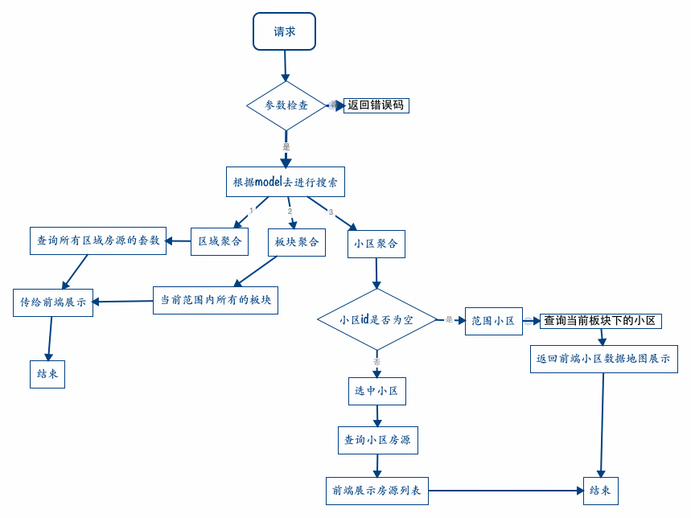

# 地图找房

## 业务背景


## 页面功能

* 区域聚合 

* 板块聚合

* 小区坐标

* 页面筛选

## 问题

* uesearch 搜索周一上线 之后底层会支持查询


## 路由

```
//二手房地图找房
$config['mappings'][$prefix.'Map_List'] = array(
    '^/[a-z]+/mapproperty/sale/$',
);
```
## controller

User_Touch_Map_ListController

## 页面UI

http://gitlab.corp.anjuke.com/_site/docs/blob/master/DesignDoc/Fangyuan/Ershou/Map/MapUI.md

## 页面的整体流程



## 接口设计

* 接口协议

    ```
    get
    
    ```

* 请求地址

    ```
    /ajax/mapsearch/sale
    
    ```
    
* 请求样例
    * pg：
    
        ```
        
        ```
    * 线上：
    
        ```
        
        ```
 
* 接口文档

    http://gitlab.corp.anjuke.com/_site/docs/blob/master/DesignDoc/Fangyuan/Ershou/Map/MapSearch.md
    
    
# 筛选项数据

```

'filters' => 
  array (
    'region' => 
    array (
      0 => 
      array (
        'type_name' => '不限',
        'type_code' => '',
        'selected' => '1',
      ),
      1 => 
      array (
        'type_id' => '7',
        'city_id' => '11',
        'type_name' => '浦东',
        'parent_id' => '1',
        'type_code' => '00010007',
        'map_x' => '12155128',
        'map_y' => '3122453',
        'map_zoom' => '11',
        'block' => 
        array (
          0 => 
          array (
            'type_name' => '不限',
            'type_code' => 'all',
            'selected' => '1',
          ),
          1 => 
          array (
            'type_id' => '7',
            'city_id' => '11',
            'type_name' => '浦东',
            'parent_id' => '1',
            'type_code' => '00010007',
            'map_x' => '12155128',
            'map_y' => '3122453',
            'map_zoom' => '11',
          ),
        ),
      ),
    ),
    'area' => 
    array (
      0 => 
      array (
        'area_range' => '不限',
        'area_id' => '0',
        'selected' => '1',
      ),
      1 => 
      array (
        'area_id' => '2',
        'area_range' => '50平米以下',
        'city_id' => '11',
        'selected' => '1',
      ),
    ),
    'house_model' => 
    array (
      0 => 
      array (
        'house_model' => '不限',
        'hm_id' => '0',
        'selected' => '1',
      ),
      1 => 
      array (
        'hm_id' => '2',
        'house_model' => '一室',
        'selected' => '1',
      ),
    ),
    'price' => 
    array (
      0 => 
      array (
        'price_range' => '不限',
        'price_id' => '0',
        'selected' => '1',
      ),
      1 => 
      array (
        'price_id' => '7',
        'city_id' => '11',
        'price_range' => '500-600万元',
        'type_name' => '浦东',
        'selected' => '1',
      ),
    ),
  )
  
  ```
  
