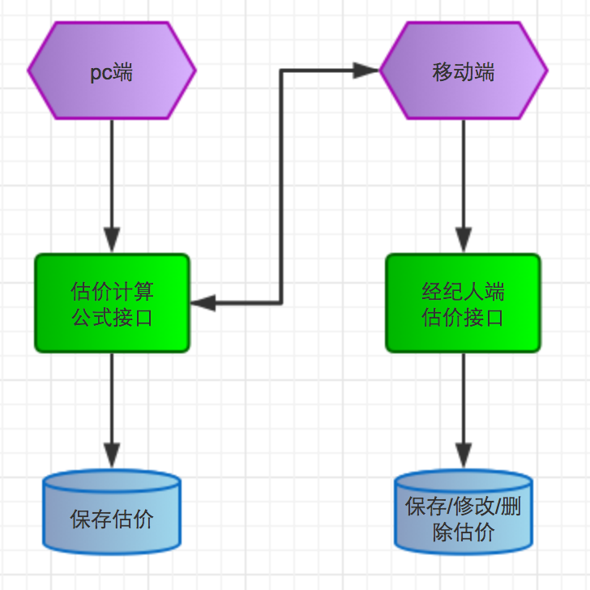

估价改进
===

项目背景
---

* 现在移动端的估价数据是保存在经纪人端，同时移动端的估价计算公式接口在用户端，所以为了统一维护管理，需要将经纪人端的估价数据保存接口移动到用户端；
* pc端重构估价频道页时，考虑到后期移动端的估价数据保存到用户端，和pc估价数据合并，所以pc端的估价数据在数据库中的id是从100000开始，前面100000的空位是给移动端估价数据保留，但现在经纪人端保存的估价数据在数据库中的id已经到达82266，所以需要尽早将接口移动到用户端，统一维护；

现存问题
---

* 现在估价流程图

	

* 1、维护不统一
* 2、数据会保存两份
* 3、估价计算公式接口现在有两个：
	* a、pc的在新框架：代码级别接口；
	* b、移动端的在老框架：http协议接口（@石兆媛）；

改进问题
---
* 现需要改进为的流程图

    
    
* 所有的估价数据保存在用户端
* 需要将估价计算公式接口移动到新框架：pc仍为代码级别接口，移动端为http协议接口
* 如果经纪人端需要分析估价数据，可以把数据同步给经纪人端

经纪人端给移动端提供的接口文档
---
* http://gitlab.corp.anjuke.com/_broker-docs/i-doc/tree/master/personal/Doc/Api/assess