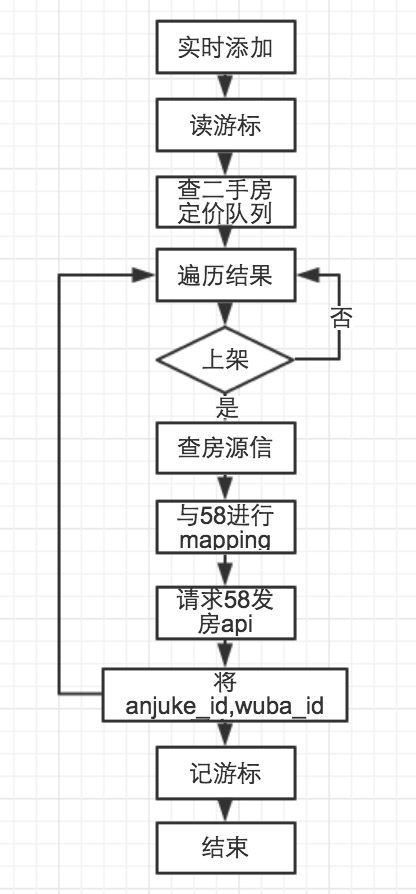

## 安居客房源实时同步到58

### 实时添加

- 流程图

  队列表：同二手房房源上架队列表
	
	

### 实时更新 / 删除

- 流程图
  
  备注：此处删除房源不是房源下架，而是经纪人手动删除房源


	

- 更新队列表

```	
CREATE TABLE `esf_prop_event_queue_{年月}_{prop % 10}` (  
	`id` int(11) UNSIGNED NOT NULL AUTO_INCREMENT COMMENT 'id' ,  
	`prop_id` int(11) UNSIGNED NOT NULL DEFAULT 0 COMMENT '房源编号' ,  
	`city_id` smallint(5)  UNSIGNED NOT NULL DEFAULT 0 COMMENT '城市id' ,  
	`flag` tinyint(1) UNSIGNED NOT NULL DEFAULT 1 COMMENT '房源操作 1-更新 2-删除' ,  
	`status` tinyint(1) UNSIGNED NOT NULL DEFAULT 0 COMMENT '操作状态 0-无操作 1-成功 2-失败' ,  
	`extend_field` text NOT NULL DEFAULT '' COMMENT '房源扩展字段' ,  
	`create_time` timestamp NOT NULL DEFAULT '0000-00-00 00:00:00' COMMENT '创建时间' ,  
	PRIMARY KEY (`id`) 
) ENGINE=InnoDB DEFAULT CHARSET=utf8 COMMENT='二手房房源操作队列表'
	
分表策略：每月分十张表，房源id对10取余
```