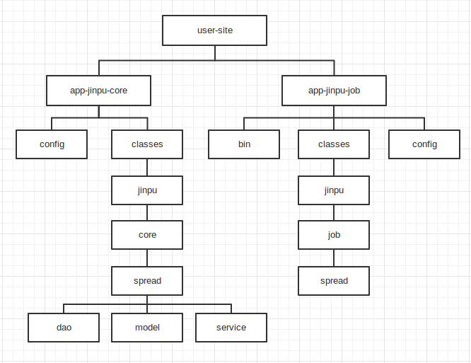

#作用

金铺房源上下架迁到新框架的设计

##消息中间件job

#流程图

#上下架消息队列

- 套餐接口
 - 测试环境：http://nydus.dev.anjuke.com/publish?tunnel=sp_prop_package_updown
 - 线上环境：http://nydus.a.ajkdns.com/publish?tunnel=sp_prop_package_updown
- 竞价接口
 - 测试环境：http://nydus.dev.anjuke.com/publish?tunnel=sp_prop_auction_updown
 - 线上环境：http://nydus.a.ajkdns.com/publish?tunnel=sp_prop_auction_updown
- 消息格式

>
    ｛
        "city_id":城市ID(int),
        "broker_id":经纪人ID(int),
        "pro_type":房源类型(int),
        "pro_id":房源ID(int),
        "flag":操作类型(int 1 上架，2 下架)
    ｝
    
#房源更新消息队列

- 套餐接口
 - 测试环境：http://nydus.dev.anjuke.com/publish?tunnel=sp_property_event
 - 线上环境：http://nydus.a.ajkdns.com/publish?tunnel=sp_property_event
- 消息格式

>
    ｛
        "city_id":城市ID(int),
        "type":房源类型(int),
        "pro_id":房源ID(int),
        "flag":操作类型(int 1 更新)
    ｝

#Job 参数说明

- Build单个或多个房源
 - house_ids ： 房源id，必填，多个房源以“，” 分割
 - status ： 上下架状态，选填，不填时默认为上架

- Build数据库中失败房源
 - status ： 上下架状态，必填，切只能为“3” 或 “4”，其中“3”表示上架失败，“4”表示下架失败
 - start_cursor ： 开始读取DB的游标，选填，不填时默认为0
 - end_cursor ： 结束读取DB的游标，选填，不填时默认为整个表的数据

- 例子：
 - 竞价上架：

    php /home/www/usersite/jobs/launcher.php --load_path=hotfix-50866-site --job_path=app-shangpu-job --class=Shangpu_Job_Spread_AuctionPropToSolr --house_ids=11666916,6022047 --status=1

 - 竞价上架失败：
    
    php /home/www/usersite/jobs/launcher.php --load_path=hotfix-50866-site --job_path=app-shangpu-job --class=Shangpu_Job_Spread_AuctionPropToSolr --start_cursor=0 --end_cursor=406 --status=3
    
#数据库表
- DB

    jinpu_db
- TABLE

    jp_combo_queue_201408,jp_auction_queue_201408
    
    备注：按月分表，仅保留当月和上一个月的数据
    
- 表结构

>

    CREATE TABLE `jp_combo_queue_{年月}` (
        `id`  int(11) UNSIGNED NOT NULL AUTO_INCREMENT COMMENT '日志编号' ,
        `house_id`  int(11) UNSIGNED NOT NULL DEFAULT 0 COMMENT '房源编号' ,
        `status`  tinyint(1) UNSIGNED NOT NULL DEFAULT 1 COMMENT '操作状态' ,
        `create_time`  timestamp NOT NULL DEFAULT '0000-00-00 00:00:00' COMMENT '更新时间' ,
        PRIMARY KEY (`id`)
    ) ENGINE=InnoDB DEFAULT CHARSET=utf8 COMMENT='套餐房源队列表'

    CREATE TABLE `jp_auction_queue_{年月}` (
        `id`  int(11) UNSIGNED NOT NULL AUTO_INCREMENT COMMENT '日志编号' ,
        `house_id`  int(11) UNSIGNED NOT NULL DEFAULT 0 COMMENT '房源编号' ,
        `status`  tinyint(1) UNSIGNED NOT NULL DEFAULT 1 COMMENT '操作状态' ,
        `create_time`  timestamp NOT NULL DEFAULT '0000-00-00 00:00:00' COMMENT '更新时间' ,
        PRIMARY KEY (`id`)
    ) ENGINE=InnoDB DEFAULT CHARSET=utf8 COMMENT='竞价房源队列表'
    
    status 说明：
    1-客户端上架请求
    2-客户端下架请求
    3-上架失败，用户端重新尝试
    4-上架失败，用户端重新尝试
    
#类设计
- AuctionMiddleware
 - 读取竞价中间件数据，写入到对竞价队列表

##房源solr更新job

#流程图

#数据库表

表描述|数据库.表名|备注|
:---------------|:---------------|:---------------|
套餐推广更新的队列表|jinpu_db.jp_combo_queue_{年月}|用于更新套餐房源的solr的队列表
竞价推广更新的队列表|jinpu_db.jp_auction_queue_{年月}|用于更新竞价房源的solr的队列表
游标表|job_db.job_runed_cursor| 
套餐房源表|ppc_db.e_house_combo_relation_jp|
房源索引表|jinpu_db.i_house|所有房源均在此表
房源详情表|e_office_rent|写字楼租
 |e_office_sale|写字楼售
 |e_shop_rent|商铺租
 |e_shop_sale|商铺售
房源图片表|e_office_sale_img_v2|
 |e_office_rent_img_v2|
 |e_shop_rent_img_v2|
 |e_shop_sale_img_v2|
板块表|d_block|
区域板块对应表|d_district_block|
区域表|d_district|
商圈板块对应表|d_new_business_block_map|
商圈表|d_new_business|
新区域表|d_new_district|
价格段表|d_filter_daily_rent|写字楼和商铺（shop）各有一套数据
 |d_filter_monthly_rent|
 |d_filter_unit_price|
 |d_filter_total_price|
面积段表|d_filter_area_rent|写字楼和商铺（shop）各有一套数据
 |d_filter_area_sale|
房源rank信息|e_house_rank|
dw表的房源rank信息|hu_rank_jp_all_score_rank_list|jp_dw_stats库中
经纪人相关信息|e_member_ext|		
物业经纬度|e_map_property|
物业的地铁公交信息表|e_building_traffic|
房源的点击数|jp_house_click_num|
计划表|e_spread|
在线竞价信息表|e_spread_bid_online|

#SOLR字段说明

字段|描述|值|
:---------------|:---------------|:---------------|
id|房源id|
is_combo|套餐推广|true-是，false-否
is_auction|竞价推广|true-是，false-否
building_id|房源所在楼盘id|
building_name|房源所在楼盘名称|
building_level_id|房源所在楼盘等级id|
member_id|经纪人id|
city_id|城市id|
district_id|房源所在区域id|
district_name|区域名称|d_district.name
block_id|房源所在版块id|
block_name|版块名称|d_block.name
title|房源标题|
floor_id||此值暂未更新
area|房源面积|
monthly_rent|月租金|房源详情表.monthly_rent
daily_rent|日租金|房源详情表.daily_rent
img_num|该房源下的总的图片数|房源图片表
is_quality||房源详情表
is_exquisite|精品房源|房源详情表
create_time|房源创建时间|房源详情表.list_time
publish_date|发布时间|房源详情表.create_time       
publish_time|发布时间|房源详情表.create_time
final_score|分数|房源rank信息表.final_score
random_score|分数|房源rank信息表.random_score
stage|分段|房源rank信息表.stage
sub_stage|分组|房源rank信息表.sub_stage
monthly_rent_id|月租金所在价格段id|
area_id|面积所在段id|
blat|房源所在物业的纬度|e_map_property.lat 
blng|房源所在物业的经度|e_map_property.lng
match_building|物业的名称|
company_id||e_member_ext.company_id
store_id||e_member_ext.store_id
new_district_id|房源新区域id|
new_district_name|区域名称|
new_business_id|房源新商圈id|
new_business_name|商圈名称|
is_developer|废弃|
house_metro|是否是地铁房|所在楼盘500米之内是否有地铁
house_grade_a|是否是甲级楼房|
house_high_level|是否是高区|房源详情表.floor_id=3
house_new_complete|是否是新竣工楼房|  
house_heat|是否是人气楼房|昨天点击数是否在前500
rent_sort||<房源详情表.rent_sort/td></tr>
address|房源地址|
list_time|开始展示的时间|参考e_spread.no_budget_date
bid_rank|推广出价|房源详情表.spread_offer
bid_time|推广出价时间|房源详情表.spread_offce_time
bid_ratio|竞价系数|e_spread_bid_online.spread_ratio
roll_ratio|综合系数|e_spread_bid_online.show_ratio

#类设计
- AbstractPropToSolr

    入口类，控制读取队列表处理流程，两个参数，一个参数是房源ids，一个参数是上下架标记（可选，默认为上架）
- AuctionPropToSolr

    竞价job实现类，继承AbstractPropToSolr
    
- ComboPropToSolr

    套餐job实现类，继承AbstractPropToSolr
    
- PropService

    写字楼租售、商铺租售公共的信息
- OfficeRentService

    组装写字楼租的的信息
- OfficeSaleService

    组装商铺售的的信息
- ShopRentService

    组装商铺租的的信息
- ShopSaleService

    组装写字楼售的的信息
    
#新框架代码目录结构

##To客户端

#TODO
- 房源上下架
 - 需要判断房源的上下架，然后再发消息通知
 - 不同类型的房源更新消息发到相应的消息中间件
- 房源更新
 - 通知更新的消息到更新中间件
- 房源展示
 - 套餐房源展示条件：is_combo = true
 - 竞价房源展示条件：is_auction = true

