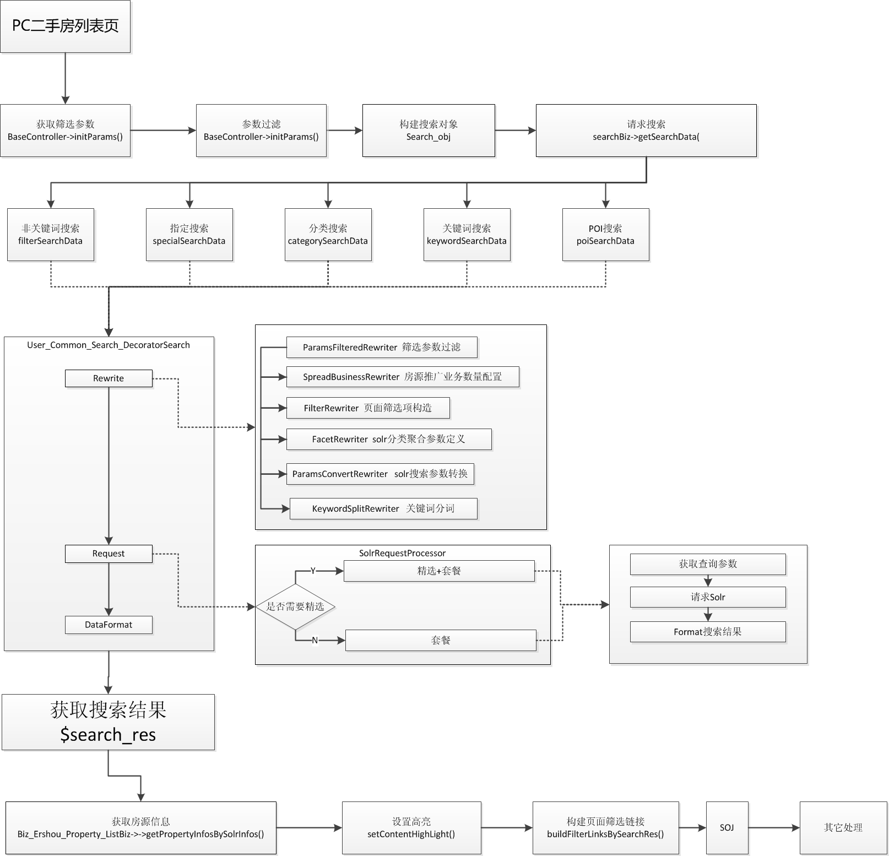
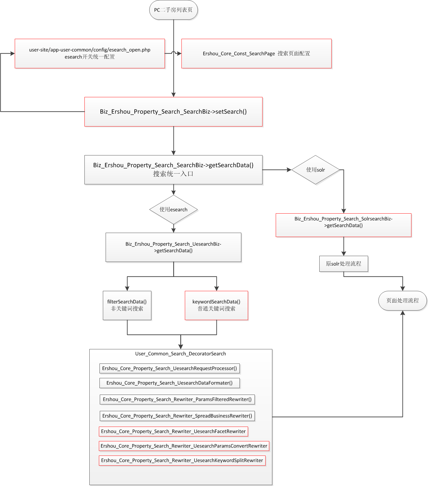

# Esearch搜索业务接入一期

## 主要修改点
- Esearch 新增Rewrite规则
- 搜索引擎开关配置
- 普通关键词搜索接入（esearch）
- 精选房源搜索接入(esearch参数处理)
- 房源信息获取优化（批量获取，经纪人隔离接入）

## 应用业务
- PC二手房列表页

## PC二手房列表页搜索流程

## 新的搜索流程

> 红色标注部分为新增

## 新增文件
名称 | 类型  | 描述
--- | --- | ---
esearch_open.php | config | Esearch配置的公共文件
Ershou_Core_Const_SearchPage | const | 搜索页面标识
Biz_Ershou_Property_Search_SolrsearchBiz | biz | 原Biz_Ershou_Property_Search_SearchBiz重命名
Biz_Ershou_Property_Search_SearchBiz | biz | 二手房搜索业务统一入口
Ershou_Core_Property_Search_Rewriter_UesearchFacetRewriter | rewrite | esearch聚合规则重写
Ershou_Core_Property_Search_Rewriter_UesearchParamsConvertRewriter | rewrite | esearch查询参数重写
Ershou_Core_Property_Search_Rewriter_UesearchKeywordSplitRewriter | rewrite | esearch分词重写
