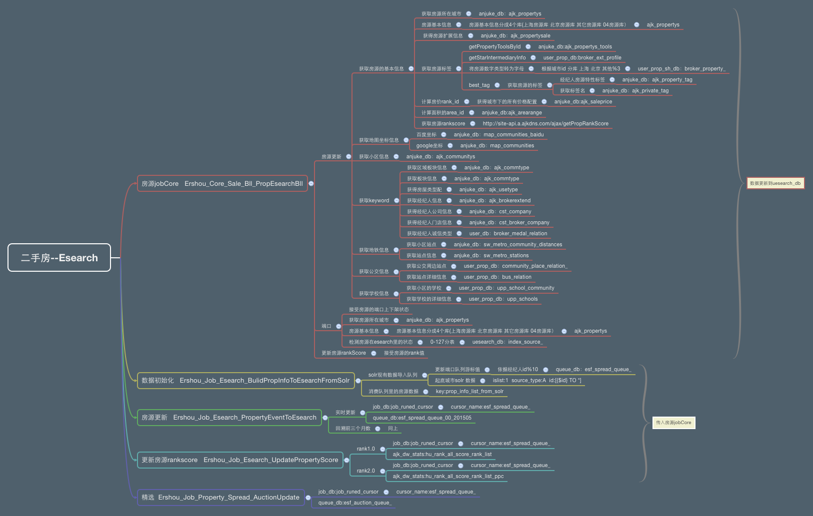

## 二手房房源导入Esearch方案
        目前房源搜索采用的是solr，随着房源体量的增加,solr已不能很好支持，因此切换到WUBA搜索架构

## 导入的房源类别与实施策略
* 五八房源
        直接从五八流水表导入
* 经纪人房源

        1. 将现有solr里在线房源导入到esarch ，记录最大的游标，从游标的位置,开始实时端口的上下架

        2. 房源的发布和更新，从现有的房源通知里介入
        
        3. 端口房源实时上架
        
        3. 精选房源实时下架
        
        4. 每日更新房源rankScore

## job地址
* [在线房源从solr导入esearch](http://drone.corp.anjuke.com/scheduler/job/383/view)
* [实时端口房源上下架](http://drone.corp.anjuke.com/daemon/job?keyword=%E5%AE%9E%E6%97%B6%E7%AB%AF%E5%8F%A3%E6%88%BF%E6%BA%90%E4%B8%8A%E4%B8%8B%E6%9E%B6)
* [经纪人发房或信息更新写入esearch](http://drone.corp.anjuke.com/daemon/job?keyword=%E7%BB%8F%E7%BA%AA%E4%BA%BA%E5%8F%91%E6%88%BF%E6%88%96%E4%BF%A1%E6%81%AF)
* [58实时房源信息写入esearch](http://drone.corp.anjuke.com/daemon/job?keyword=58%E5%AE%9E%E6%97%B6%E6%88%BF%E6%BA%90%E4%BF%A1%E6%81%AF%E5%86%99)
* [精选写入esearch索引源](http://drone.corp.anjuke.com/daemon/job?keyword=%E7%B2%BE%E9%80%89%E5%86%99%E5%85%A5esearch%E7%B4%A2%E5%BC%95%E6%BA%90)
        
* job内部结构

    
    
## 资源配置
*  redis   
    esearch host:10.249.7.17 port:11211 
   DB
    uesearch_db host:10.20.3.80 user:anjuke_triger passwd:anjuke_triger
  
## 监控日志

        更新异常的信息
        no_success_add_to_esearch
        2015-09-01 00:00:01|pro_id:334429305|ret:a:3:{s:4:"code";s:3:"201";s:3:"msg";s:10:"no comm_id";s:5:"datas";a:0:{}}|params:a:3:{i:0;s:9:"334429305";i:1;s:5:"event";i:2;a:3:{s:7:"city_id";i:11;s:4:"flag";i:1;s:12:"extend_field";s:12:"{'type':'1'}";}}
        下线房源的信息
        prop_down_info
        2015-09-01 05:31:49|info_id289005532172206918|talbe_nameindex_source_070single_dataO:38:"User_Common_Uesearch_Model_IndexSourc
        

    
