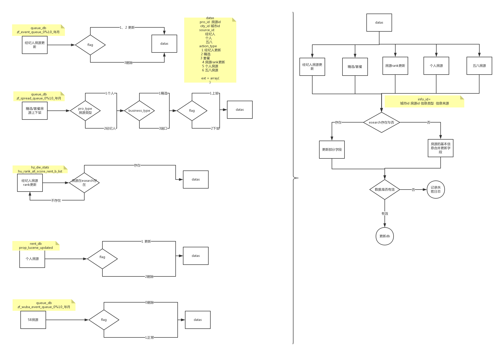

# 租房数据写入esearch流程

## 房源类型

* 经纪人房源
    * 套餐 
    * 精选
* 个人房源
* 58房源

## 流程图

## 功能设计&数据分析
* 经纪人房源更新
    * 数据源
        * db:   queue_db
        * table:    zf_event_queue_0%10_年月
        * 分表策略: 0%10_年月
    * 数据量
        * 参考数据源：zf_event_queue_08_201508
        * 单表记录数：68万/月 2.3万/日    0.26/秒  
        * 总量： 680万/月 23万/日 2.6/秒
    * 实施方案
        *  针对各分表独立处理 
        *  按id升序轮询分表
        *  游标策略 分表名
* 经纪人端口、精选房源上下架
    * 数据源
        *  db: queue_db
        *  talbe:  zf_spread_queue_0%10_年月
        *  分表策略：0%10_年月
    * 数据量
        * 参考数据源:   zf_spread_queue_08_201508
        * 单表记录数：  1.8千万/月  61万/日 7/秒
        * 总量: 1.8亿/月 610万/日 70/秒
    *  实施方案 
        *  针对各分表独立处理 
        *  按id升序轮询分表
        *  游标策略： 分表名 
*  经纪人房源rank更新
    *  数据源
        *  db:  hz_dw_stats
        *  table: hu_rank_all_score_rent_b_list
    * 数据量
        * 参考数据源: hu_rank_all_score_rent_b_list
        * 记录数： 105万  12/秒
    * 实施方案
        * 按pro_id升序轮询分表 
        * 游标策略： 每天游标归零 游标名：表名
* 个人房源上下架
    *  数据源
        * db: rent_db
        * table: prop_lucene_updated
    * 数据量
        * 参考数据源： prop_lucene_updated
        * 归档天数: 15
        * 记录数： 101万/月 16.7万/日 0.77/秒
    * 实施方案
        *   按id升序轮询表
        *   游标策略 表名
* 58房源
    * 数据源
        * db: queue_db
        * table: zf_wuba_event_queue_0%10_年月
        * 分表策略 ：0%10_年月
    * 数据量
        * 参考数据源: zf_wuba_event_queue_08_201508
        * 分表数据量： 684万/月 23万/日 2.6/秒
        * 总量： 6.84千万/月 230万/日 26/秒
    * 实施方案
        *  针对各分表独立处理 
        *  按id升序轮询分表
        *  游标策略： 分表名
       
## 表结构

| 序号 | uesearch | solr | 注释 |
|:---:|:---:|:---:|:---:|
| 1 | id | id |
| 2 | info_id | info_id | //二手房 1;//租房 2; |
| 3 | info_type | info_type |
| 4 | info_source | info_source | //来源经纪人
const SOURCE_ID_BROKER = 1;
//来源个个
const SOURCE_ID_PERSONAL = 2;
//来源58
const SOURCE_ID_WUBA = 3;

//租房58经纪人房源
const WUBA_BROKER_PROP_SOURCE_TYPE = 16;
//租房58个人认证人审房源
const WUBA_LANDLORD_HAND_REAL_SOURCE_TYPE = 17;
//租房个人认证机审房源
const WUBA_LANDLORD_MACHINE_REAL_SOURCE_TYPE = 18;
//租房58个人未认证房源
const WUBA_LANDLORD_NOT_REAL_SOURCE_TYPE = 19;
//租房58抓取房源
const WUBA_CRAWLER_SOURCE_TYPE = 20;
 |
| 5 | city_id | city_id |
| 6 | owner_id | broker_id |
| 7 | community_id | commid |
| 8 | use_type | usetype |
| 9 | build_year |
| 10 | district_ids | area_id |
| 11 | block_id |
| 12 | area_num | square |
| 13 | unit_price |
| 14 | total_price | price |
| 15 | room_num | room_num |
| 16 | hall_num | hall_num |
| 17 | toilet_num | toilet_num |
| 18 | fitment_id | fitment_id |
| 19 | floor | floor |
| 20 | floor_num | floor_total |
| 21 | state |
| 22 | post_time | creation_time |
| 23 | update_time | updated_date |
| 24 | area_id |
| 25 | price_id |
| 26 | is_list | islist |
| 27 | hp_start_time |
| 28 | hp_end_time |
| 29 | hp_ratio | hp_ratio |
| 30 | hp_ratio2 |
| 31 | best_tags | solr_tags.deployment |
| 32 | keywords | area_string |
| 33 | block_string |
| 34 | broker_name |
| 35 | mobile |
| 36 | housetype_str |
| 37 | bus_ids |
| 38 | school_ids |
| 39 | school_tags |
| 40 | school_names |
| 41 | metro_ids | metro_ids |
| 42 | metro_station_ids | metro_station_ids |
| 43 | metro_distance | metro_distance |
| 44 | metro_line_distance | metro_line_distance |
| 45 | metro_station_distance | metro_station_distance |
| 46 | tags | is_shared solr_tags.sharesex solr_tags.towards | 是否合租  'sharesex'  => array(
    0 => 'E000', // 男女不限
    1 => 'E001', // 仅限男
    2 => 'E002'  // 仅限女
),|
| 47 | rank_level | rank_type |
| 48 | rank_sub_level | rank_type_24 |
| 49 | rank_score | rank_score |
| 50 | rank_score2 |
| 51 | blat | blat |
| 52 | blng | blng |
| 53 | glat | glat |
| 54 | glng | glng |
| 55 | company_id | company_id |
| 56 | store_id | store_id |
| 57 | retrive_text | title |
| 58 | address |
| 59 | community_name |
| 60 | extend |
| 61 | auction_type | is_hp |
| 62 | orientation | orientation | 'towards'    => array(
    1 => 'F001',//"东",
    2 => 'F002',//"南",
    3 => 'F003',//"西",
    4 => 'F004',//"北",
    5 => 'F005',//"南北",
    6 => 'F006',//"东西",
    7 => 'F007',//"东南",
    8 => 'F008',//"西南",
    9 => 'F009',//"东北",
    10=> 'F010',//"西北",
    11=> 'F011'//"不知道朝向"
), |

## 任务分解
* 基本数据准备
    * 经纪人基本信息准备
    * 五八房源基本信息准备
* 业务实现
	* 房源更新
	* 上下架
	* 个人房源
	* 五八房源
	* 房源rank 	
	    
## 租房esearch 对应job

  * [租房房源更新](http://drone.corp.anjuke.com/daemon/job?keyword=%E7%A7%9F%E6%88%BF%E6%88%BF%E6%BA%90%E6%9B%B4%E6%96%B0)

  * [租房房源上下架写入esearch](http://drone.corp.anjuke.com/daemon/job?keyword=%E7%A7%9F%E6%88%BF%E6%88%BF%E6%BA%90%E4%B8%8A%E4%B8%8B%E6%9E%B6%E5%86%99%E5%85%A5)

  * [租房个人房源上下架](http://drone.corp.anjuke.com/daemon/job/307/view?droneList=&droneList=anlife&droneList=app-%28qa%7Cseo%29-job&droneList=app-%28zu%7Csp%29-job&droneList=app-%28zu%7Csp%29-job-2&droneList=app-%28zu%7Csp%29-job-test&droneList=app-58anjuke-job&droneList=app-cookie-job&droneList=app-ershou-job&droneList=app-hz-job%5Bnew%5D&droneList=user-site&subscribe=true)

  * [租房58房源写入esearch](http://drone.corp.anjuke.com/daemon/job?keyword=%E7%A7%9F%E6%88%BF58%E6%88%BF%E6%BA%90%E5%86%99%E5%85%A5)

  * [租房落地城市rank更新](http://drone.corp.anjuke.com/scheduler/job/448/view?droneList=anlife&droneList=app-%28qa%7Cseo%29-job&droneList=app-%28zu%7Csp%29-job&droneList=app-%28zu%7Csp%29-job-2&droneList=app-%28zu%7Csp%29-job-test&droneList=app-58anjuke-job&droneList=app-cookie-job&droneList=app-ershou-job&droneList=app-hz-job%5Bnew%5D&droneList=user-site&subscribe=true)

  * [租房电销城市rank更新](http://drone.corp.anjuke.com/scheduler/job/449/view)
  
## 问题

* 租房房源的归档接入esearch
* 房源的部分字段变化未通知更新队列，如经纪人手机号码变化 涉及到的房源理论都要更新
* 房源的rank规则
* 数据修复机制

