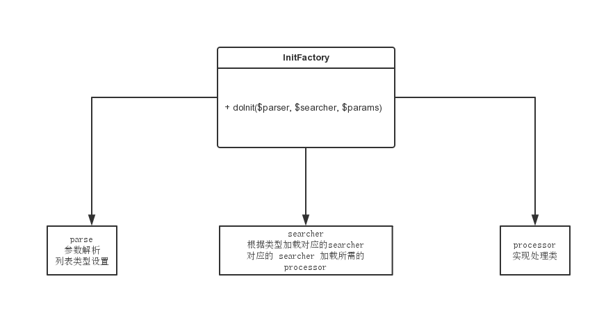

# Touch 大业主专区列表页详细设计

## Question
* 地铁线路表 display_order 值无人维护  需要自己代码手动排序
* solr 字段 plan_type 计划类型 不知道这个字段的具体含义 只知道需 -play_type:2
I
## url 规则

* http://m.anjuke.com/sh/rent-dyz/区域-板块||m地铁线路ID-站点ID/a价格_价格-b1(户型)-租赁类型(0不限1整租2合租)-装修(0不限1毛坯2普通装修3精装修4豪华装修)-f(来源 0不限 4个人1经纪人)

## route 配置

```php
<?php
$config['mappings']['User_Touch_Zufang_Rent_List_ListController'] = array(
    '^/[a-z]+/rent-dyzfy.*', 
);
?>
```

## LB 修改

* /[a-z]+/rent-dyzfy 的请求转发至PHP服务器

## 头部

* title 品牌公寓专区
* 返回 有refer则已refer为准 无则租房首页

## 筛选项
* 交互规则  选中区域 出现版块(不限) 地铁隐藏(不可使用地铁筛选)
* 选中地铁线路 出现对应的地铁站点  区域/板块隐藏(不可使用区域板块筛选)
* 选中的筛选项需置前

### 区域

* 数据来源 rent_db.area  3307 dsn rent_master rent_slave
* 查询条件 array("where" => array("cityid" => $city_id, "parentid" => 0, "typeflag" => 1))
* area_id 使用的是 id

```php
//database config
$config['master'] = array (
    'dsn'=>'mysql:host=10.20.3.80;port=3307;dbname=rent_db',
    'username' => 'anjuke_triger',
    'password' => 'anjuke_triger',
    'init_attributes' => array(),
    'init_statements' => array('SET CHARACTER SET utf8','SET NAMES utf8'),
    'default_fetch_mode' => $default_fetch_mode
);
```

### 板块

* 数据来源 rent_db.area  3307 dsn rent_master rent_slave
* 查询条件 array("where" => array("parentid" => $city_area['id'], "typeflag" => 1), 'order' => 'typerank DESC')
* block_id 使用的是 id

### 地铁线路

* 数据来源 anjuke_db.sw_metros  3306 dsn slave master
* 查询条件 array("where"=>array("city_id"=>$city_id, "status"=>1), "order"=>"display_order")
* metro_id 使用的是 id

```php
//database config
$config['anjuke_slave'] = array (
    'dsn'=>'mysql:host=10.20.3.80;port=3306;dbname=anjuke_db',
    'username' => 'readonly_v2',
    'password' => 'aNjuKe9dx1Pdw',
    'init_attributes' => array(),
    'init_statements' => array('SET CHARACTER SET utf8','SET NAMES utf8'),
    'default_fetch_mode' => $default_fetch_mode
);

//地铁线路排序 新的表中 display_order 值无人维护，所以默认地铁线路排序混乱，这里重新排序           
$metros = $this->fetchList($opts);
$metro_normal = array();
foreach($metros as $k=>$metro) {
    if(false !== strpos($metro['name'], '号线')) {
        $num = str_replace('号线', '', $metro['name']);
        $metro_normal[$num] = $metro;
        unset($metros[$k]);
    }
}
if(empty($metro_normal)) {
    $metro_list = $metros;
} else {
    ksort($metro_normal);
    $metro_list = array_merge($metro_normal, $metros);
} 

```

### 地铁站点
* 数据来源 anjuke_db.sw_metro_stations  3306 dsn slave master
* 查询条件 array("metro_id" => $metro_id, "status"=>1, "order"=>"display_order DESC")
* station_id 使用的是 id

### 租金
* 数据来源 rent_db.zf_price  3307  dsn rent_master rent_slave
* 查询条件 $where = '`city_id` = ? AND `type` = ? AND `flg` = 1 ORDER BY `sort`'
* price_id 使用的是 id

### 户型
* 数据来源 读配置文件  APF::get_instance()->get_config('bedroom', 'house');

```php
// 户型
$config['bedroom'] = array(
    "1" => "一室",
    "2" => "二室",
    "3" => "三室",
    "4" => "四室",
    "5" => "五室及以上"
);
```

## 列表

* Click Url   http://m.anjuke.com/[city]/rent/[id]-[from]/?isauction=0&from=dyzzq
* 默认图 Sorl 返回的  需替换 /display/(.*)/  为/m/   display后面跟的hj/hz 含义不明
* 标题 
* 板块
* 小区名
* N室N厅
* 租赁类型 [整租/合租]
* 价格 xxx元/月
* 分页 (点击加载更多) 每页20条 大于第一页后的页面需显示 xx-xx条 
* 数据 Biz_Zufang_Rent_SublessorRentBiz::getPropertyAndImagesInfo();

## 页脚

* 使用 footer 公用组件

```php
$this->component('User_Touch_Common_Footer_Footer', array(
));
```
## 代码设计

### 类图


```php
//path app-user-touch/controller/user/touch/zufang/rent/list/List.php
class User_Touch_Zufang_Rent_List_ViewController extends User_Touch_Anjuke_AbstractAnjukeController {
    protected $initFactory;
    protected function getInitObjectMap() {
        return array(
            'User_Touch_Rent_List_InitFactory' => '',
        );
    }

    protected function handleRequestInner() {
        $params = new User_Touch_Rent_List_Dto_ListSearch();
        $this->initFactory->getInstance($params);
        return $params->page;
    }

    protected function initParams() {
        return true;
    }
    protected function checkParams() {
        return true;
    }
}

//租房列表处理类 path app-user-touch/config/zufang.php
$config['list_searcher'] = array(
    'Sublessor' => 'User_Touch_Rent_List_Searcher_ListSublessorSearcher', //大业主列表
);

//租房列表DTO path app-user-touch/classes/user/touch/rent/list/dto/ListSearch.php
class User_Touch_Rent_List_Dto_ListSearch {
    public $city_id;
    public $filter; //筛选项数据
    public $list; //列表数据
    public $page; //page 名称
    public $processor; //处理器
}

//列表页初始化Factory path app-user-touch/classes/user/touch/rent/list/InitFactory.php
class User_Touch_Rent_List_InitFactory extends Apf_BaseService {
    /* (non-PHPdoc)
     * @see Apf_BaseInit::getInitObjectMap()
     */
    public function getInitObjectMap() {
        return array(
        );
    }

    public function getInstance ($params = array()) {
        $parser = array(
            new User_Touch_Rent_List_Parser_ParseParam(),
            new User_Touch_Rent_List_Parser_ParseListType()
        );
        $searcher = APF::get_instance()->get_config('list_searcher', 'zufang');
        $this->doInit($parser, $searcher, $params);
    }

    protected function doInit ($parser, $searcher, $params) {
        foreach ($parser as $v) {
            //do parse
            $v->parse($params);
        }
        foreach ($searcher as $key => $val) {
            //do searcher
            if ($params->list_type != $key) {
                continue;
            }
            $obj = new $val();
            $obj->search($params);
        }
        foreach ($params->processor as $v) {
            //do process
            $v->process($params);
        }
    }
}

//列表页URL参数解析 path app-user-touch/classes/user/touch/rent/list/parser/ParseParam.php
class User_Touch_Rent_List_Parser_ParseParam extends Apf_BaseService {
    public function parse ($params) {
        //TO DO
    }
}

//列表页类型/获取/设置 path app-user-touch/classes/user/touch/rent/list/parser/ParseListType.php
class User_Touch_Rent_List_Parser_ParseListType extends Apf_BaseService {
    public function parse ($params) {
        $this->getListType();
    }

    protected function getListType () {
        //To DO
        return $this->setListType();
    }

    protected function setListType () {
        //To DO
        return 'Sublessor'; 
    }
}

//大业主列表专区处理类  path app-user-touch/classes/user/touch/rent/list/searcher/ListSublessorSearcher.php
class User_Touch_Rent_List_Searcher_ListSublessorSearcher extends Apf_BaseService {
    public function search ($params) {
        $params->processor = array(
            new User_Touch_Rent_List_Processor_ListSearchProcessor(),
            new User_Touch_Rent_List_Processor_ListDataFormaterProcessor(),
        );
    }
}

//获取搜索列表相关数据 path app-user-touch/classes/user/touch/rent/list/processor/ListSearchProcessor.php
class User_Touch_Rent_List_Processor_ListSearchProcessor extends Apf_BaseService {
    public function process ($params) {
        //TO DO
    }
}

//数据格式化 path app-user-touch/classes/user/touch/rent/list/processor/ListDataFormaterProcessor.php
class User_Touch_Rent_List_Processor_ListDataFormaterProcessor extends Apf_BaseService {
    public function process ($params) {
        //TO DO
    }
}


```

## 模块划分

* 框架搭建  16h --朱建军
    * 底层结构、目录结构、页面拆分、component、controller、page

* 头部    4h  --石兆媛
    * title、keywords、description、返回 

* 筛选项 20h  
    * 底层获取筛选项数据
    * 前台底层
        * url参数解析 4h
        * 参数转换为后台所对应的参数 4h
        * 筛选项数据格式化、选中的筛选项置前 4h
        * 筛选项嵌套、build url 筛选项交互逻辑 8h

* 列表项 32h

    * 底层获取列表数据  16h
        * 后台底层  16h
            * 获取筛选项数据 8h
            * 请求solr获取列表数据、筛选项聚合、结果格式化 8h

    * 前台底层 8h
        * 底层数据获取、房源数据获取、数据格式化 8h

    * 列表嵌套、已筛选的条件、分页、默认图 8h

* 自测、联调 16h

## TO DO

* 区域板块 改成读二手房的区域 板块表  统一使用 ajk_id 搜索
