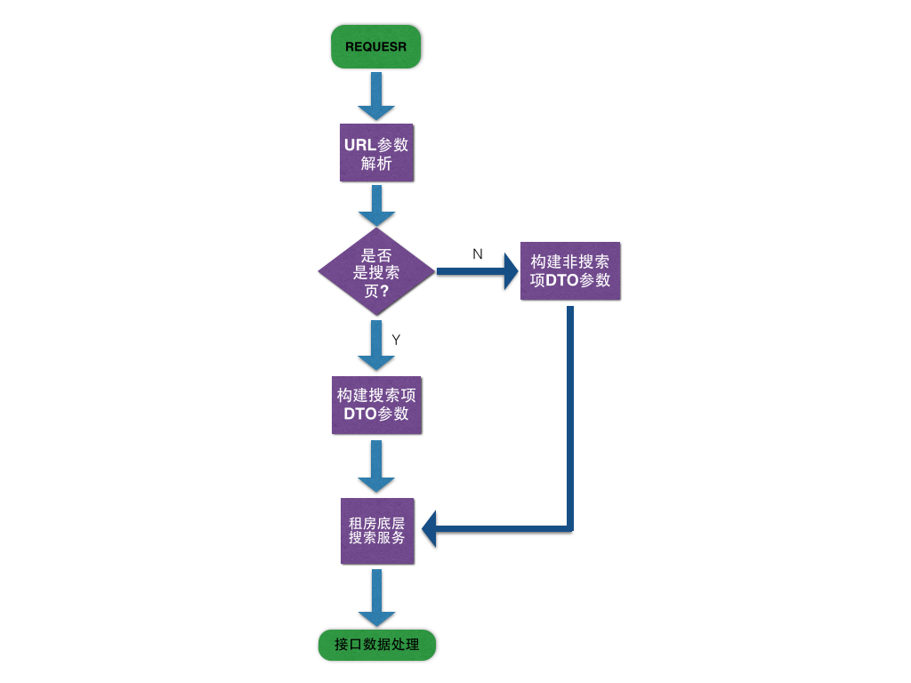
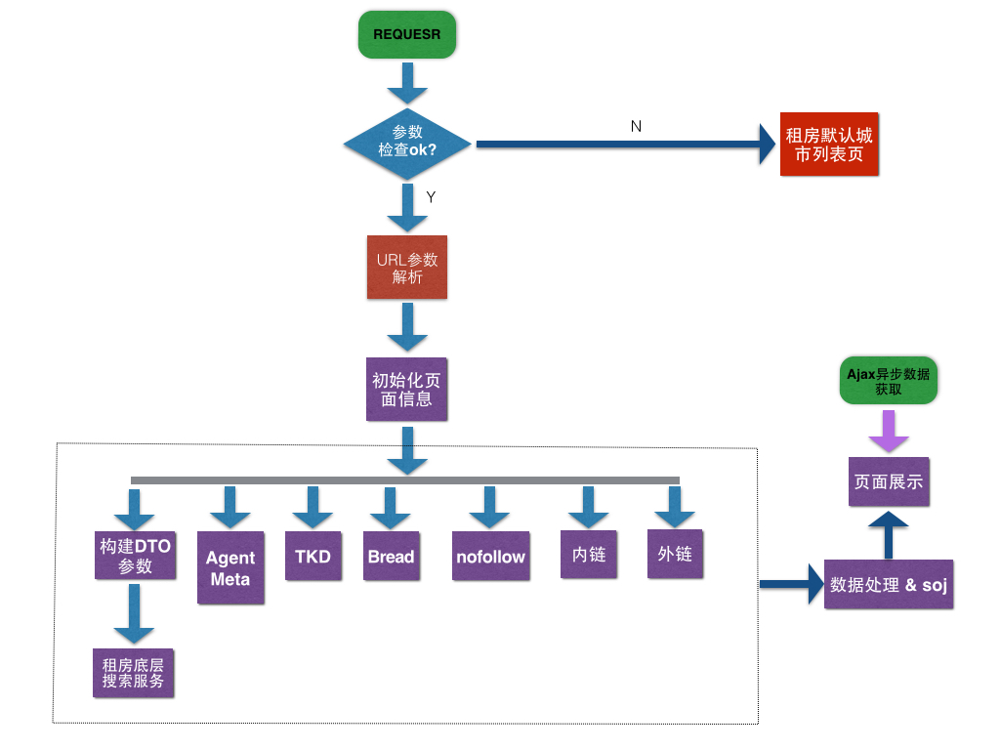

## PC租房列表页后端迁移详细设计

### 1 搜索逻辑



#### 1.0 联想词库搜索

* **API_URL:**
```
    http://www.anjuke.com/ajax/indexautocomplete

    对应后端API Controller : /anjuke-site/app-anjuke/controller/ajax/IndexAutoComplete.php
```

* **PARAMS**:
```
t:(1:二手房 2:新房 3:好租 4:金铺-租写字楼 5:金铺-买写字楼 6:金铺-租商铺 7:金铺-买商铺)
g: 是否返回相应搜索总套数 (1:返回)
c: 城市id
kw: 搜索关键词
k: 搜索关键词 (有kw参数时，不考虑k参数,只有在没有kw参数时才会使用k值)
n: 期望搜索的数量
callback: 回调函数，如$call_back = $params['callback']; $json_str = $call_back."(".$json_str.")";
```

* **RESULT**:
```
    {
        "keyword" : "世茂滨江",
        "is_contain_num" : true,
        "type" : 3,
        "list" : [
            {
                "keyword" : "xxx",
                "num" : 101,
            },
            ....
            {
                "keyword" : "xx",
                "num" : 101,
            },
        ],
        "total_info" : {
            "type" : 1,
            "num" : 100,
            "name" : "二手房",
        }
    }

    其中返回的list里的关键字已经加上<em>标签
```

#### 1.1 主控制器流程

. request -参数校验 -url解析 -信息初始化 -tkd & 内链 & 外链 & 租房房源 & act -数据格式化 -页面渲染 -ajax异步数据(广告，房源数量)



#### 1.2 搜索词流程

[请参考租房底层搜索服务搭建](http://gitlab.corp.anjuke.com/_site/docs/blob/master/DesignDoc/Fangyuan/Zufang/Search_Site_20140822/README.md)

#### 1.3 搜索类型及类组合

`PC租房列表页搜索服务与tw租房列表页搜索服务不是同一套服务，而且代码库之间不能平级调用`,

搜索业务类型 | 关键代码函数
----       | ----
非关键词搜索 | Biz_Zufang_Rent_SearchBiz->getFilterSearchData($params)
过滤敏感词  | User_Common_Sensitive_KeywordHandlerService->isSensitiveKeyword($word)
分类搜索 | Biz_Zufang_Rent_SearchBiz->getCategorySearchData($params)
普通关键词搜索 | Biz_Zufang_Rent_SearchBiz->getKeywordSearchData($params)
地标搜索 | Biz_Zufang_Rent_SearchBiz->getPoiSearchData($params)

#### 1.4 零少结果推荐

* 请参考小路同学的文档[租房零少结果推荐](http://gitlab.corp.anjuke.com/_site/docs/tree/master/DesignDoc/Recommend/PC-Rent/Recommend_List_20150201)

### 2 覆盖逻辑

* 覆盖逻辑包括大部分因业务需要影响列表展示的逻辑，他们大多独立与搜索体系之外，是为了跟精准的为用户展示房源、推荐房源或者对站内统计、SEO、外部合作等增加的逻辑。

#### 2.1 房源置顶

* [项目pmt](http://p.corp.anjuke.com/project/detail?id=27465)

* 在`默认列表页`时，如果在url传递`ajkid`参数，若此id为有效租房房源id（`安居客经纪人`、`安居客个人房源`），则将该房源显示在列表顶部，UI见PRD

* 请求举例
```
http://sh.zu.anjuke.com/fangyuan/?ajkid=41725102
```

#### 2.2 搜索列表底部推荐

. 不再推荐大业主，推荐逻辑与租房单页`猜你喜欢`相同

. 推荐加码 from = home_rent_list_rec

. [推荐API文档](http://gitlab.corp.anjuke.com/_site/docs/blob/master/DesignDoc/Recommend/PC-Rent/Recommend_View_20150226/%E7%A7%9F%E6%88%BF%E5%8D%95%E9%A1%B5%E6%8E%A8%E8%8D%90%E4%BD%8D%E6%95%B4%E7%90%86.md)

. 租房列表页`猜你喜欢`推荐接口 http://www.zu.anjuke.com/v3/ajax/listrecommend/?city_id=11&rec_type=list&num=5&guid=xxx, 线下接口地址 http://sh.yongding.zu.dev.anjuke.com/v3/ajax/listrecommend/?city_id=11&rec_type=list&num=5

参数名称 | 数据类型 | 含义 | 备注
--- | --- | --- | ---
city_id | integer | 城市id | 城市id，不能为空
num | integer | 期望条数 | 默认是5条，可不传
rec_type | string | 推荐类型 | list:租房列表页，必传参数
guid | string | user唯一标识 | js里获取guid方法"<?=APF::getInstance()->get_request()->get_guid()?>"，BI推荐依据

. 接口会返回多个推荐数据，猜你喜欢数据key = guess_like

```
{
    status: "ok",
    data: {
        guess_like: [
        {
            id: 888895735,
            title: "房源标题房源标题房源标题",
            type: 3,
            img: "http://b.pic1.ajkimg.com/display/hj/1bd0a62b76efb926ffbe8602565b45a5/240x180c.jpg",
            url: "http://sh.yongding.zu.dev.anjuke.com/fangyuan/888895735",
            room_num: 2,
            hall_num: 2,
            fitment_name: "普通装修",
            price: 1111,
            comm_name: "丽园路1弄",
            from: "home_rent_list_rec",
            is_hp: 0
        },
        {
            id: 888895396,
            title: "租房精选*房源5租房精选*房源5租房精选*房源5",
            type: 3,
            img: "http://b.pic1.ajkimg.com/display/hj/59125e9192568693f559320344be4a16/240x180c.jpg",
            url: "http://sh.yongding.zu.dev.anjuke.com/fangyuan/888895396",
            room_num: 2,
            hall_num: 2,
            fitment_name: "普通装修",
            price: 3100,
            comm_name: "好日子大家园D区",
            from: "home_rent_list_rec",
            is_hp: 1
        },
        {
            id: 888895397,
            title: "租房精选*房源6租房精选*房源6租房精选*房源",
            type: 3,
            img: "http://d.pic1.ajkimg.com/display/hj/34d8bcaad4a731199c2d130709fa3148/240x180c.jpg",
            url: "http://sh.yongding.zu.dev.anjuke.com/fangyuan/888895397",
            room_num: 3,
            hall_num: 2,
            fitment_name: "精装修",
            price: 4000,
            comm_name: "好日子大家园D区",
            from: "home_rent_list_rec",
            is_hp: 1
        },
        {
            id: 888895393,
            title: "租房精选*房源2租房精选*房源2租房精",
            type: 3,
            img: "http://b.pic1.ajkimg.com/display/hj/9c316292a0619fea874bd9b7c6c82334/240x180c.jpg",
            url: "http://sh.yongding.zu.dev.anjuke.com/fangyuan/888895393",
            room_num: 3,
            hall_num: 1,
            fitment_name: "普通装修",
            price: 3500,
            comm_name: "好日子大家园D区",
            from: "home_rent_list_rec",
            is_hp: 1
        },
        {
            id: 888895392,
            title: "租房精选*房源1租房精选*房源1租房精选*房源1",
            type: 3,
            img: "http://b.pic1.ajkimg.com/display/hj/9c316292a0619fea874bd9b7c6c82334/240x180c.jpg",
            url: "http://sh.yongding.zu.dev.anjuke.com/fangyuan/888895392",
            room_num: 2,
            hall_num: 1,
            fitment_name: "普通装修",
            price: 3200,
            comm_name: "好日子大家园D区",
            from: "home_rent_list_rec",
            is_hp: 1
        }
        ]
    }
}
```

. 接口中is_hp=1是精选房源，is_hp=0是套餐，没有注明的也是套餐，精选需要发hfilter=filterlist

#### 2.3 搜索列表房源加码

```
    无论精选还是非精选都要添加统计加码：from=Filter_{$position} , 其中 1 <= $position <= 57， `Bill的意思是可以完全参照二手房from构造规则来玩，需要产品确认`
    当房源是精选时需要添加精选加码 spread=xxx, `xxx由后端、经纪人、BI商讨后确认`
```


#### 2.4 列表页SOJ

```
p:Listing_V2_IndexPage_All
h:http://sh.zu.anjuke.com/?from=navigation
r:http://user.anjuke.com/my/login?history=aHR0cDovL3NoLnp1LmFuanVrZS5jb20vP2Zyb209bmF2aWdhdGlvbg==
site:anjuke
guid:73580990-DB05-22DA-215C-21612AC7D907
ssid:29101C48-C384-AE1A-C4EF-TFAD06242046
uid:4192887
t:1435300661092
ctid:11
luid:4192887:1
m:
pn:Listing_V2_IndexPage_All
cp:{
    "v": "2.0",
    "tradeType": "2",
    "userType": "1",
    "hpPage": "Haozu_Hp_View",
    "channel": "3",
    "entry": "1",
    "commid": "0",
    "userid": "4192887",
    "result": "1547120",
    "proids": "41725102|1453519|85|1,41743328|1790232|189916|1,41760635|2279191|27|1,41865609|1656824|305|1,41960935|2347389|162|1,42021332|1524518|1283|1,F49907258|0|5239|1,42048460|1425210|344397|1,42304189|1590096|413|1,42355782|2347060|62202|1,42377572|2017157|75015|1,42378978|2017157|75015|1,42411660|2363250|1777|1,F51922255|0|9839|1,42411458|2363250|1777|1,42458970|1982401|2500|1,42460946|1877674|650263|1,42499203|2366883|5769|1,42030833|2122129|116663|1,42168963|1772023|3761|1,F52025148|0|639347|1,42290381|2363979|0|1,42342051|1624197|16027|1,41865726|1656824|6090|1,42286981|1453900|544616|1,42243744|2004807|292026|1,42289804|2363979|217240|1,F52025157|0|5077|1,42388294|1971746|85673|1,42400234|1562325|7280|1,42012731|1939960|16554|1,41865469|1656824|305|1,41904149|1502823|3883|1,41918039|2312731|263435|1,F41811936|0|12881|1,41924029|1502823|596150|1,41909739|2122214|27|1,41899982|1467927|6302|1,41943992|1986601|7620|1,41912402|2122214|6|1,41974092|1602565|2026|1,F51930298|0|330314|1,42292745|1445048|75468|1,42276619|1716194|856|1,42235549|1624197|14255|1,42359005|1554885|378|1,42407975|1455446|1731|1,41771345|2335842|5560|1,F51932933|0|330314|1,41803921|2349998|63519|1,41896201|1529960|261051|1,41842191|2055821|4734|1,41899903|1467927|6533|1,41907203|1502823|266825|1,41910603|2122214|27|1,42011963|1939960|4959|1,42338837|2365901|4959|1"
}
```

#### 2.5 底部内链

* 本次新增一个内链模块, 按照城市维度分组

* [内链服务文档](http://gitlab.corp.anjuke.com/_site/docs/blob/master/DesignDoc/Seo/internal_links/SEO%E6%96%B0%E7%89%88%E5%86%85%E9%93%BE201504.md)

### 3 文件结构

`未使用工厂模式时代码组织如下：`

    user-site/
    ├── app-biz/classes/biz/zufang/rent/SearchBiz.php
    ├── app-zufang-core/classes/zufang/core/rent/service/FilterSearchService.php
    │                                               ├── ZeroResultHandleService.php
    │                                               ├── KeywordSearchService.php
    │                                               └── PoiSearchService.php
    └── app-zufang-web/controller/zufang/web/rent/list/List.php
                └── page/zufang/web/rent/list/List.php
                                            └── List.phtml

`PS:`

    Controller, Page, Phtml目前后端已完成，JS、Css、Component需要前端按需添加, 前端需要用到的后端数据资源时，需要提前确认，咱们尽量一次敲定数据对接格式

### 4 相关资料
* [租房列表页迁移后端第一版文档](http://gitlab.corp.anjuke.com/_site/docs/blob/master/DesignDoc/Fangyuan/Zufang/List_Rent_PC_20150623/README.md)
* [页面相关的SEO规则](Seo)

### 编辑历史

日期 | 内容
--- | ---
2015-06-29 | 文档框架搭建
2015-06-29 | 文档补充
2015-06-30 | 添加推荐api文档链接

### 租房列表页迁移前后端及BI沟通纪要

```
    2015-06-30
        ├── @前端@
            ├── 需要做成公共组件的部分
                ├── 1. 导航条
                ├── 2. 底部推荐位(猜你喜欢), Component里不要用id标识，因为一个页面可能会调用多个这样的推荐组件(租房推荐后期可能会这么做)
                ├── 3. 底部SEO内链(内链需要支持两种形式，一种是tab形式，一种是list列表形式，列表页用的是list方式，单页多数使用的是tab切换方式 http://shanghai.anjuke.com/sale/?from=navigation, http://shanghai.anjuke.com/prop/view/A302671736?from=structured_dict-saleMetro-salesxq&spread=commsearch_p&equid=201506300b01224e-91)
                ├── 4. 底部SEO外链(友情链接那块, 友链不能与内链使用同一个组件，因为一个页面一般会同时调用这两个组件)
                ├── 5. 分页组件
            ├── 页面元素开发建议顺序
                ├── 1. 区域板块筛选(前端已完成)
                ├── 2. 猜你喜欢组件
                ├── 3. 底部SEO内链组件
                ├── 4. 底部SEO友链组件
                ├── 5. 房源列表展示元素

        ├── @BI@
            ├── `猜你喜欢`推荐接口复用租房单页猜你喜欢的逻辑，不采用页面与位置方式，继续按照之前的功能逻辑来推荐，多个推荐模块需要数据去重。
```
