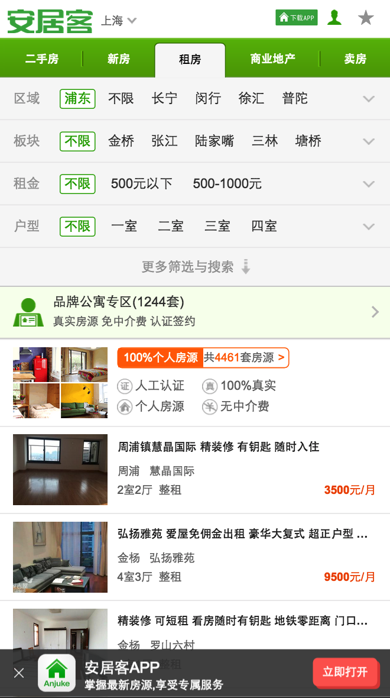
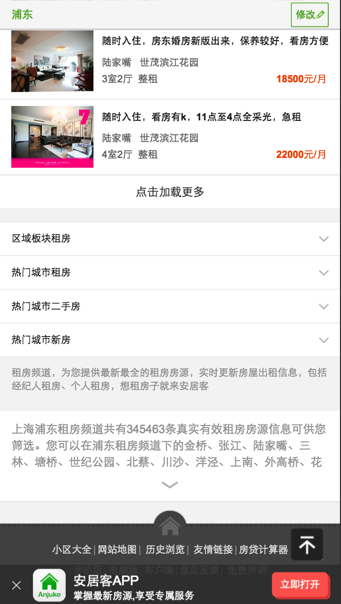
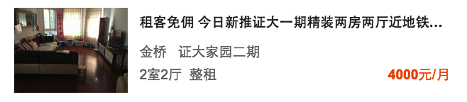
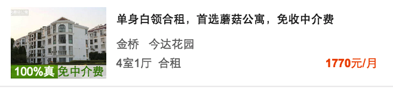
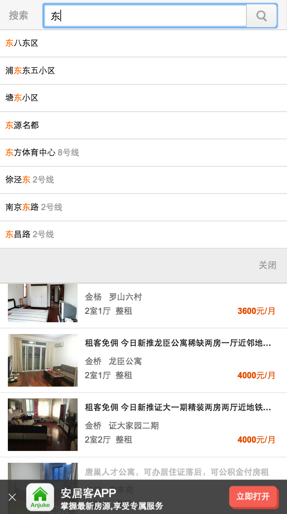
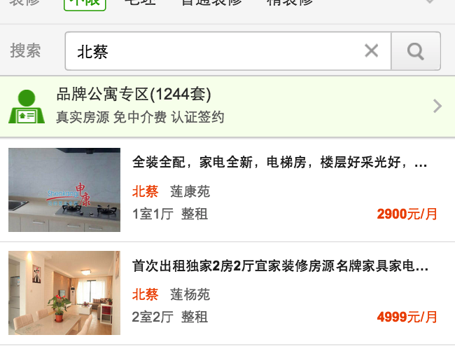
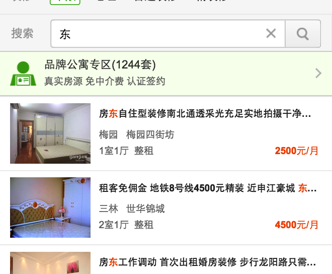

## 【TW】租房列表页改版

### 产品背景

* 目前TW租房列表页筛选所占首屏位置过多, 将近一半的位置都是筛选功能, 导致首屏最多只能显示出一套房源；
* 同时搜素功能也是找房用户最常用的功能之一, 而现在搜素输入框隐藏在筛选功能里面需要点击后才能使用, 大大提高了用户使用成本。
* 主要基于以上两点需要对TW租房列表页的筛选搜素功能做一次优化, 以提升用户体验

### 首屏功能

* logo
* 当前城市 -> 城市列表
* app下载入口
* 用户登陆入口
* 用户收藏入口
* 基本筛选区
* 更多筛选+搜索框
* 品牌公寓专区入口
* 100%个人房源入口
* 列表
* seo内链
* app浮层
* 
* 

### 房源模块

* 房源信息中按照现有逻辑及ＵＩ保持不变, 依次显示房`源默认图`、`房源标题（超出一行的以…替代）`、`板块名称（为空的时候不显示）`、`小区名称（为空的时候不显示）`、`户型`、`类型`、`租金`、`距离地标的距离（仅地标搜索时出现）`、`品牌公寓房源在房源默认图下方显示"100%真 无中介费"`
* 
* 

### 翻页

* 列表页下拉滑动后, 筛选条件始终保持置顶, 同时保持所选择的条件;
* 列表页每次加载20套房源, 当列表页下拉到最后一套房源处于可视界面的屏幕一半以上的位置时, 开始自动加载下20套房源, 加载过程中显示"。。。加载中"的效果;
* 每20套房源之间有间隔, 显示房源数量, 如"21-40条";

### 搜索模块

* 搜索框默认文字: "嗨, 你想租哪里？" ;
* 用户点击搜索后进入输入页面, 如下图, 当用户输入文字后, 出现联想词, 联想词逻辑和线上保持一致不变, 联想词最多出现8条;
    * 当用户点击联想词中某个词后立即使用选中的词进行搜索,  同时进入租房列表搜索结果页;
    * 当用户输入文字后, 输入框后端出现"X", 点击输入框后面的"搜索"或者输入法中的"搜索"后立即使用所输入的文字进行搜索, 同时进入租房列表搜索结果页;
    * 当用户点击输入框后端的"X"后立即清空输入框的内容;
    * 当用户点击标题栏的"<"返回至租房列表页, 同时保持进入搜索之前的所有状态和数据, 不记录所输入的文字;(暂不实现)
* 

### 搜索逻辑

* 每一次的搜索行为都将`清空`之前的所有 _筛选条件_ 和 _搜索条件_ , `以最新的搜索词进行搜索`;
* 搜索词词元分为以下两大类
    * 筛选词（`区域词`、`板块词`、`户型词`、`房屋类型词`、`地铁线路词`、`地铁站点词`）;
    * 普通词（`小区词`、`地址词`、`地标词`、`其他`词）;
* 当搜索词进行词元分类后仅包含了一个"筛选词", 则输出的搜索结果和选中该词进行筛选的结果保持一致;
* 当搜索词进行词元分类后包含了多个"筛选词"时, 则进行如下判断: 
    * "区域/板块"和"地铁线路/地铁站点"互斥, 保留"区域/板块";
    * "区域"和"板块"互斥, 保留**"板块"**;
    * "地铁线路"和"地铁站点"互斥, 保留**"地铁站点"**;
    * "户型"、"房屋类型"可以分别与"区域"、"板块"、"地铁线路"、"地铁站点"并存做AND关系复合搜索;
    * "户型"和"房屋类型"并存做AND关系复合搜索;
* 当搜索词进行词元分类后仅包含了一个"普通词", 则直接输出该词的搜索结果;
* 当搜索词进行词元分类后包含了多个"普通词"时, 则按照以下优先级进行结果输出: 
    * "小区词" > "地址词"> "地标词"> "其他词",
    * 即当搜索词中有命中小区词的, 则直接输出该小区的所有房源, 不用再匹配其他词, 以此类推;
* 当搜索词进行词元分类后同时包含了"筛选词"和"普通词", 则进行如下判断: 
    * 普通词中的"小区/地址/地标"和筛选词中的"区域/板块/地铁线路/地铁站点"互斥, 保留普通词;
    * 普通词中的"其他"和筛选词中的"区域/板块/地铁线路/地铁站点" 并存做AND关系复合搜索;
    * 普通词和筛选词中的"户型/房屋类型"并存做AND关系复合搜索;

### UI效果举例如下: 

* 搜索命中"小区词", 高亮显示"小区名称"
    * 
* <del>搜索命中"地标词", 新增显示房源距离地标的距离, 如"距东方明珠510米"</del>
* 搜索命中"板块", 高亮显示"板块名称"
    * 
* 搜索命中"其他词", 高亮所有命中词
    * 
* 搜索后再筛选
    * 

### 筛选逻辑

* 当用户选中任意一个筛选条件后则按照选中的筛选条件显示符合条件的房源
* "位置"、"价格"、"户型"、"更多"作为and关系做组合筛选
* 筛选条件和搜索词的关系参照如下规则: 
    * 先筛选后搜索, 则清空所有筛选条件, 完全按照搜索逻辑进行结果展示
    * 先搜索后筛选, 则保留搜索结果, 在现有的搜索结果中进行筛选

### <del>附近房源</del>

* 当用户点击"附近"后直接为用户定位寻找附近的房源, 数据逻辑和线上保持一致（附近１公里范围内的房源按照房源Rank排序）, 清除掉之前的所有筛选和搜索条件, ＵＩ如下:
    * 页面标题为"附近房源";
    * 点击"返回"后返回前一页面, 和浏览器的返回功能一致;
    * 筛选区域去除掉"位置"筛选项, 仅保留"价格"、"户型"和"更多", 用户进行筛选操作后需保留"附近"的条件, 即在附近的所有房源中进行筛选;
    * 房源信息里面显示房源距离当前位置的距离（单位: km）, 不显示板块名称, 其余信息保持一致;

### 同小区房源

* 点击房源单页中同小区房源入口后进入小区房源列表页, 显示该小区的所有房源, 数据和显示逻辑和线上保持一致, UI交互和附近房源一致, 房源信息和普通列表页一致
    * 页面标题为"{小区名称}";
    * 点击"返回"后返回前一页面, 和浏览器的返回功能一致;
    * 筛选区域去除掉"位置"筛选项, 仅保留"价格"、"户型"和"更多", 用户进行筛选操作后需保留"小区"的条件, 即在该小区的所有房源中进行筛选;
    * 房源信息里面依次显示房源默认图、房源标题（超出一行的以…替代）、板块名称（为空的时候不显示）、小区名称（为空的时候不显示）、户型、类型、租金;
* Example [传送门](http://m.anjuke.com/sh/community/619183/rent/)
* 

### 猜你喜欢

* 点击房源单页中"查看更多房源"入口后进入猜你喜欢列表页, 显示该房源的所有推荐房源, 数据和显示逻辑和线上保持一致, 无筛选功能模块, ＵＩ如下:
    * 页面标题为"猜你喜欢";
    * 点击"返回"后返回前一页面, 和浏览器的返回功能一致;
    * 房源信息里面依次显示房源默认图、房源标题（超出一行的以…替代）、板块名称（为空的时候不显示）、小区名称（为空的时候不显示）、户型、类型、租金;
* Example [传送门](http://m.anjuke.com/sh/rent/recom/more/41741103-2)
* 

### 品牌公寓

* <del>仅适用于上海, 点击租房首页和所有列表页的"品牌公寓专区"相当于进行了更多中的"无中介费（品牌公寓）"筛选动作, 显示所有品牌公寓房源, 清除掉之前的所有其他筛选和搜索条件, 筛选项的最后显示为"品牌公寓", 且结果列表页中不再显示"品牌公寓专区"横幅入口, UI如下:</del>
 
### 零少结果(待产品确认)

* 搜索和筛选的零少结果定义和推荐逻辑都采用和现有逻辑一致不变, ＵＩ调整如下: 
    * 搜索／筛选后无结果推荐;
    * 搜索／筛选后少结果并且无推荐;
 
### 精选展示逻辑
* 精选房源: 
    * 筛选（`所有`筛选组合）: 第一页最前面5个位置, 显示5套符合对应筛选条件下的精选房源, 超过5套房源等概率随机展示5套, 
    * 搜索`小区词`: 有几套精选房源出几套, 显示顺序等概率随机展示 

### 大业主房源（仅针对上海）: 
* 筛选（所有筛选组合）:  5个位置, 在精选的位置之后插入符合对应筛选条件下的5套大业主房源, 按rank排序

## 概设

### 目标

* tw租房列表页从java平台迁移到php平台
* 使用新迁移的搜索底层，暴露问题

#### 迁移工作量

* 需要迁移的页面
    * tw列表页
        * http://m.anjuke.com/sh/rent/
        * http://m.anjuke.com/sh/rent/{区域拼音}/
        * http://m.anjuke.com/sh/rent/{区域拼音}-{版块拼音}/
        * http://m.anjuke.com/sh/rent/{区域拼音}-{版块拼音}/a{最小价格}_{最大价格}-b{室}-{整租/合租}-{装修}-f{经纪人/个人}
    * 同小区房源 (无搜索)(需要前端支持)
        * http://m.anjuke.com/sh/community/{小区id}/rent/
    * 猜你喜欢 (无搜索)(需要前端支持)
        * http://m.anjuke.com/sh/rent/recom/more/{房源id}-{租房类型}

* 