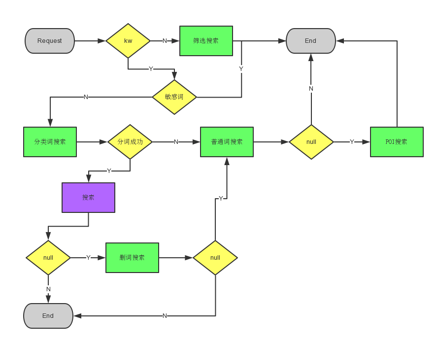
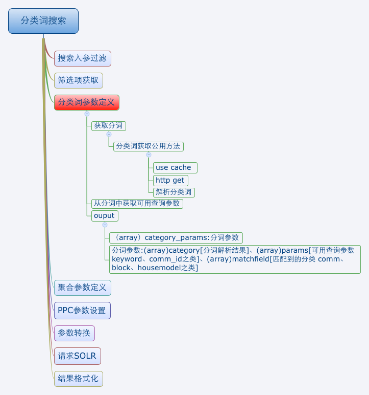
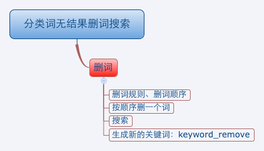
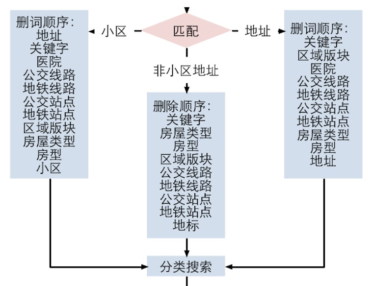

## 租房搜索设计

### 整体流程图
>


### 代码设计模式图
>


### 普通关键词搜索Service [Zufang_Core_Rent_Service_KeywordSearchService]
>


### 地标词搜索Service [Zufang_Core_Rent_Service_PoiSearchService]
>


### 分类词搜索Service [Zufang_Core_Rent_Service_CategorySearchService]
>


* 关键词冲突时的取舍


### 筛选搜索Service [Zufang_Core_Rent_Service_FilterSearchService]
>


### 分类词无结果删词Service [Zufang_Core_Rent_Service_ZeroResultHandleService]
>


* 删词逻辑



## 竞价定价显示
>
Zufang_Core_Rent_Search_PpcRewriter // 设置竞价定价参数
* 默认列表  只展示定价
* 命中小区时 有多少竟价展示多少
* 有关键词 并且是第一页 展示15套竟价
* 筛选列表  并且是第一页 展示5套竟价

### 权重
>

* 关键词是数值时的权重   id^100 area_string^10 block_string^10 title^10 address^15 mobile^10 community_name^20
* 其它时的权重  area_string^10 block_string^10 title^10 housetype_str^20 address^15 complex_info^10 broker_name^10 community_name^20
### 使用示例

* 详见 Zufang_Core_Rent_Biz_SearchBizTest

### 入参说明 详见 Zufang_Core_Rent_Dto_ListingSearch
| FIELD    | 类型 | 可否为空 | 注释 | 
| :------:  | :-------:  |  :-------:  |  :-------:  |
| city_id | int | N | 城市ID |
| keyword | string | Y | 关键词 |
| filter_params | array | Y | 筛选条件 详见 filter_params 说明  |
| retrieve_params | array | Y | 参加聚合的检索条件 详见 retrieve_params 说明  |
| no_facet | bool | Y | 是否不聚合 默认false 参加聚合 |
| sort | array | Y | 排序 如按价格排序之类 详见sort说明 |
| from_type | string | Y | 房源类型 landlord:个人  broker:经纪人  sublessor:大业主 |
| rows | int | N | 条数 |
| page | int | N | 页码 |
| debug | bool | Y | debug solr request url 前台调用无需传递 |

### filter_params 支持的筛选参数  注 该属性里的参数不参加聚合  
| FIELD    | 类型 | 注释 | 
| :------:  | :-------:  |  :-------:  | 
| area_id | int OR array | 区域ID |
| block_id | int OR array | 板块ID |
| area_pinyin | string | 区域拼音 |
| block_pinyin | string | 板块拼音 |
| metro_id | int OR array | 地铁线路ID |
| metro_station_id | int OR array | 地铁站点ID |
| price | array | 价格  array('lower' => 1000, 'upper' => 1500) |
| usetype | int OR array | 房屋类型 公寓 老公房 值需加10000 如10001 |
| fitment_id | int OR array | 装修类型ID |
| is_shared | int OR array | 0 整租 1 合租 |
| room_num | int OR array | 户型 1室:1 |
| from | int OR array | 来源 13:大业主 最好使用from_type代替 详见from_type说明 |
| commid | int OR array | 小区ID |
| companyid | int OR array | 公司ID |

### retrieve_params 检索参数  该属性的参数参加聚合  

* 参数同 filter_params  
* 区别是 该属性的参数参加聚合
* 如小区列表页  使用 commid 做聚合条件 如果放在filter_params 中是不参加聚合的  

### sort 支持的排序条件 
    * created up  // 发布时间由旧到新
    * created down  // 发布时间由新到旧
    * area up  // 面积由小到大
    * area down // 面积由大到小
    * price up // 价格由低到高
    * price down // 价格由高到低

### 支持的筛选项
    * 区域
    * 板块
    * 地铁线路
    * 地铁站点
    * 价格
    * 户型
    * 房屋类型
    * 装修
    * 租赁类型
    * 来源类型(个人 经纪人 大业主)

    ```

    * 增加筛选项方法
    1. Zufang_Core_Rent_Const_SearchParams 增加solr参数常量定义 不然入参时会被 入参过滤掉 如 const METRO_ID = 'metro_id'
    2. Zufang_Core_Rent_Dto_ListingSearchFilterFields 添加一个属性 如 public $region_list; 即给筛选项命名
    3. Zufang_Core_Rent_Search_FilterRewriter  筛选项组件中 增加一个实现的组件 如 Zufang_Core_Rent_Search_AreaFilterRewriter
    4. 注意实现的组件顺序需与 Zufang_Core_Rent_Dto_ListingSearchFilterFields 中顺序保持一致 反射需要保持顺序一致
    5. Zufang_Core_Rent_Search_FacetRewriter 聚合组件中 增加该筛选项的 聚合实现组件 如 Zufang_Core_Rent_Search_BlockFacetRewriter

    ```

## output
>
| FIELD    | 类型 | 注释 | 
| :------:  | :-------:  |  :-------:  | 
| page | array | 分页信息 详见page参数说明 |
| list | array | 数据结果集 |
| filters | object | 筛选项 详见 Zufang_Core_Rent_Dto_ListingSearchFilterFields  注：为了保持聚合与非聚合的数据格式统一 所以num为-1时代表不聚合|
| is_facet | int | 是否是聚合查询 0否 1是 |
| type | string | 搜索类型  filter:筛选 category:分类词 category_remove:删词 normal_keyword:普通关键词搜索 normal_poi:地标 |

## page参数说明
>
| FIELD    | 类型 | 注释 | 
| :------:  | :-------:  |  :-------:  | 
| pagenum | int | 页码 |
| pagesize | int | 条数 |
| totalnum | int | 搜索到的符合条件的总条数 |
| hptotal | int | 页面竟价展示条数 |
| ptotal | int | 页面套餐展示条数 |
