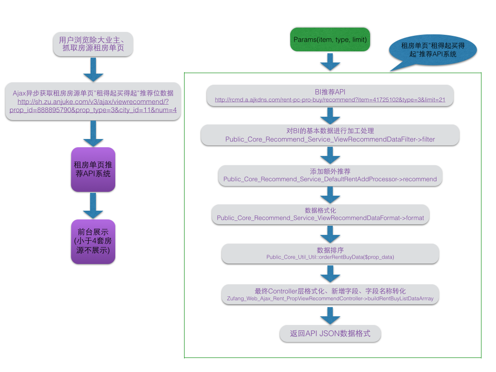

# *租房单页买得起租得起租房单页推荐*
## 1. 项目简介

* [项目PRD](http://p.corp.anjuke.com/project/detail?id=27822)
* [项目有Deploy分支](http://deploy.corp.anjuke.com/project/detail/5404/)

. 为了更有效的将租房流量转化为二手房流量，加强从租房到二手房的转化，在租房单页上增加“租得起买得起”的二手房推荐

. 当前网站流量租房流量较高（月均180万vppv）。

. 58 pc端通过租房单页上“租得起买得起”到达安居客的用户数量（4.24~4.30）日均为9554。

. 当前租房单页vppv整体180万，假设点击率为3%，带来二手房vppv为5.4w。

. pc端为55w，带来二手房为1.65万。

. 涉及的页面有个人、经济人、58个人、58经纪人租房单页

## 2. “租得起买得起”推荐二手房单页数据逻辑及展示要求
```
<1> 月供 = X*0.005 (X是二手房总价格)。

<2> 取当前租房房源单页所在板块的二手房房源单页，取4条月供最低的房源，取的房源数不够4条，则余下的几条从对应的区域中获取，区域再取不够则从该城市取余下的房源。

<3> 以上步骤获取的二手房房源套数如果还不够4套，那么就不展示该推荐模块；如果套数够4套，则优先展示精选房源，再展示非精选房源，精选发扣费及soj统计，非精选发soj统计曝光；
    精选房源内部按照月供从低到高排序，费精选内部也按照从低到高排序。

<4> 推荐的二手房房源加码from=zufang_page_rec_zdqmdq

    扣费entry=singlezu,即spread=singlezu标示精选扣费，spread=singlezu_p标示竞价

    完整的url示例:
                http://shanghai.anjuke.com/prop/view/A268466238?from=zufang_page_rec_zdqmdq&spread=singlezu_p(费精选)
                http://shanghai.anjuke.com/prop/view/A268466239?from=zufang_page_rec_zdqmdq&spread=singlezu(精选)
```

## 3. 数据处理流程

####  .*BI API数据*
```
<1> BI提供API:

    [接口文档gitlab地址](http://gitlab.corp.anjuke.com/_microdata/recommend-api-doc/blob/master/rent-pc-pro-buy.md)

    线上API:http://rcmd.a.ajkdns.com/rent-pc-pro-buy/recommend,

    pg环境API: http://xapp20-076.i.ajkdns.com:8080/rent-pc-pro-buy/recommend,

<2> API参数
    item:租房房源id

    type:租房类型
        0  个人房源
        3  经纪人房源
        13 大业主房源
        16 58经纪人房源
        17 58个人认证人审房源
        18 58个人认证机审房源
        19 58个人未认证房源
        20 58抓取房源

    limit:待获取的房源套数

<3> API结果
    [{
      "pro_id": 284589163,
      "pro_type": 1,
      "sim_score": 0.0
    }, ...]

    pro_id:二手房房源id

    pro_type:二手房房源类型
        1 安居客经纪人
        3 安居客抓取
        5 58经纪人房源
        6 58抓取房源

    sim_score:相似度
```

#### 获取二手房房源数据并以接口形式返回

```
<1> API地址：
        http://sh.zu.anjuke.com/v3/ajax/viewrecommend/?prop_id=888895790&prop_type=3&city_id=11&num=4

        prop_id:租房房源id

        prop_type:租房房源类型
            0  个人房源
            3  经纪人房源
            13 大业主房源
            16 58经纪人房源
            17 58个人认证人审房源
            18 58个人认证机审房源
            19 58个人未认证房源
            20 58抓取房源

        city_id:房源所在城市id

        num:请求房源数量

<2> API返回的关于`买得起租得起`推荐数据结果格式
        rent_buy_list: [
        {
            id: "268466461",
            title: "2_20150623 11:15:51",
            type: 1,
            img: "http://a.pic1.ajkimg.com/display/anjuke/0bd90e9a69eaf66626b533008037c3ff/240x180.jpg",
            url: "http://shanghai.yongding.dev.anjuke.com/prop/view/A268466461",
            room_num: "4",
            hall_num: "1",
            price: 169,
            comm_name: "培育苑",
            fitment_name: "84平米",
            hp_type: 3,
            soj: "singlezu_p",
            from: "zufang_page_rec_zdqmdq",
            month_pay: 8450
        },
        {
            id: "169439742",
            title: "精选*房源房源",
            type: "1",
            img: "http://a.pic1.ajkimg.com/display/anjuke/dfc7478779de299db5946cbe407fa23f/240x180c.jpg",
            url: "http://shanghai.yongding.dev.anjuke.com/prop/view/A169439742",
            room_num: "1",
            hall_num: "1",
            price: 200,
            comm_name: "运旺嘉云苑",
            fitment_name: "100平米",
            hp_type: 3,
            soj: "singlezu_p",
            from: "zufang_page_rec_zdqmdq",
            month_pay: 10000
        },
        {
            id: "268465574",
            title: "瞧一瞧看一看验一验更新来瞧升级来看",
            type: "1",
            img: "http://a.pic1.ajkimg.com/display/anjuke/8dd39e311e45bcfe3d6a1c4544e2bc07/240x180c.jpg",
            url: "http://shanghai.yongding.dev.anjuke.com/prop/view/A268465574",
            room_num: "3",
            hall_num: "3",
            price: 300,
            comm_name: "龙柏七村",
            fitment_name: "100平米",
            hp_type: 3,
            soj: "singlezu_p",
            from: "zufang_page_rec_zdqmdq",
            month_pay: 15000
        }
        ]

<3> API中关于`买得起租得起`推荐数据的实现过程

    .调用过程见
        Zufang_Web_Ajax_Rent_PropViewRecommendController中调用'rent_buy_list' => $this->rentRecommendBll->getRentBuyListForPC($rec_params['prop_id'], $rec_params['num'], $rec_params),

    .扩展租房房源单页推荐接口Controller(Zufang_Web_Ajax_Rent_PropViewRecommendController)
    
    .扩展租房推荐BLL(Public_Core_Recommend_Bll_RentRecommendBll),在推荐服务中新增对象
         $this->rentBuyListRecommend = new Public_Core_Recommend_NewRecommender(
             new Public_Core_Recommend_Service_RentBuyListRecommendProcessor(),
             new Public_Core_Recommend_Service_ViewRecommendDataFilter(),
             new Public_Core_Recommend_Service_DefaultRentAddProcessor(),
             new Public_Core_Recommend_Service_ViewRecommendDataFormat()
         );
     其中
     Public_Core_Recommend_Service_RentBuyListRecommendProcessor为新增基本数据处理器，负责从BI API拿数据，
     Public_Core_Recommend_Service_ViewRecommendDataFilter为已存在二手房房源数据过滤器，其作用是对基本数据加工过滤
     Public_Core_Recommend_Service_DefaultRentAddProcessor为新增附加推荐处理器，本业务中它不会推荐任何附加补充逻辑的数据
     Public_Core_Recommend_Service_ViewRecommendDataFormat为已存在二手房房源数据格式化类

    .通过扩展租房推荐逻辑可以获取格式化后的二手房房源数据，但是格式化后的数据依然不能满足`租得起买得起`推荐业务，在Zufang_Web_Ajax_Rent_PropViewRecommendController中扩展格式化，添加soj参数、month_pay参数

<4> `租得起买得起`推荐特殊性
        . 在租房业务里推荐二手房业务，不能直接调用租房单页现有的推荐系统，因为出参不同，需要适当转化出参

        . 推荐的二手房需要发soj精选扣费

        . 在ajk个人、ajk经纪人、58个人、58经纪人租房单页都需要该推荐位，其他页面不需要，但是目前前端的JS都是混在一个文件中的，不易拆分，为了复用前端js，必须构造与租房单页其他推荐一直的数据格式json，增加了开发复杂度
```

## 4. 业务实现流程图
---


