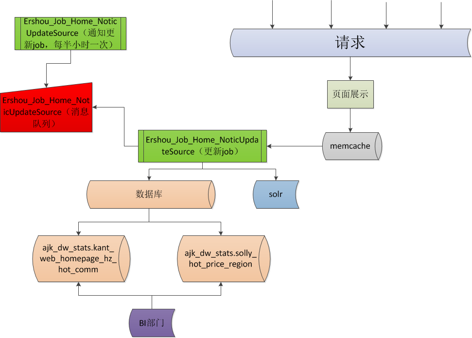

# 首页文档

## 首页的数据流向


## 首页相关的Job

### 首页各个模块
class Biz_Home_HomeModeName

{

    const MODE_NAME_INDEXSEARCH = 'indexsearch';//搜索域
    
    const MODE_NAME_TUAN = 'tuan';//新房优惠
    
    const MODE_NAME_HOTGUIDE = 'hotguide';//热门导购
    
    const MODE_NAME_HOTTRACK = 'hottrack';//热点追踪
    
    const MODE_NAME_DISCFIELD = 'discfield';//实地探盘
    
    const MODE_NAME_TREND = 'trend';//新房动态
    
    const MODE_NAME_KFT = 'kft';//看房团
    
    const MODE_NAME_LATESTOPEN = 'latestopen';//新开楼盘
    
    const MODE_NAME_FEATURELOUPAN = 'featureloupan';//特色楼盘
    
    const MODE_NAME_FOOT_F_LINK = 'foot_f_link';//合作伙伴
    
    const MODE_NAME_FOOTERSEOLINKLIST = 'footerSeoLinkList'; //小区大全
    
    const MODE_NAME_LANDLORD = 'landlord';//房东委托
    
    const MODE_NAME_QUESTION= 'question'; //问答
    
    const MODE_NAME_HAOZURANK= 'haoZuRank';//好租排行
    
    const MODE_NAME_HOTERSHOU = 'hotErShou';//二手房房源精选
    
    const MODE_NAME_HOTZUFANG = 'hotZuFang';//租房房源精选
    
    const MODE_NAME_HOTCOMMUNITY = 'hotCommunity';//二手房推荐小区
    
    const MODE_NAME_JINPU = 'jinPu';//商业地产搜索框
    
    const MODE_NAME_ERSHOU = 'erShou';//二手搜索框
    
    const MODE_NAME_XINFANG = 'xinFang';//新房搜索框
    
    const MODE_NAME_ZUFANG = 'zuFang';//租房搜索框
    
    const MODE_NAME_SUGGEST = 'strSuggest';//用户推荐搜索框
    
    const MODE_NAME_PRICE_INFO = 'price_info';// 房价
    
	const MODE_NAME_JINPU_SEARCH  = 'jinPu_search_info';//商业地产搜索框
	
	const MODE_NAME_JINPU_HOTS    = 'jinPu_hot_info';//商业地产热门推荐
	
	const MODE_NAME_SEO_EXT_INFO  = 'seo_ext_info'; // SEO扩展信息
	
	const MODE_NAME_HOT_COMMUNITY = 'seo_hot_community_info'; // SEO热门小区
	

}

### 首页数据模块分组

private $notice_model = array(

       'xinfang' => array(
       
            1 => Biz_Home_HomeModeName::MODE_NAME_INDEXSEARCH,//搜索域
            2 => Biz_Home_HomeModeName::MODE_NAME_TUAN,//新房优惠
            3 => Biz_Home_HomeModeName::MODE_NAME_HOTGUIDE,//热门导购
            4 => Biz_Home_HomeModeName::MODE_NAME_HOTTRACK,//热点追踪
            5 => Biz_Home_HomeModeName::MODE_NAME_DISCFIELD,//实地探盘
            6 => Biz_Home_HomeModeName::MODE_NAME_TREND,//新房动态
            7 => Biz_Home_HomeModeName::MODE_NAME_KFT,//看房团
            8 => Biz_Home_HomeModeName::MODE_NAME_LATESTOPEN, //新开楼盘
            9 => Biz_Home_HomeModeName::MODE_NAME_FEATURELOUPAN,//特色楼盘
           10=>  Biz_Home_HomeModeName::MODE_NAME_FOOT_F_LINK, //小区大全
         //  24 => Biz_Home_HomeModeName::MODE_NAME_LOUPANCOUNT // 新房数量
       ),

        'hot' => array(
            13 => Biz_Home_HomeModeName::MODE_NAME_QUESTION, //问答  getQuestion($city_id)
            14 => Biz_Home_HomeModeName::MODE_NAME_HAOZURANK,//好租排行 getHaoZuRank($city_id)
            15 => Biz_Home_HomeModeName::MODE_NAME_HOTERSHOU,//二手房房源精选 getHotErShou($city_id)
            16 => Biz_Home_HomeModeName::MODE_NAME_HOTZUFANG,//租房房源精选 getHotZuFang($city_id)
            17 => Biz_Home_HomeModeName::MODE_NAME_HOTCOMMUNITY,//二手房推荐小区 getHotCommunity($city_id)
        ),


        'search' => array(
            18 =>  Biz_Home_HomeModeName::MODE_NAME_JINPU,//商业地产搜索框  geJinPu($city_id)
            19 => Biz_Home_HomeModeName::MODE_NAME_ERSHOU,//二手搜索框  getErShou($city_id)
            20 => Biz_Home_HomeModeName::MODE_NAME_XINFANG,//新房搜索框 getXinFang($city_id)
            21 => Biz_Home_HomeModeName::MODE_NAME_ZUFANG,//租房搜索框  getZufang($city_id)
            22 =>  Biz_Home_HomeModeName::MODE_NAME_SUGGEST,//用户推荐搜索框  getUserSuggest($city_id)
        ),

        'seo' => array(
            11=>  Biz_Home_HomeModeName::MODE_NAME_FOOTERSEOLINKLIST, //小区大全
        ),

        'landlord' => array(
            12 => Biz_Home_HomeModeName::MODE_NAME_LANDLORD, //房东委托
        ),

        'price' => array(
            23 => Biz_Home_HomeModeName::MODE_NAME_PRICE_INFO, //房价
        ),

	    'seoextension'=>array(
		    25 => Biz_Home_HomeModeName::MODE_NAME_SEO_EXT_INFO, // 相关城市租房,相关城市二手房,特色找房
	    ),

	    'seo_hot_community'=>array(
		    26 => Biz_Home_HomeModeName::MODE_NAME_HOT_COMMUNITY, // 热门小区
	    ),

	    'jinPu_search_info'=>array(
		    27 => Biz_Home_HomeModeName::MODE_NAME_JINPU_SEARCH, //商业地产搜索框
	    ),

	    'jinPu_hot_info'=>array(
		    28 => Biz_Home_HomeModeName::MODE_NAME_JINPU_HOTS, //商业地产热门推荐
	    ),


    );


### 首页数据更新通知Job

* job名称：Ershou_Job_Home_NoticUpdateSource

* 参数：run_type　

　1.传入　xinfang　更新新房模块数据

  2.传入　other　更新首页的模块
  
  3.默认　传值时　更新首页相关的模块

* 部署：每半小时执行一次

* Cron表达式: 0 */30 * * * ? *

* 消息中间件的地址：
　　
　１.pg环境: http://xapp20-061.i.ajkdns.com/publish?

　2 .线上:　　

* 首页模块通知更新的消息结构：
{"mode_name":"erShou","city_id" :"230", "service_type":"search", "del_flag": "false"}

mode_name: 模块的名称(请看Biz_Home_HomeModeName)

city_id: 城市id

service_type: 服务的类型(请看$notice_model)

del_flag: 如果是删除某一模块的数据可以设置成true,更新是false.

* 首页发消息样例：

```
curl -d '{"mode_name":"erShou","city_id":"230", "service_type":"search", "del_flag":"false"}' 'http://xapp20-061.i.ajkdns.com/publish?tunnel=anjuke_home'

```

* 流程：


### 首页数据更新Job

* job名称：Ershou_Job_Home_UpdateDataSource

* 部署：实时（常驻）job

* 流程：


### 首页相关模块

#### 首页的类型

A,B,C类首页只是广告位不同，其他的功能模块没有区别

#### 搜索域

##### 热门区域-热门板块－购房预算

* 数据来源：ajk_dw_stats

#####　商业地产
 
* 热门区域：数据库表　jp_dw_stats.jp_district_vppv_sd
根据最近７天的vppv降序排列

数量：默认取10条，我们取１８条

* 热门写字楼列表：　jp_dw_stats.jp_property_district_vppv_sd

数量：　１８条　最后要4条
根据最近７天的vppv降序排列
根据地区ｉｄ（district_id）和　（house_type）筛选。


首页　二手房推荐小区
kant_web_homepage_hot_tags

租房小区排行
kant_web_homepage_hz_hot_comm

明星中介的表
数据库：broker_id_ajk
star_intermediary_score_


　 


