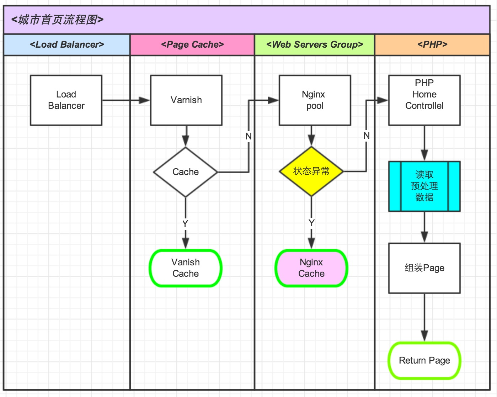

# 14版首页重构方案
版本 | 日期 | 设计 | 备注
:----------- | :-----------: | :-----------: | -----------:
v0.9   | 2014-07-23      | 李超平 | 初稿

	
## 现状 && 问题

### 	网站速度慢 250-300ms
	*	依赖新房,BI等RPC和CURL服务不稳定
	*	三网合一多处调用API
	*	请求的API数据比较多
	* 	Cache命中率低
	*	依赖数据的缓存更新和监控
### 	可控性和稳定性差
	*	数据可控性:依赖多方数据,并数据的合法性效验比较薄弱
		*	依赖新房RPC
		*	依赖BI数据源
		*	依赖运营手动配置,
			*	特别是html闭合风险,会导致首页排版乱
			*	经常会有死链接,会影响用户体验和seo权重
			*	带有Html样式,影响维护和改变
	*	系统稳定性
		*	nginx 500
		*	varnish 缓存问题
		*	单数据Cache服务的可靠性
	*	监控
		*	页面故障被动发现,主动通知策略弱
		*	日志弱并缺少分析机制
		*	报警机制
	*	广告显示问题
		*	IFX经常不出来,目前新房在解决

## 目标
### 	提高城市首页访问速度 
	公司标准200ms,期望150ms内
		原由用户触发数据源改成JOB定时触发
### 	保证城市首页系统稳定性和可控性
	
	*	稳定性99.99%
	*	增加报警,监控和日志
	*	增加异常处理机制
		* 增加**500|502**应急方案
		* 增加cache宕机应急方案
	
### 	产品内容全新改版
### 	提高代码可维护性及扩展性
	*	代码从旧框架迁移到新框架
	*	数据模块解耦化
	*	抽象模型和注册调用
	*	统一管理 Cache Key, 运营标识Code, 广告code管理(前段管理)
	*	最大量的减少API请求数量.

## 怎么做


### 后台JOB主动触发更新数据
更新机制


*	更新缓存
	*	缓存效验更严格
		*	有数据更新
		*	数据满足
		*	格式满足 
	*	大,中,小城市不同的更新机制
	*	每个服务可设置定时更新时间
	*	扩展: 通知更新cache		
*	依赖新房,BI服务的监控,日志
*	后台多套缓存机制 
*	便于扩展

### 前台展示公用service
架构图


*	统一获取cache,
*	统一监控
*	统一扩展

## 具体工作:
### job 徐建龙

*	Datasource.php //接受模块更新消息，更新模块数据源
*	NoticeUpdateSource //生成城市首页需要更新模块通知 
### service
 
#### 	搜索导购service BI提供 SearchBiz 邱维路

*	getErShou() 二手房导航
*	getXinFang() 新房导航
*	getZufang() 租房导航
*	geJinPu() 金铺导航


#### 新房相关service

*	getIndexSearchData()  //搜索域
*	getTuanData() //新房优惠
*	getHotGuideData()  //热门导购
*	getHotTrackData() //热点追踪
*	getDiscfieldData()  //实地探盘
*	getTrendData() //新房动态
*	getFeatureLoupanData() // 特色楼盘
*	getKftData() //看房团
*	getLatestOpenData()  // 最新开盘

#### 二手房|租房等推荐 BI提供	HotTagBiz 邱维路
*	getHotErShou() 二手房推荐
*	getHotZuFang() 租房推荐
*	getHotCommunity() 热门小区
*	getRentRank()	租房排行榜

#### 其他service
*	getAskForHome() 问答模块
*	getChatForHome()	微聊达人
*	getCommunityMapForHome()	小区大全
*	getFriendLinkForHome()	友情链接
*	getFangEntrust() 委托房源

### 填充数据

#### 数据封装并填充


*	20个service数据显示层封装 

#### 异步Ajax填充
* 	登录状态
	*	用户登录填充	
	*	经纪人登录填充
	*	收藏填充	
*	搜索框填充
	* 	二手房搜索框搜索填充
	*	新房
	*	租房
	*	商业地产
*	卖房表单填充

### 读取静态文件

## todolist
### DBRT
```
USE `user_prop_db`;
CREATE TABLE `cityhome_mcache` (
  `id` int(4) NOT NULL auto_increment COMMENT 'ID',
  `city_id` int(4) NOT NULL COMMENT 'city_ID',
  `module` int(4) NOT NULL COMMENT '模块',
  `mvalue` text NOT NULL COMMENT 'mvalue',
  `type` tinyint(1) NOT NULL default '0' COMMENT '待扩展',
  `update` timestamp NOT NULL default CURRENT_TIMESTAMP on update CURRENT_TIMESTAMP COMMENT '更新',
  `create` timestamp NOT NULL default '0000-00-00 00:00:00' COMMENT '创建',
  PRIMARY KEY  (`id`),
  UNIQUE KEY `uq_city_module` (`city_id`,`module`)
) ENGINE=InnoDB AUTO_INCREMENT=1 DEFAULT CHARSET=utf8 COMMENT='城市首页备用cacahe';
```

### 资源申请

#### 一台memcache 服务器
*	为什么申请?
	*	城市首页属于安居客一级业务
	*	访问量较大
	*	门面 && 广告
*	申请多大?	
	*	内存 1G 
	*	目前城市单页所需cache内容少于1M * 66个城市

### server配置
#### varnish配置
#### nginx配置
	
### JOB部署
####	拉取依赖数据更新数据
*	Datasource 部署
####	通知更新数据
*	NoticeUpdateSource 部署

### 运营配置
*	首页问答配置
*	广告运营配置

### BI相关
*	二手房小区,房源数据
*	租房推荐,租房排行榜数据推荐

### 依赖项目

#### CMS问答配置项目
*	PMT:http://p.corp.anjuke.com/project/detail?id=22473


#### 城市首页依赖api
*	PMT:http://p.corp.anjuke.com/project/detail?id=22637

## TO 前端&测试
### 性能
*	首页加载 2s
*	控制dom数
*	页面大小
*	图片加载

### 测试
*	qa监控脚本
*	城市首页广告,素材图片 
	*	img:50kb
	*	flash:80kb		


## 项目成员
人员 | 岗位 | 职责 
:----------- | :-----------: | :----------- 
李超平 | 后端开发    
徐建龙 | 后端开发     | JOB,新房service,数据填充开发
邱维路   | 后端开发     | BI相关service,开发
