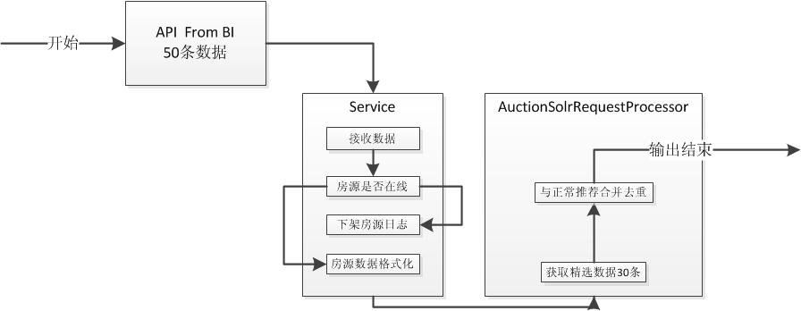

# TW二手房默认列表页推荐&个性化rank设计文档

* * *

## 背景
添加更多的精选，提高精选曝光度
> PRD   [http://p.corp.anjuke.com/file/download?id=35552](http://p.corp.anjuke.com/file/download?id=35552)

## PMT
[http://p.corp.anjuke.com/project/detail?id=28529](http://p.corp.anjuke.com/project/detail?id=28529)

## 代码仓库
- 产品线：TW
- 仓库：user-site

* * *

## 数据获取与展示方案设计

> API [http://gitlab.corp.anjuke.com/_microdata/recommend-api-doc/blob/master/sale-tw-list-jx.md](http://gitlab.corp.anjuke.com/_microdata/recommend-api-doc/blob/master/sale-tw-list-jx.md)

* * *

## 详细设计

- Ershou_Core_Sale_Service_PropRecommendService
	- getData() *获取数据统一入口* 
	- getDataFromBI() *从BI获取推荐数据* `性能监控`
	- checkData() *检查房源【API】*
	> 检查各类型房源是否下架 Ershou_Core_Property_Service_UserPropertyService->checkPropsExist()
	- addDataLog() *添加异常房源日志*
	> nlog
	- formatDataToSolr() *转化数据格式和Solr返回一致*

- 页面SOJ相关
> 推荐房源加码：from= sale_list_rec

- 页面房源获取优化
	-  列表页获取数据时经纪人信息走隔离
	- 前台增加判断，房源信息获取时增加判断不需要的属性，实现按需获取房源属性，目前已优化列表页经纪人（touch二手房列表页不需要经纪人信息）

- 性能优化方案
> 当页面因为添加房源数量过多而导致明显拖慢页面加载，可以把现有首页页面加载数据量减少至30条，推荐房源和默认房源各15条

* * *

## Todo
