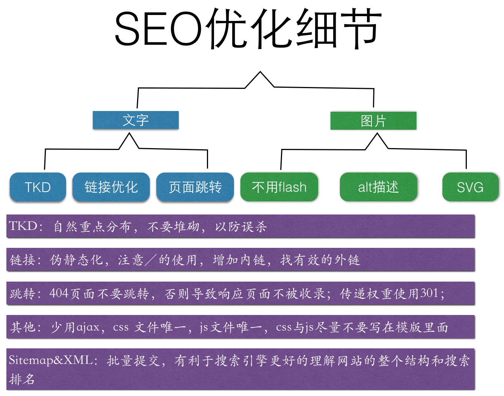

# SEO开发规范

## 何谓SEO

SEO、SEM、PPC、索引量、收录量

## SEO常见细节

## 常见SEO规范准则

内容|说明|
---|---|
关键词|  结合位置，排列组合，调查，分析竞争对手关键词，自然分布，使用－连接(针对百度)，title里不要超过5个
nofollow|    不是给spider爬去的需要nofollow
内链  |  在页面里增加相关性推荐，以提高当前页面的权重，被推荐的页面可以使用不同的相关性TKD
外链  |  找同行业比自己排名高的网站交换友链
404| 统一404页面，不要将404跳转其他页面
301 |权重传递，如将旧版房价页面权重传递到新版房价页面
带？的url|   需要做伪静态化处理，如index.php?act=msg->index/act/msg/
图片  |  带alt描述，少用flash
js&css | 作为外部引用，不要写在当前页面模版里
唯一URL| 地址要唯一，不要有两个不同的URL都能访问同一个页面
面包屑 | 最后一级不加链接，需带上地理位置
