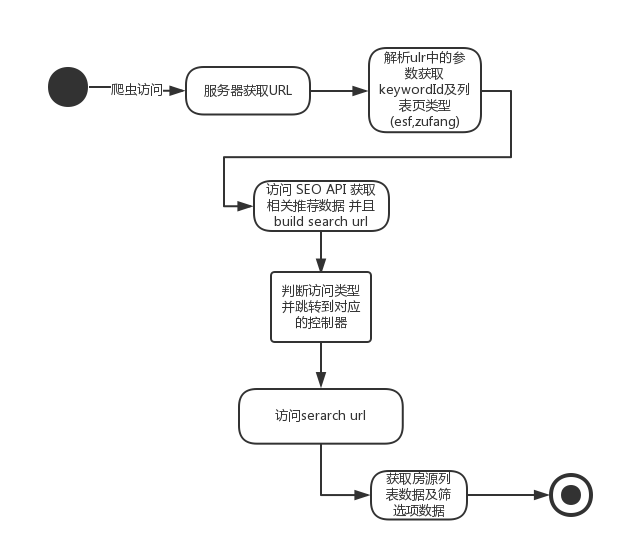
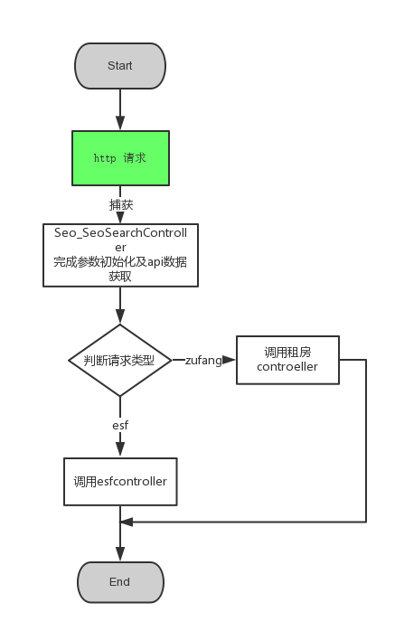
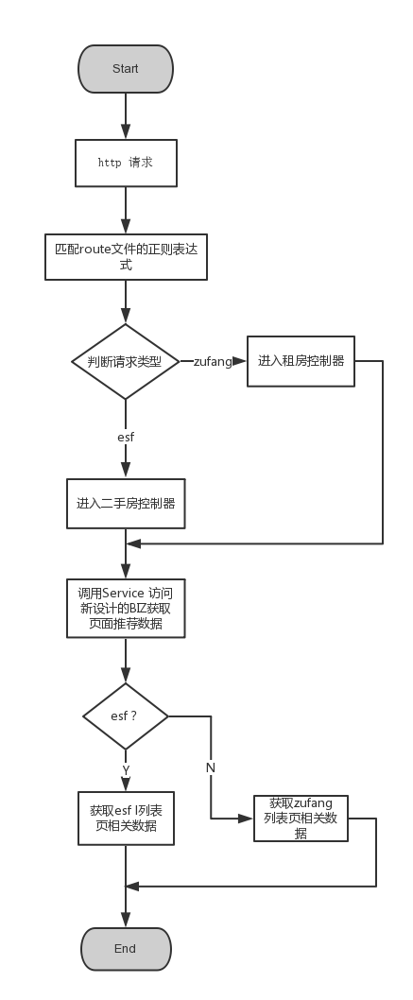
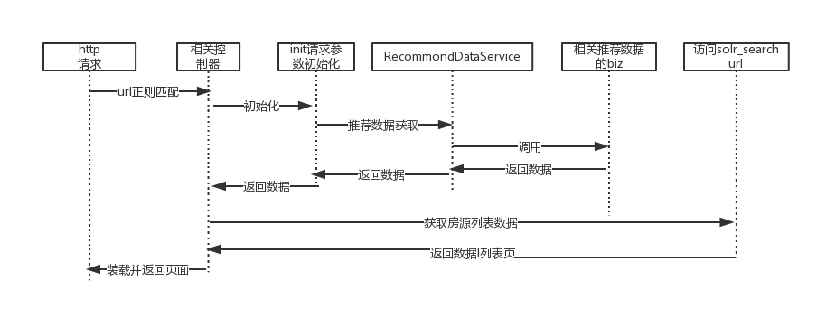

## SEO 列表页迁移

[SEO url解析][api迁移|二手房列表页]

**项目目的**迁移SEO列表页到新框架 便于后期SEO模块的维护
- **优化api请求** ：原SEO代码现存于老框架的仓库，而与SEO 相关的API代码存于新框架 ，迁移代码之后就不必通过http请求获取相关数据；
- **便于后期代码维护** ：与二手房业务相关的代码都存在于新框架中，将代码迁移到新框架中便于后期整个项目的维护；

###SEO列表页现状调研

> 当前SEO相关代码存于老仓库anjuke-site 中，数据来源分为两个部分 通过http api请求，而列表页，筛选项，数据来源于solr请求。

####与SEO列表页相关API接口

  - **/seo/api/** ：
  已在user-site中          Ershou_Web_Seo_Api_SearchApiController
  相关模块 ：面包屑 , 搜索框 , 筛选框推荐搜索数据 ;

  - **/seo/channel/api/**:
  已在user-site中        Ershou_Web_Seo_Api_SeoChannelApiController
  相关模块 ： 相关小区和房价的推荐;
  
  - **/seo/extapi/**:
   相关模块 ：网页底部推荐内链

涉及到的文件：
- **/anjuke-site/app-anjuke/controller/seo/SeoSearch.php **;
- **/anjuke-site/app-anjuke/controller/seo/EsfSearch.php **;

#### url 参数解析及数据过程
- 根据url 获取列表页类型（esf , zufang）;
- 获取url关键词 keywordId，初始化其他相关参数；
- 使用 keywordId 及 其他相关参数 请求API  获取所需数据；
- 根据 请求API返回对应的默认搜索词build 对应的二手房搜索页solr url；
- 根据SEO页面的类型调用对应的控制器；
- 访问搜索solr url 获取筛选项数据及房源列表数据；
- 将相应的数据渲染到结果页面中；

简单的流程图

###API逻辑分析及相关迁移设计
 /seo/api/  =>  Ershou_Web_Seo_Api_SearchApiController
- 数据来源 memcache : service_seo_cache_group;
 -相关dao :Ershou_Core_Seo_Dao_OnlineWordsDao(seo_online_words);
Ershou_Core_Seo_Dao_OnlineWordsExtensionDao(seo_online_words_extension);
Ershou_Core_Seo_Dao_BaseWordsDao(seo_base_words);
Ershou_Core_Seo_Dao_BaseWordsExtensionADao(seo_db.seo_base_words_extensiona);
Ershou_Core_Seo_Dao_BaseWordsExtensionBDao(seo_base_words_extensionb);

- 相关services :Ershou_Core_Seo_Service_OnlineWordsService;

services 的内聚性较高，迁移的时候直接用，对于将Ershou_Web_Seo_Api_SearchApiController改为services 
需要注意父类controller继承的方法。

/seo/channel/api/ => Ershou_Web_Seo_Api_SeoChannelApiController（@丁勇）
 相关Biz及Dao
 - Biz_Seo_SeoChannelBiz 获取seo小区相关的信息；
 - Biz_Seo_SeoUtilsBiz
 - Ershou_Core_Seo_Dao_OnlineWordsDao 

/seo/extapi/ ＝>Ershou_Web_Seo_Api_SeoExtensionApiController (@丁勇)

######API迁移
原有的api 请求模式 是因为所需数据与项目代码不同属一个仓库，因此在项目迁移之后 不适合再通过http 请求获取数据，需要重新封装biz
-  (/app-biz/seo)Biz_Seo_SeoSearchApiBiz   --- Ershou_Web_Seo_Api_SearchApiController (原有逻辑不变);
-  (/app-biz/seo)Biz_Seo_SeoChannelApiBiz --- Ershou_Web_Seo_Api_SeoChannelApiController (原有逻辑不变);
-  (/app-biz/seo)Biz_Seo_SeoExtensionApiBiz --- Ershou_Web_Seo_Api_SeoExtensionApiController(原有逻辑不变) ;

######相关services 封装

原 SEO 请求控制器奋发及处理流程图：

新设计的  SEO 请求控制器奋发及处理流程图：

针对新的设计流程图我们需要将原有在基类(Seo_SeoSearchController)中的处理api请求的部分分离成单独的services 向controller 提供数据
因此新建 
Ershou_Core_Seo_Service_RecommondDataService 负责调用biz 获取SEO推荐数据

整体设计时序图：
