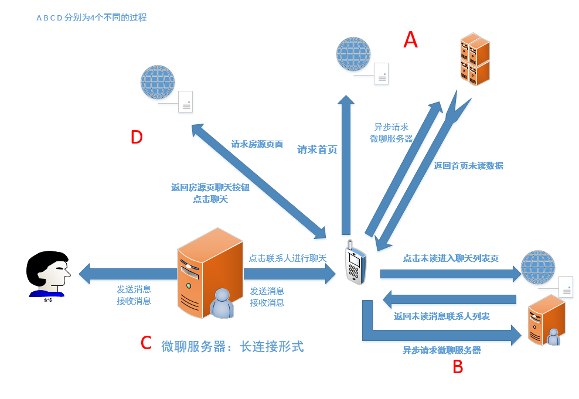
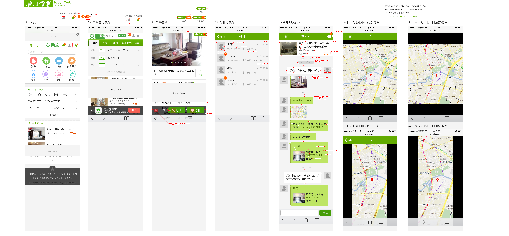

### 1. 结构图

### UI图

### 2. TW微聊设计文档

### 背景

现状：现pc、移动app端均实现了经纪人跟用户之间的在线实时聊天，tw端暂时空缺这方面的功能。

意义：1、提升转化率 2、与经纪人端的“抢客户”项目配合，达到商业目的。

路线：一期无登录，在cookie标示上做基本的沟通功能即可。

目标：3个月内达到每天1w对微聊。

### 需求细节

  > #### 入口页
  
  > [页面位置]:大首页+二手房列表页+二手房单页；
  
  > [页面元素]: **头部的图标中显示总的未读消息条数**；**该单页的经纪人如果开通了“微聊”则在下方显示“微聊”按钮，否则不显示**。
  
  > [加载时间]: 每次加载该页面时进行消息数量的读取；
  
  > [交互]: 点击头部的图标进入到联系人列表，点击“微聊”到于该经纪人的对话窗口
  
  > #### 联系人列表
  
  > [页面内容]: 显示有聊天历史的经纪人，显示项包括“经纪人头像”、“姓名”、“最近一条聊天记录”以及“最后一条聊天记录的时间”，头像上显示与该经纪人的对话中未读的消息数；
  
  > [排序]按最后一条聊天记录的时间进行倒序（默认取前20条），上拉显示更多经纪人
  
  > [交互]:点击某一经纪人的所在任一区域，进入与该经纪人的对话窗口。 
  
  > [已读消息判断]：当前聊天窗口所有接收到的消息；

  > #### 设计方案
  
  > **现有微聊接口：**
  
  > 设备拉取新消息：http://git.corp.anjuke.com/_mobileAPI/mobileApiDoc/browse/master/anjuke-chat/message/app/getNewMessages.md 
  
  > 根据设备id，tw端为cookie中的aQQ_ajkguid；
  
  > 返回为消息id为标识的消息信息及该消息附属的经纪人账户信息
  
  > 1. 统计所有返回消息数，封装，返回给前端未读消息数；
  
  > 2. 是否开通微聊，参考pc端房源页面，已有解决方案；
  
  > 3. 消息列表，交由前端来存储**未清除浏览器缓存**前提下的所有聊天消息记录，原因：微聊系统无此接口；

------

  >
  > #### 对话窗口
  
  > **需求**
  
  > [页面内容]: 
  
  > 1、房源信息：如果其前置页为单页，则代入该房源信息，否则该模块为空。
  
  > 2、2条消息间隔超过10分钟，则分开显示发送时间：今天的消息：{hh:mm}、昨天和之前的消息：{XX月XX日 hh:mm} (24小时制)。
  
  > [消息加载] 默认显示最近的20条信息，往下拉触发请求更多聊天记录，每次按聊天记录时间倒序请求20条。
  
  > [消息类型] 本地可发送的消息仅包括“文字”，可接受阅读的信息类型包括“文字”“表情”“图片”“房源卡”“地图位置”。
  
  > 1、文字和表情：文字直接显示即可，表情显示为unicode表情即可，如果消息中包括url，则url部分显示为超链样式，点击当前页面打开该地址；
  
  > 2、图片：对话窗中显示缩微图，点击显示大图；
  
  > 3、房源卡：包括二手房和租房2类，二手房房源卡样式（{房源默认图}、{小区名称}、{户型}、{房源面积}、{房源价格}），租房房源卡样式（{房源默认图}、{小区名称}、{户型}、{房源面积}、{房源价格}），点击本页面打开对应房源页面；
  
  > 4、地图：显示缩微图，点击显示大图；
  
  > 5、语音及其他类型：显示“经纪人发送了{类型} ，本页面暂不支持阅读，下载app阅读该信息”，点击进入app的下载页面（ios地址为：https://itunes.apple.com/cn/app/ju-ke-er-shou-fang-fang-jia/id415606289?mt=8，安卓地址为：http://android.anjuke.com/getapkx.php?app=Anjuke&amp;pm=b293&amp;b293.apk）如果取不到类型值，则显示为“未知文件”。
  
  > [补充逻辑] 如果第一屏的消息中没有与当前房源所对应的房源卡，则将该房源的房源卡作为前置消息发送给经纪人。
  
  > [错误提示]1、用户最多可输入200个字，超过200个字后点击提交，则弹窗提示“最多可发送200个字”2、当未输入任何内容时提交，则弹窗提示“信息不能为空”。
  
  > #### 设计方案
  
  > 发送设备消息接口：http://git.corp.anjuke.com/_mobileAPI/mobileApiDoc/browse/master/anjuke-chat/message/sendDeviceMessage.md
  
  > 入参：aQQ_ajkguid,返回：msg_id
  
  > 消息类型标识：
  > > 1	文本
  > > 2	图片
  > > 3	房源卡片：接口调用pc房源卡接口：property/card/ershou
  > > 5	语音
  > > 6	位置卡片
  
  > 长连接服务接口：http://gitlab.corp.anjuke.com/_mobile-api/push-server/tree/master 

### 3. 附前端使用接口列表汇总

发送设备消息：http://git.corp.anjuke.com/_mobileAPI/mobileApiDoc/browse/master/anjuke-chat/message/sendDeviceMessage.md 

拉取设备新消息：http://git.corp.anjuke.com/_mobileAPI/mobileApiDoc/browse/master/anjuke-chat/message/app/getNewMessages.md 

长连接服务：http://gitlab.corp.anjuke.com/_mobile-api/push-server/tree/master

房源卡：http://chat.anjuke.com/property/card/ershou?request_url=329065168&city_id=11

消息类型：

  > 消息类型标识：
  > > 1	文本
  > > 2	图片
  > > 3	房源卡片
  > > 5	语音
  > > 6	位置卡片

