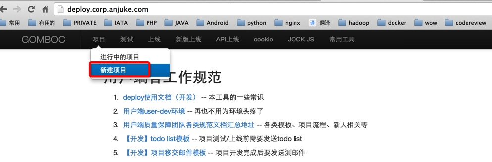
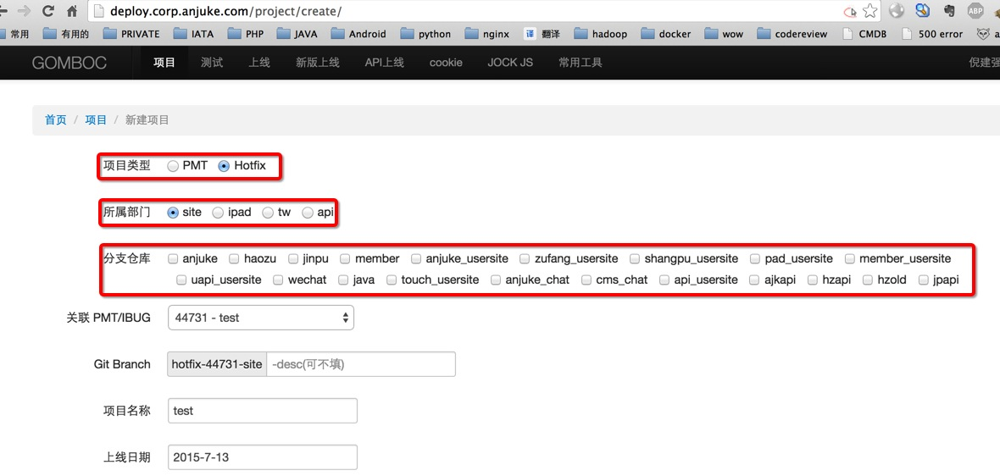
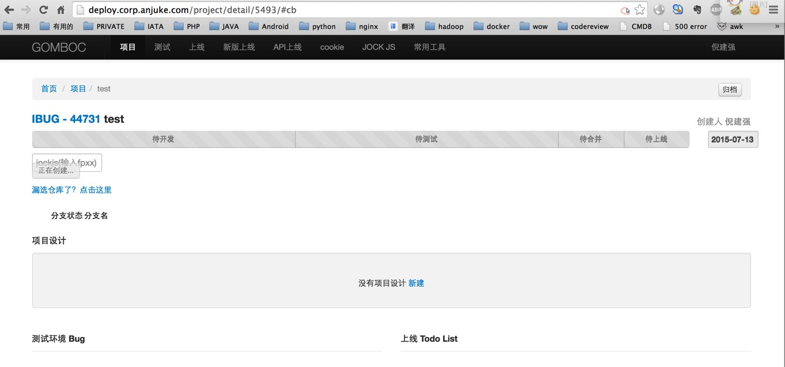
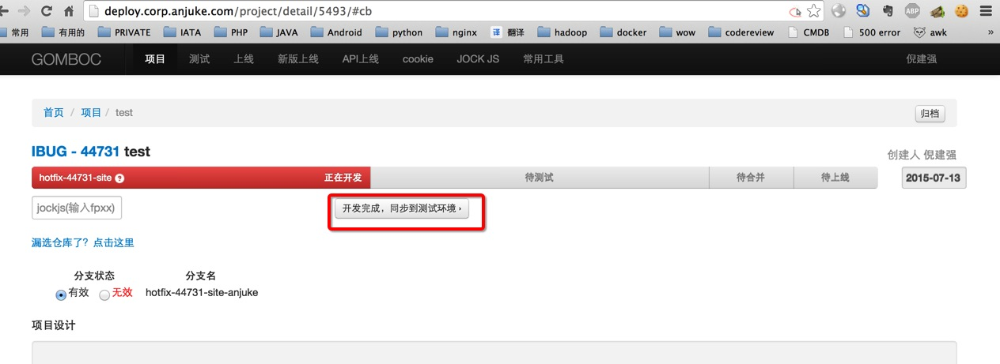
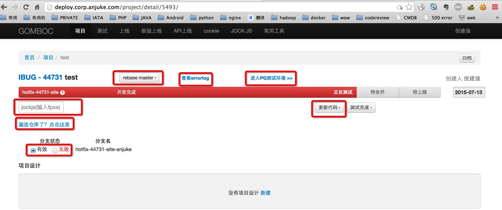
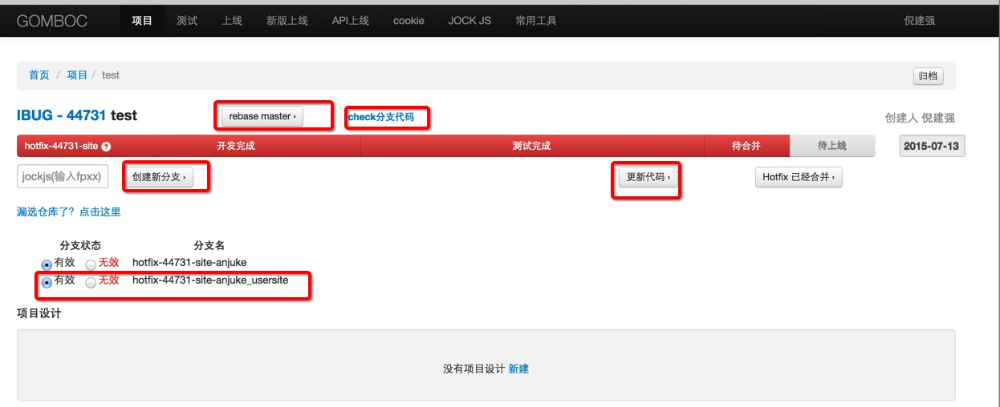

deploy流程（开发人员）=

 deploy地址:http://deploy.corp.anjuke.com/

 仓库：

    anjuke
    origin	git@gitlab.corp.anjuke.com:_site/anjuke.git

    haozu
    origin	git@gitlab.corp.anjuke.com:_site/haozu.git

    jinpu
    origin	git@gitlab.corp.anjuke.com:_site/jinpu.git

    anjuke_usersite
    origin	git@gitlab.corp.anjuke.com:_site/user-site.git

    zufang_usersite
    origin	git@gitlab.corp.anjuke.com:_site/user-site.git

    shangpu_usersite
    origin	git@gitlab.corp.anjuke.com:_site/user-site.git

    pad_usersite
    origin	git@gitlab.corp.anjuke.com:_site/user-site.git

    member_usersite
    origin	git@gitlab.corp.anjuke.com:_site/user-site.git

    wechat 
    origin	git@gitlab.corp.anjuke.com:_site/wechat.git

    java
    origin	git@gitlab.corp.anjuke.com:_site/tw_java.git

    touch_usersite
    origin	git@gitlab.corp.anjuke.com:_site/user-site.git

    anjuke_chat
    origin	git@gitlab.corp.anjuke.com:_mobile-api/anjuke-chat.git

    cms_chat
    origin	git@gitlab.corp.anjuke.com:_mobile-api/chat-cms.git

    api_usersite
    origin	git@gitlab.corp.anjuke.com:_mobile-api/new-api.git
    
    api_usersite
    origin	git@gitlab.corp.anjuke.com:_site/user-site.git
    
    ajkapi
    origin	git@gitlab.corp.anjuke.com:_mobile-api/anjuke-mobile-api.git

    hzapi
    origin	git@gitlab.corp.anjuke.com:_mobile-api/haozu.git

    hzold
    origin	git@gitlab.corp.anjuke.com:_mobile-api/haozu3.git

    jpapi
    origin	git@gitlab.corp.anjuke.com:_mobile-api/jinpu.git

 
### 新建项目

##### 选中pmt的话，下拉列表会展现你参与的所有项目（该pmt未被关闭 && 该项目分支未被其他项目参与者创建）
##### 选中hotfix的话会出现BUG列表（BUG类型为Production/Test && owner是你本人 && 分支未被创建）
***

### 项目创建中

##### 点击创建新项目后会进入上图页面，正在创建分支（创建的分支为新建项目时选择的仓库）。
***

### 编码完成，同步到PG

##### 创建好分支后就可以使用git拉取分支了，当移交测试的时候，点击`开发完成,同步到测试环境`（同步的代码为新建项目时选择的仓库，仓库可以通过漏选仓库页面新增/取消）。
***

### 按钮功能

##### 更新代码：更新代码至PG环境
##### rebaseMaster：根据你创建项目时选择的仓库，分别与各自的master做rebase操作，如果有冲突会有提示。
##### 漏选仓库了，点击这里：作用是弥补新建项目时候，少/多选择了仓库。
##### 左下角的分支状态：会显示当前项目/BUG共创建了哪些分支。如果是usersite的，因为是同一个master，所以分支只需合并一次。后面的多选框说明是针对哪些页面需要发布代码（PG的话需要保证多个user-site分支保持一致）。
##### jockjs输入框：不输入的话 默认读取master的jockjs（fp10,fp20,fp30），其中fp01~fp10为site的jockjs，fp11~fp20为pad的jockjs，fp21~fp30为touch的jockjs
##### 分支状态：QA只会合并状态为有效的代码。

##### 图中的anjuke_usersite就是用该功能补加的。（另外usersite仓库，不要重复选，不然pg会覆盖，他们是同一个master）
##### check分支代码：查看本次分支与master之间的差异，类似于git diff 。会确认代码是否变更，并且PHP语法是否错误（兼容PHP5.3与PHP5.5）（上线前必须的一个步骤，不然无法上线。）
##### 创建新分支：假设当前分支为hotfix-44731-site-anjuke，点击该按钮，会自动创建hotfix-44731-site1-anjuke，以此类推(site2,site3...)。
***

#### 本次改动
##### 点击测试完成后还能继续更新代码至PG。
##### check分支只能在点击测试完成后出现。
