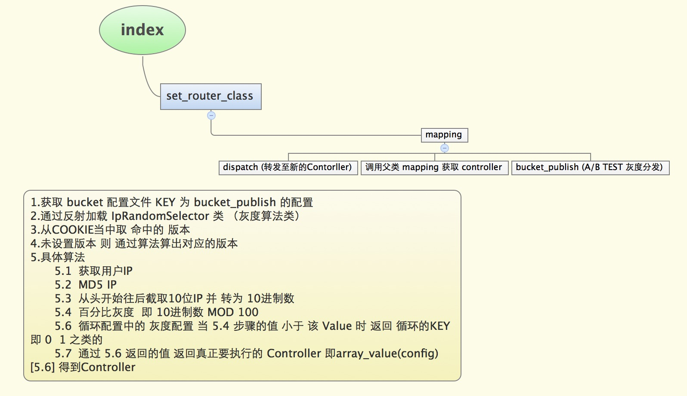

# ABtest实现原理分析
##A/B TEST 是什么

所谓 A/B 测试，简单来说，就是为同一个目标制定两个方案（比如两个页面），
让一部分用户使用 A 方案，另一部分用户使用 B 方案，记录下用户相应方案的使用情况，
看哪个方案更受用户喜欢

##A/B TEST 实现原理


##A/B TEST 使用方法
```
<?
$config["bucket_dispatcher"]["Finding_Sale"]=>array("Bucket_Dispatch_IpadDispatcher" , "Finding_SalePad"); //dispatch 转发至新的URL

$pad_list_has_tags = array(50, 50);  //灰度

//PAD A/B TEST
$config['bucket_publish']['Finding_SalePad'] = array(
     'cookie_key' => 'pad-finding_sale',
     'selector' => array('Bucket_Publish_IpadAndIpRandomSelector', $pad_list_has_tags),
     'buckets' => array(
         'pad-finding_sale' => array(
             'bucket_controller_class_name' => 'Finding_SalePad',
             'soj_tag' => 'pad-finding_sale',
         ),
         'pad-finding_sale-b' => array(
             'bucket_controller_class_name' => 'Findingv2_SalePad',
             'soj_tag' => 'pad-finding_sale',
         ),
     ),
 );
 
 //普通设备 A/B TEST（无需限制终端类型的）
$tw_prop_ab = APF::get_instance()->get_config('tw_prop_ab');
$tw_prop_ab_cookie_key = 'tw-prop-view'; //cookie key
$config['bucket_publish']['User_Touch_Anjuke_Prop_View'] = array(
    'cookie_key' => $tw_prop_ab_cookie_key,
    'selector' => array('User_Common_Bucket_Publish_IpRandomSelector', $tw_prop_ab),
    'buckets' => array(
        'User_Touch_Anjuke_Prop_View-a' => array(
            'bucket_controller_class_name' => 'User_Touch_Anjuke_Prop_View',
            'soj_tag' => 'a1b0',
        ),
        'User_Touch_Anjuke_Prop_View-b' => array(
            'bucket_controller_class_name' => 'User_Touch_Anjuke_Property_View',
            'soj_tag' => 'a0b1',
        ),
    ),
);
 
?>
```

##AB TEST 使用注意事项  遇到的问题


--------------------

# ABtest常态化流程
## 说明
* A版本：做测试的老版本
* B版本：做测试的新版本

## 配置bucket（bucket.php）

* ABtset实现原理请参考上文（原理分析）

## 流程图
* 

## 示例：以二手房单页为例
* 1.controller处理：B版本继承A版本

#####a版本
    
```
<?php
class User_Touch_Anjuke_Property_ViewController extends User_Touch_Anjuke_AbstractAnjukeController {

    protected function handleRequestInner(){
        $this->_init();
        return $this->get_page_name();
    }
    //AB版本都需要的公有处理
    protected function _init() {
        //
    }
    //返回该版本page
    protected function get_page_name() {
        return "User_Touch_Anjuke_Property_View";
    }
}
?>
```

#####b版本
    
```
<?php
class User_Touch_Anjuke_Property_View2Controller extends User_Touch_Anjuke_Property_ViewController {

    protected function handleRequestInner() {
        $this->_init();
        $this->newRequest();
        return $this->get_page_name(); 
    }
    //新版本（B版本）所需的私有处理
    protected function newRequest(){
        //
    } 
    //返回该版本page
    protected function get_page_name() {   
        return "User_Touch_Anjuke_Property_View2"; 
    }
}
?>
```

* 2.page处理(同controller处理方式)

#####a版本
    
```
<?php
class User_Touch_Anjuke_Property_ViewPage extends User_Touch_LayoutPage {
    
    protected function get_view(){
        $this->_init();
        return $this->get_page_name();
    }
    //AB版本都需要的公有处理
    protected function _init() {
        //
    }
    //返回该版本page_name
    protected function get_page_name() {
        return "View";
    }
}
?>
```

#####b版本
    
```
<?php
class User_Touch_Anjuke_Property_View2Page extends User_Touch_Anjuke_Property_ViewPage {

    protected function get_view() {
        $this->_init();
        $this->newRequest();
        return $this->get_page_name(); 
    }
    //新版本（B版本）所需的私有处理
    protected function newRequest(){
        //
    } 
    //返回该版本page
    protected function get_page_name() {   
        return "View2"; 
    }
}
?>
```

* 3.添加component

#####a版本
    
```
<?php
//AB版本的公有组件
$this->component('AB', array(
));
?>

<?php
//A版本私有组件
$this->component('A', array(
));
?>
```
#####b版本
    
```
<?php
//AB版本的公有组件
$this->component('AB', array(
));
?>

<?
//B版本私有组件
$this->component('B', array(
));
?>
```

* 4.控制AB版本变量
    * BUCKET_PUBLISH
    * 如果AB版本有局部微小差异时可使用变量去控制

## AB版本切换
* 1.去掉bucket配置
* 2.根据最终保留的版本做代码调整
    * 保留A版本
        * 毋需调整
    * 保留B版本
        * controller调整
        * page调整
