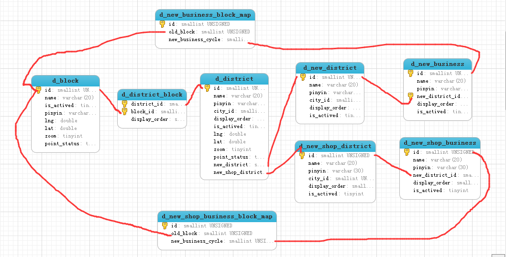

# 商业地产区域板块ER关系图

* 

# 商业地产6个导航筛选项DB及代码层配置整理

```
商业地产6个导航，写字楼出租、写字楼出售、楼盘、商铺出租、商铺出售、物业，筛选项整理
```

. [商圈的公共db](Common_DB.md)

. [写字楼出租筛选](Xzl_Rent_DB.md)

```
北京、上海、广州、深圳、成都、重庆，这6个城市读取d_new_district区域表，其他城市走老表d_district
```

. [写字楼出售筛选](Xzl_Sale_DB.md)

```
北京、上海、广州、深圳、成都、重庆，这6个城市读取d_new_district区域表，其他城市走老表d_district
```

. [商铺出租筛选](Sp_Rent_DB.md)

```
北京、上海、广州、深圳、成都、重庆，这6个城市读取d_new_shop_district区域表，其他城市走老表d_district
```

. [商铺出售筛选](Sp_Sale_DB.md)

```
北京、上海、广州、深圳、成都、重庆，这6个城市读取d_new_shop_district区域表，其他城市走老表d_district
```

. [物业筛选](Wuye_DB.md)

```
只有`上海`这个城市读取d_new_district区域表，其他城市区域读取d_district表

`北京、上海、杭州`，这三个城市显示`日租金`，其他城市显示`月租金`
```

. [楼盘筛选](Loupan_DB.md)

```
只有`上海`这个城市读取d_new_district区域表，其他城市区域读取d_district表

`北京、上海、杭州、郑州`，这四个城市显示`日租金`，其他城市显示`月租金`
```