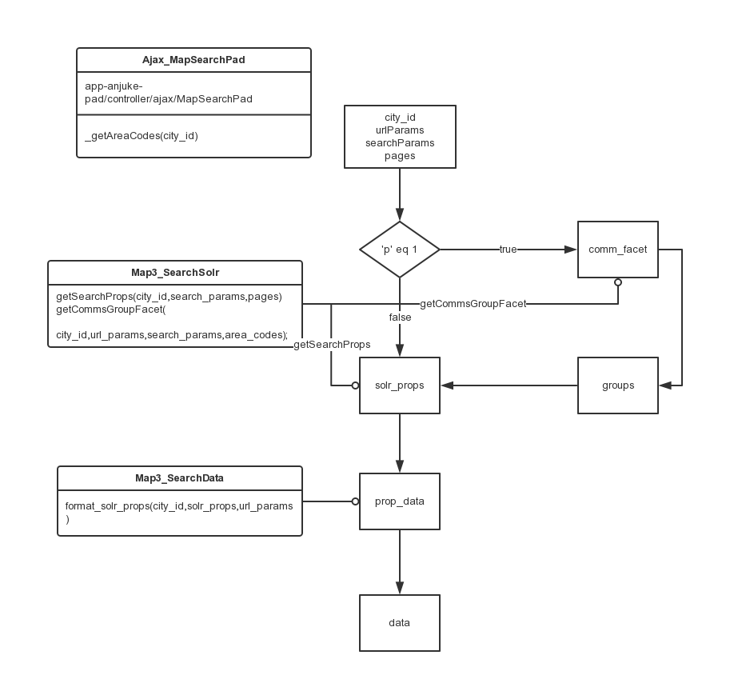
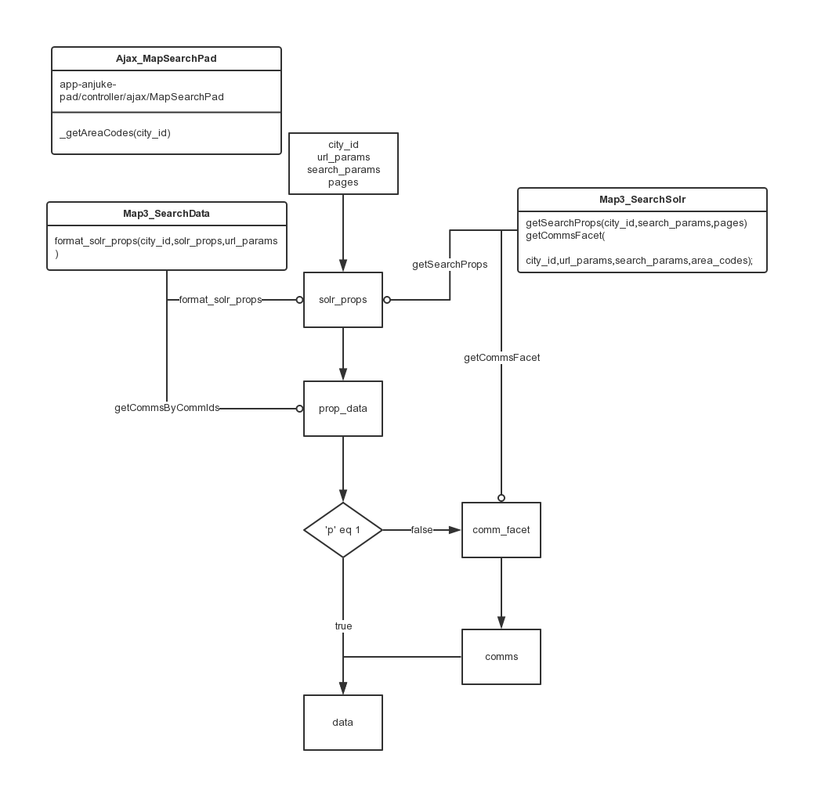
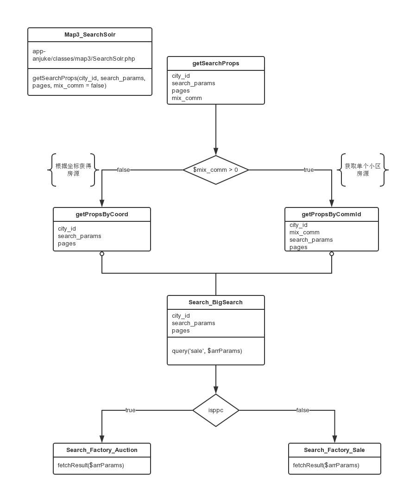

### padweb二手房v2.0详细设计

#### 新控制器及配置路由配置

路径：`app-anjuke-pad/controller/ajax/MapSearchPad.php`

类名：`Ajax_MapSearchPad`

```php
<?php
// app-anjuke/config/route.php
$config['mapping']['Ajax_MapSearchPad'] = array(
    '^/ajax/newmap/search/$'
);
?>
```

#### 新业务处理类

路径：`app-anjuke-pad/classes/search/SaleMapPad.php`

类名：`Search_SaleMapPad`

功能说明：供地图调用的业务逻辑类，通过传递参数返回地图数据，封装相关数据调用`逻辑`和`业务`逻辑。

##### 二手房地图获取数据主要方法

* 相关参数由调用类方法的控制器提供，只要提供正确的参数就能获得数据

```php
<?php

    /**
     * 二手房地图获取数据聚合数据数据
     * @param  int $city_id
     * @param  array $url_params
     * @param  array $search_params
     * @param  array $pages
     * @return array
     */
    protected function getViewableGroup($city_id, $url_params, $search_params, $pages) {}

    /**
     * 二手房地图获取数据可视区域数据
     * @param  int $city_id
     * @param  array $url_params
     * @param  array $search_params
     * @param  array $pages
     * @return array
     */
    protected function getViewableArea($city_id, $url_params, $search_params, $pages) {}
    
?>
```
* 方法实现流程
    * 获取可视区域聚合<br>
    * 获取可视区域信息<br>
    * 获取房源列表的实现流程<br>

* 接口数据需要进行performance监控

```php
<?php
private function getSolrProps($city_id, $search_params, $pages) {
        $perf_name = __FUNCTION__'@'__CLASS__;
        $this->perf->benchmark_begin($perf_name);
        $solr_data = Map3_SearchSolr::getSearchProps($city_id, $search_params, $pages);
        $this->perf->benchmark_end($perf_name);
        return $solr_data;
    }
?>
```

#### js调取数据请求和返回约定

地图数据接口统一入口: http://shanghai.anjuke.com/ajax/newmap/search

详细约定设计请戳[>>>这里<<<](http://git.corp.anjuke.com/_user_site/doc/browse/master/mobileWeb/devDoc/design/21200/padweb%E4%BA%8C%E6%89%8B%E6%88%BFv2.0%E6%8E%A5%E5%8F%A3%E7%BA%A6%E5%AE%9A.md)

#### 需要注意的问题

* 地图缩放层级对地图标点的影响，区域聚合将在11-13级显示，小区标点将在14-18级显示，去除了前一版中根据可视区域聚合部分小区的设计；

* 地图在显示小区时最多显示`25`个小区以及对应的标点和信息；

* 二手房原列表页数据默认使用可视区域内的房源，地图移动时列表数据不会随可是区域变化，本版地图将跟随用户移动地图而从新的可视区域内获取数据；

* 二手房列表房源在搜索时的竞价和定价规则需要明确。