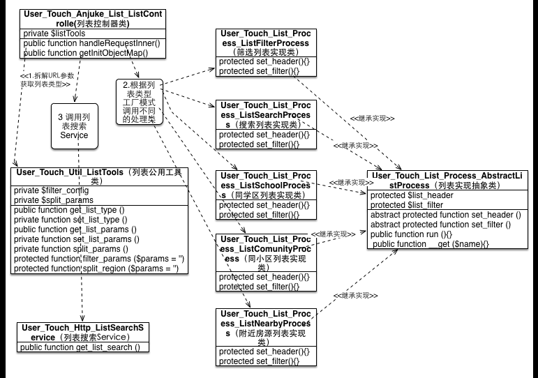

#二手房列表页迁移详细设计
###需求背景
###route 配置
```php
<?php
    $config['mappings'][$prefix.'List_ListController'] = array(
        '^/[a-z]+/sale/?(\?.*)*', //匹配无搜索和筛选参数的列表页如 /sh/sale/?a=b
        '^/[a-z]+/sale/[a-z-]+/?(\?.*)*', //匹配只有一个区域+板块搜索参数的列表页 如 /sh/sale/pudong-qingpu/?a=123
        '^/[a-z]+/sale/[a-z-]+/a\d+_\d+-b\d-(x|\d+_\d+){1}-(x|\d+_\d+){1}-\d.*' //匹配严格类型的列表页 搜索筛选URL 如 /sh/sale/all/a500000_1000000-b0-0_50-x-3?a=123
    );
?>
```

###To Do List
    1. LB修改
    2. 确认是否可放开所有 sh/sale 类型的URL
    3. 零少结果SOJ

###所需接口
    1. 个人消息数量接口 (Ajax)
    2. 收藏数量接口 (Ajax)
    5. 搜索零结果推荐接口(Ajax) http://m.anjuke.com/sh/sale/recommend?from=listpage (是否命中小区 命中小区需走另外接口)
    6. 筛选零结果推荐接口(Ajax) http://m.anjuke.com/sh/sale/pudong/a0_500000-b4-x-x-0?s=m&page=1
    7. 新房推荐接口(Ajax) http://api.aifang.com/m/iphone/1.3/advert/throughtrain/?city_id=11&region_title=%E6%B5%A6%E4%B8%9C&prop_ht=0&prop_pr=100-150&from_module=touch_web
    9. 下拉词接口 (Ajax) (如果下拉词小区与当前搜索词匹配那就是同小区)  http://api.anjuke.com/mobile/1.3/location.getByKeywords
    3. 筛选项接口 http://api.anjuke.com/mobile/1.3/city.getFilters (service 可提供数据 封闭得我们自己做)
    4. 房源列表搜索接口 http://hiapi.qa.anjuke.com/2.0/testPage/anjuke.php?api_id=165
    8. 记录下一套信息接口 cookie  service KEY(touchweb_memory_proplist) 这是个大坑 得好好梳理逻辑
    
###Question
    1. 同首付房源功能如何做？PRD里面没有
    2. 零结果 SOJ 
    3. 搜索词是不是违禁词(接口) 跳到404页
    
###列表页类型
    1. 搜索列表页
    2. 筛选列表页
    3. 同小区房源列表页
    4. 学区房列表页
    5. 附近房源列表页
    6. 同首付房源列表页

### jock js 模块
    1. page/dom.dom/ui.rSearchpage/event/ui.autocomplete/ui.exposure/ajax/utils.base/
    
###头部
    1. topbar c  
        * 模块
            * LOGO (url index)
            * current city (url city list)
            * home logo （url index）
                * 交互 `如果是首页则不显示该图标`
            * user logo 显示个人消息数量（数据来自问答）
                * 交互 未登录灰色；登录后绿色，并显示被回答个数圆圈
                * question `需要个人消息数量接口`
            * favorite logo
                * 交互 无收藏灰色，有收藏变绿，并显示收藏个数圆圈
                * question `需要收藏数量接口`
        * 出现页面
            * 搜索列表页
            * 筛选列表页
            * 学区列表页
            * 附近房源列表页
        * 不出现页面
            * 同小区房源列表页 （该页面显示 灰色文字区域）
        * 文件位置
            * component/user/touch/common/topbar/TopBar.phtml
    2. 列表导航
        * 模块
            * 二手房
            * 新房
            * 租房
            * 商业地产
            * 问答
        * 出现页面
            * 筛选列表页
            * 搜索列表页
        * 文件位置
            * component/user/touch/topbar/NavBar.phtml
    3. 灰色文字头
        * 模块
            * 返回
            * 同小区页 显示 小区名 
            * 学区页 显示 学区名+学区房 
            * 附近房源页 显示 [区域名]+附近房源
        * 出现页面
            * 同小区房源页
            * 学区房列表页
            * 附近房源页
        * 文件位置
            * component/user/touch/common/header/ListHead.phtml
    
    4. 头部伪代码实现 （3个component 按需调用）
        * 根据当前所处的页面 判断该让哪个头的部分出现。即
        ```php
        <?php
            if ($topbar == 1) {
                //topbar  该值在 controller 控制
                $this->component('User_Touch_Common_Topbar_TopBar', array(
                    //内部再控制该显示出现具体的元素
                ));
            }
            if ($navbar == 1) {
                //navbar  该值在 controller 控制
                $this->component('User_Touch_Common_Topbar_NavBar', array(
                ));
            }
            if ($listHeader == 1) {
                //listHeader  该值在 controller 控制
                $this->component('User_Touch_Common_Head_ListHead', array(
                ));
            }
        ?>
        ```
            
###筛选项
    * 筛选页、搜索列表页  默认出现 （1，2，3项 4，5，6折叠隐藏  7：首页进入时置顶显示 否则折叠）
        1. 区域
            * 1.1 板块 (只有选择区域时才会显示)
            * question 区域是否能按照房源数从多至少排列

        2. 价格
        3. 户型
        4. 面积
        5. 房龄
        6. 类型
        7. 搜索框 （首页搜索进入时会置顶 from=new_search 在最后）
    * 学区房、同小区房源、附近房源  列表页 （展示1，2 折叠3，4，5，6项  不含区域条件）
        1. 价格
            1.1 板块 (只有选择区域时才会显示)
        2. 户型
        3. 面积
        4. 房龄
        5. 类型
        6. 搜索框
    * 需要筛选项接口
    * 筛选项URL规则
        * domain/city/区域-板块/价格-户型-面积-房龄-类型 (即a0_0-b0-x-x-0 条件都不限)
            * 区域 all (不限) || 区域（板块不限）|| 区域-板块
            * 价格 a0_0 (不限) || a0_500000 (50W以下) || a500000_100000 (50-100W)
            * 户型 b0 (不限) || b1(一室) || b2 (二室)
            * 面积 x (不限) || 0_0 (不限) || 0_50 (50平米以下) || 50_100 (50-70平米)
            * 房龄 x (不限) || 0_2 (2年以内) || 2_5 (2-5年)
            * 类型 0 (不限) || 1 (公寓) || 2 (别墅) 
    * 筛选后请求方式
        * 刷新整个页面 
    * 文件位置
        * component/user/touch/common/list/ListFilter.phtml

###列表
    * 模块 （搜索命中小区时 显示 1，2项 并且区域筛选荐不显示 否则只显示 第2项 ）
        1. 小区介绍 （小区名称、均价、涨跌状态 进入单页链接）
        2. 列表 (非AJAX请求时 展示数据整个页面（包含头）  AJAX请求时 只显示列表内容(往下滑动翻页时用))
        3. 分页功能 (ajax append) 
        4. 列表显示房源标签
    * 文件位置 (component)
        1. component/user/touch/common/list/List.phtml
    

###首页搜索进入结果小于10条 搜索零结果推荐 Ajax 
    * 区分命中小区 和 未命中小区  
    * 命中小区  取 附近7个小区的房源 调接口
    * 未命中取 首页猜你喜欢结果
    * 没有结果也取 首页猜你喜欢结果

###New Search 列表页搜索 零结果推荐 Ajax
    * 退条件法
    * question 退条件接口

###筛选结果小于10条 筛选零结果推荐 Ajax 
    * 如果接口没有返回结果 使用首页猜你喜欢

###新房推荐 Ajax
    * 何时推荐 满足以下任意条件
        1. 筛选了 区域/板块+户型 
        2. 区域/板块+价格
        3. 价格+户型 (需确认)
    * 插入位置
        * 在20条内容下方插入 推荐符合条件的新房推荐
    * 加入 SOJ 统计


###底部APP广告

###二手房列表页迁移伪代码设计

###代码设计
    * 设计说明
        * 该功能基于 工厂模式 实现的 
            这样做的好处：在抽象类中定义了流程 必须实现的功能 使代码更规范，流程更清晰
            灵活动态的扩展功能（Controller）以及 代码的解耦 避免Controller 到处充斥 If else
        1.User_Touch_Anjuke_List_ListController 二手房列表页控制器    
            * 功能：实现了 URL 参数的拆分 列表类型的判断（如同小区列表、同学区……
            根据列表类型 使用 工厂模式 加载对应的处理实现类
        2. User_Touch_Anjuke_List_Process_AbstractListProcess 二手房列表页实现抽象类
            * 功能：规定了实现类（子类）必须做的事情  以及执行流程 外部取参数值的方法
        3. User_Touch_Anjuke_List_Process_ListSearchProcess 二手房列表页 列表搜索 实现类
            * 实现 二手房列表实现抽象类所定义的事情
        4. User_Touch_Http_ListSearchService 列表搜索Service
            * 单例模式  取列表页搜索数据 判断是否违禁词 ……
    * 文件位置
        1.controller controller/user/touch/anjuke/list/
```php
<?php
//二手房列表控制器
class User_Touch_Anjuke_List_ListController extends User_Touch_Anjuke_AbstractAnjukeController {
    private $listTools;
    protected function handleRequestInner() {
        $list_type = $this->listTools->get_list_type ();
        $list_type = ucfirst($list_type);
        if ($list_type == 'Community') {
            $this -> real_city ();
        }
        // 如果存在搜索参数 需 判断是否命中小区 调用关键词接口
        $file = 'User_Touch_List_Process_List' . $list_type . 'Process';
        $obj = new $file();
        $obj -> run ();
        return 'User_Touch_Anjuke_List_List';
    }

    public function getInitObjectMap() {
        return array(
            'User_Touch_Util_ListTools'=>'', //列表公用工具类
            'User_Touch_Http_ListSearchService'=>'', //搜索Service
        );
    }

}

//筛选列表实现类
class User_Touch_List_Process_ListFilterProcess extends User_Touch_List_Process_AbstractListProcess {
    // 设置需要显示的头
    protected function set_header () {}
    // 设置需要显示的筛选项
    protected function set_filter () {}
}

//搜索列表实现类
class User_Touch_List_Process_ListSearchProcess extends User_Touch_List_Process_AbstractListProcess {
    // 设置需要显示的头
    protected function set_header () {}
    // 设置需要显示的筛选项
    protected function set_filter () {}
}

//同学区列表实现类
class User_Touch_List_Process_ListSchoolProcess extends User_Touch_List_Process_AbstractListProcess {
    // 设置需要显示的头
    protected function set_header () {}
    // 设置需要显示的筛选项
    protected function set_filter () {}
}

//列表实现抽象类
abstract class User_Touch_List_Process_AbstractListProcess {
    protected $list_header;
    protected $list_filter;
    // 业务层根据需求设置调用不同的头
    abstract protected function set_header ();
    // 业务层根据需求设置不同的筛选项
    abstract protected function set_filter ();
    //执行流程
    public function run () {
        $this -> list_header = $this -> set_header ();
        $this -> list_filter = $this -> set_filter ();
    }
    //获取参数值
    public function __get ($name) {
        if (isset($this -> $name)) 
            return $this -> $name;
    }
}

//列表搜索Service
class User_Touch_Http_ListSearchService {
    /*
     * API 接口 获取列表搜索数据
     */
    public function get_list_search () {
        //curl 调用关键词接口 是否违禁词 跳至404页
        //curl 获取 API 接口信息
    }
}

//列表页公用类
class User_Touch_Util_ListTools {
    private $filter_config = array(
        array( 'min_price', 'max_price'), //价格
        array( 'room_num'), //户型
        array('min_area', 'max_area'), //面积
        array('min_age', 'max_age'), //房龄
        array('use_type'), //类型
    ); //筛选项配置
    private $split_params; //URL 拆分的参数

    /*
     * 获取列表页类型
     * @author jeyzhu
     * @date 2014/05/04
     */
    public function get_list_type (){
        return $this -> set_list_type ();
    }

    /*
     * 根据URL参数设置列表类型 搜索、筛选、同小区、同学区、附近
     * @author jeyzhu
     * @date 2014/05/04
     */
    private function set_list_type () {
        $params = $this -> get_list_params();
        if (isset($params['comm_id'])) {
            //同小区
            return 'Community';
        }
        if (isset($params['school_id']) && isset($params['school_name'])) {
            //同学区
            return 'School';
        }
        if (isset($params['lat']) && isset($params['lng'])) {
            //附近房源
            return 'Nearby';
        }
        if (isset($params['q'])) {
            //搜索
            return 'Search';
        }
        return 'Filter'; //默认 filter 筛选列表表 即 筛选不限
        //类型为同小区时 需判断 real_city
        //类型为搜索时 需判断是否命中小区 调用 关键词接口
    }

    /*
     * 获取列表页参数
     * @author jeyzhu
     * @date 2014/05/04
     */
    public function get_list_params () {
        return $this->set_list_params();
    }

    /*
     * 设置列表页参数
     * @author jeyzhu
     * @date 2014/05/04
     */
    private function set_list_params () {
        $this -> split_params ();
        $params = APF::get_instance()->get_request()->get_parameters();
        return array_merge($params, $this -> split_params);
    }

    /*
     * 拆分列表页URL参数
     * @author jeyzhu
     * @date 2014/05/04
     */
    private function split_params () {
        $matches = APF::get_instance()->get_request()->get_router_matches();
        $matches = explode('/', trim($matches[0], '/'));
        $this -> split_params['city_id'] = APF::get_instance()->get_request()->getCityId();
        if (isset($matches[2])) {
            $this -> split_region ($matches[2]); //拆分区域、板块
        }
        if (isset($matches[3])) {
            $this -> filter_params ($matches[3]); //拆分筛选项参数
        }
    }

    //拆分筛选项参数
    protected function filter_params ($params = '') {
        if (empty($params))
            return array();
        $noLimitKeyWord = array('0_0', '0', 'x'); //不限的关键字
        $params = explode('-', $params);
        foreach($params as $k => $v) {
            $v = ltrim($v, 'a'); //去除a开头的字母
            $v = ltrim($v, 'b'); //去除b开头的字母
            if (!in_array($v, $noLimitKeyWord)) {
                //非不限
                foreach ($this -> filter_config[$k] as $fk => $fv) {
                    $tmp = explode('_', $v);
                    $this -> split_params[$fv] = $tmp[$fk];
                }
            }
        }
    }

    //拆分 区域/板块
    protected function split_region ($params = '') {
        if (empty($params))
            return 0;
        if ($params == 'all') 
            return array(); //不限
        $params = explode('-', $params);
        $this -> split_params['area'] = $params[0]; //区域
        if (isset($params[1])) {
            $this -> split_params['block'] = $params[1]; //板块
        }
        return 1;
    }


}


?>


```
