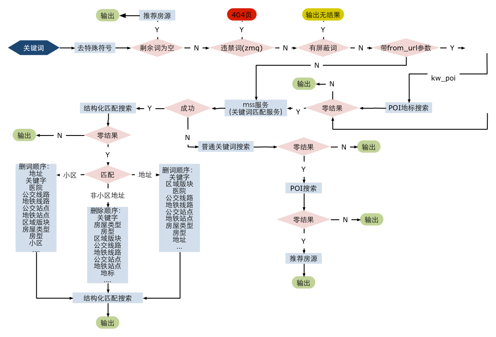
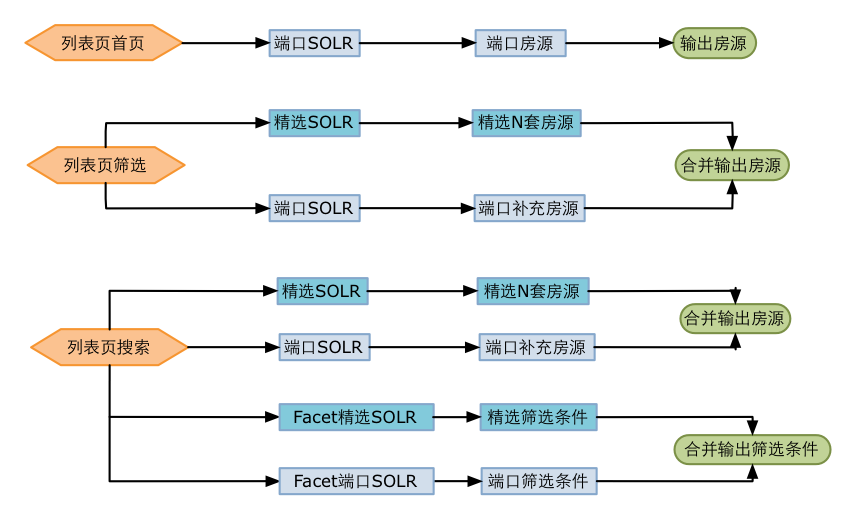

## 房源搜索
---

#### 概述

我们的搜索是通过solr检索的, 前台搜索关键词经过一些词语匹配算法,生成结构化词,再传入solr检索

#### 相关数据
* 分组和配置:
    * 按城市房源量分为16组, 每组solr跟两个实例, [点击详情](http://gitlab.corp.anjuke.com/_site/docs/blob/master/BizDesc/Fangyuan/Ershou/SolrSplit.md)
    * 部署: 10台物理机
    * 内存: 64G
    * CPU: 32 Core
    * 硬盘: 1T
* 日查询量: 2350万
* 文档数量: 1433万
* 占用总内存: 144G

#### 数据流程
* 

#### 房源打分(Rank)
* 精选房源
    * 全国数量: 8万 发房推广时即打分, 分值写到solr中
* 端口房源
    * 数量: 1400万
    * 即时打分: 推广到solr时, 根据各维度打分,比如小区热门度, 图片数量, 均价
    * 全量打分: 每天晚上全量将所有房源根据bi推广的数据, 重新给房源打分, 更新到solr中
    
####  搜索关键词处理
* mss服务
    * 关键词匹配服务, 检测搜索词库内容, 根据一定算法, 返回结构化词语
    * 比如"二室": 返回room_num:2 此就是结构化, 然后带入solr中检索

* 搜索词库:
    * 包括小区词, 区域版块词, 地标词,景点, 公交词等
    * 每天更新
     
* 匹配算法
    * 在拿到mss返回的结构化后, 我们会进行一些加工处理, 比如一关键词从mss返回即时区域和小区时,我们会根据搜索的一些数据, 将些关键词作为小区词搜索
    * 删词处理: 当关键词匹配到多个结构化词时, 比如"中远两湾城 二室 南北通透", 这样的词从匹配到的是小区, 户型, 标签, 在传入solr时没有符合这三个条件的数据时, 会根据结构化权重进行删词,现删除标签,剩下小区和户型去solr中检索
    * 普通关键词搜索: 当关键词不在搜索词库中时, 以普通关键词去solr中匹配房源标题, 经纪人名称等
    * 

    
#### 前台产品逻辑

    
    
    
    
    
    
    
    
    
    
    
    
    
    
    