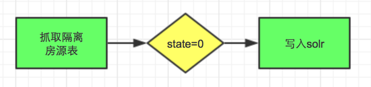

### 抓取房源solr上下架
___

#### 项目背景:

* 产品需求：抓取二手房房源入solr，来增加房源量
* 项目地址：http://p.corp.anjuke.com/project/detail?id=24568

#### 主要修改点
* 房源id索引表
* solr字段修改
* 抓取房源入solr
* 房源上下架job修改

#### 房源id索引表
_____

* 功能：
	* 房源id生成器
	* 房源id与城市id对应关系

* 房源id索引表结构：

```
	CREATE TABLE `user_prop_db`.`crawl_property` (
		`prop_id` int(11) unsigned NOT NULL auto_increment COMMENT '房源id',
  		`city_id` smallint(6) unsigned NOT NULL default '11' COMMENT '城市id',
  		PRIMARY KEY  (`prop_id`),
  		KEY `city_id` USING BTREE (`city_id`)
	) ENGINE=InnoDB DEFAULT CHARSET=utf8 COMMENT='抓取房源id索引表'
```

* 房源id生成流程图
	* 经纪人抓取房源插入到抓取隔离表流程图
	
		
	
	* 用户端抓取房源插入到抓取隔离表流程图
	
		

* job1：经纪人抓取的房源已经插入到抓取隔离表，但是需要将房源id插入到房源id索引表中；
* job2：将抓取的房源插入到抓取隔离表中之前，先需要在房源id索引表中插入一条数据，将生成的id作为房源id在插入到抓取隔离表；

#### solr字段修改
##### 方案一
* 增加字段 

		unique_id(可存储)：A/C+房源id 
		source_type(可存储)：A/C

* solr主键设置

		取消字段id主键
		增加字段unique_id主键

##### 方案二
* 增加字段：

		source_type(可存储)：A/C
		
* solr主键id字段由int类型修改string类型，其值为：

		经纪人房源：房源id
		抓取房源：C+房源id


		
#### 抓取房源入solr
* 直接读取抓取房源隔离表，判断状态，最后写入solr；
* 流程图



#### 房源上下架job修改
* 房源上下架job的修改，主要是随上面solr字段的改变而改变的

##### 房源上架

		写solr时，增加unique_id，source_type字段值

##### 房源下架
##### 针对于方案一
* 当前房源下架solr条件为：

		id=123456
		
* 现在修改为：

		unique_id=A123456
		
##### 针对于方案二
* 暂不做修改


#### solr修改上线流程图


#### job运行
* 1、抓取房源插入到线上正式数据库中

		php /home/www/user/usersite/app-ershou-job/launcher.php   --class=Ershou_Job_Property_UserCrawlPropertyToUserProp --city_id=43 --limit=100

		city_id 城市id 多个可半角逗号链接
		limit 条数

* 2、将线上数据库中抓取房源上传到solr

		php /home/www/user/usersite/app-ershou-job/launcher.php   --class=Ershou_Job_Property_Solr_CrawlPropertyToSolr --city_id=43 --limit=100 --cursor_id=xxxx  --loop=x
		
		city_id 城市id 多个可半角逗号链接
		limit 条数
		cursor_id 起始游标
		loop 循环次数