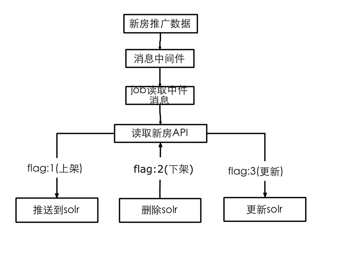
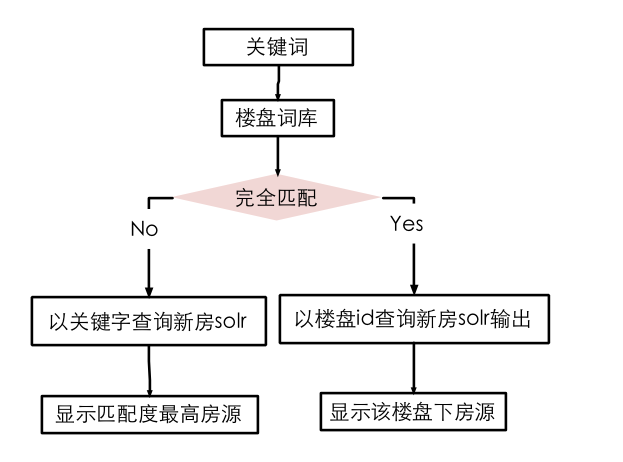

## 聚客宝项目设计

#### 后台数据流向



* 消息中间件
    * 测试环境：http://nydus.dev.anjuke.com/publish?tunnel=third_party_house
    * 线上环境：http://nydus.a.ajkdns.com/publish?tunnel=third_party_house
    * 消息格式:JSON
    
	    ```
	    ｛
			    "tunnel":频道(int,1:新房),
			    "city_id":城市ID(int),
			    "house_id":房源ID(int),
			    "flag":操作类型(int,1:上架,2:下架,3:房源更新，比如房源上架过，后续又更新时用此类型),
			    "update_time":更新时间(int),
			    "from_type":标记类型，默认为0，非必要字段,新房标记建议用(100-199之间)(int)
		  ｝
		```
	* 消息入表
	    * 所在表：quque\_db.third\_party\_house\_queue\_{分表}\_{年月} 
	    * 分表策略：根据house\_id取模分表，目前数据量少都存在00这个分表里
	    * 建表SQL
	
			```
			CREATE TABLE `third_party_house_queue_{分表}_{年月}` (
			  `id` int(11) NOT NULL AUTO_INCREMENT,
			  `tunnel` tinyint(1) unsigned DEFAULT '0' COMMENT '频道类型;1:新房',
			  `city_id` smallint(6) NOT NULL DEFAULT '0' COMMENT '城市ID',
			  `house_id` int(11) NOT NULL DEFAULT '0' COMMENT '房源ID',
			  `flag` tinyint(1) unsigned DEFAULT '0' COMMENT '操作类型:1:上架,2:下架,3:更新',
			  `from_type` smallint(4) unsigned DEFAULT '0' COMMENT '来源',
			  `update_time` int(11) NOT NULL DEFAULT '0' COMMENT '更新时间',
			  PRIMARY KEY (`id`),   
			  KEY `house_id` (`house_id`)
			) ENGINE=InnoDB DEFAULT CHARSET=utf8 COMMENT='第三方房源上下架队列';
			```

* 新房接口需求
    * 说明：此接口供job使用，在新房推送房源时，读取此api获得房源信息
    * 具体接口返回值:参见如下Solr字段说明

* 新房Solr字段(以下字段需从新房接口中获得)

Field | Type | Indexed | Stored | Required | Description
---|---|---|---|---|---|---
id     		  |int        |Y         |Y        |Y      | 房源ID  
usetype        |int        |Y         |Y         |Y      |类型ID(老公房／公寓....)  
city\_id        |int        |Y         |Y         |Y      |城市ID
creation       |int        |Y         |Y         |Y      |发布时间(时间戳) 
lastedit       |int        |Y         |Y         |Y      |上次编辑时间(时间戳)
area\_code      |int        |Y         |Y         |Y      |区域代码  
price          |int        |Y         |Y         |Y      |总价格（单位：元）   
unit\_price     |tint        |Y         |Y         |Y      |单价（单位：元）
area           |tfloat        |Y         |Y         |Y      |面积（单位：平米）   
room\_num       |tint        |Y         |Y         |Y      |房间数(几室) 
hall\_num       |int        |Y         |Y         |Y      |客厅数(几厅) 
toilet\_num     |int        |Y         |Y         |Y      |卫生间(几卫)  
house_age		  |int        |Y         |Y         |Y      |房屋年龄
title          |text        |Y         |Y         |Y      |房源标题  
address        |text       |Y         |Y         |Y      |小区地址
commid         |int        |Y         |Y         |Y      |小区（楼盘）ID
community\_name |int        |Y         |Y         |Y      |小区（楼盘）名称
floor          |string        |Y         |Y         |Y      |楼层（第多少层）  
floor\_total    |string        |Y         |Y         |Y      |楼层总数    
ishq           |int        |Y         |Y         |Y      |是否优质房源（多图）
host\_id        |string        |Y         |Y         |Y      |默认图HostId
image\_id       |string     |Y         |Y         |Y      |默认图Hash
region\_name    |string     |Y         |Y         |Y      |区域名称
block\_name     |string     |Y         |Y         |Y      |版块名称

* 其它solr字段说明(以下字段job生成)

Field | Type | Indexed | Stored | Required | Description
---|---|---|---|---|---|---
source\_type    |string        |Y         |Y        |Y      | 房源类型，新房是D 
unique\_id        |string        |Y         |Y         |Y      |唯一键，即source\_type+id
islist    |boolean        |Y         |Y        |Y      | 在列表页显示的房源 
metro\_distance    |int(MultiValued)        |Y         |Y        |Y      | 对应新房is\_metro
school\_info\_ids    |string(MultiValued)         |Y         |Y        |Y      | 对应新房is\_school
updatetime    |int         |Y         |Y        |Y      |数据更新到solr的时间

* 二手房筛选项的对应关系
    * 区域版块
        * 见表：anjuke\_db.ajk\_commtype
    * 房型（几室）
        * 见表：anjuke\_db.ajk\_housemodel
    * 建造年代：
        * 成都
        
	        ```
	        array(
	                array(
	                    'AGEID' => 2,
	                    'AGENAME' =>'2010年以后'
	                ),
	                array(
	                    'AGEID' => 7,
	                    'AGENAME' =>'2008年以后'
	                ),
	                array(
	                    'AGEID' => 8,
	                    'AGENAME' =>'2000~2008年'
	                ),
	                array(
	                    'AGEID' => 6,
	                    'AGENAME' =>'2000年以前'
	                ),
	            );
	        ``` 
        * 其它城市
	        
	        ```
	        array(
	                array(
	                    'AGEID' => 2,
	                    'AGENAME' =>'2010年以后'
	                ),
	                array(
	                    'AGEID' => 3,
	                    'AGENAME' =>'2005年以后'
	                ),
	                array(
	                    'AGEID' => 5,
	                    'AGENAME' =>'2000年以后'
	                ),
	                array(
	                    'AGEID' => 6,
	                    'AGENAME' =>'2000年以前'
	                ),
	            );
	        ``` 
        
    * 房屋类型
        * 见表：anjuke\_db. ajk\_usetype
    * 楼层

	    ```
	    array(
	            array(
	                'FLOORID' => 6,
	                'FLOORNAME' =>'6层以下'
	            ),
	            array(
	                'FLOORID' => 12,
	                'FLOORNAME' =>'6-12层'
	            ),
	            array(
	                'FLOORID' => 13,
	                'FLOORNAME' =>'12层以上'	            ),
	        );
	    ```
    * 品牌中介
        * 见表：anjuke\_db.cst\_broker\_company
    * 学区房
        * 见表：user_prop\_db.upp\_school\_community
    * 地铁房：
        * 见表: anjuke\_db.sw\_metro\_community\_distances


#### 前台显示

* 筛选
 * 按照用户的筛选项->查询新房solr->所有数据从solr读取->插入指定位置->显示
 * 问题：所有新建的新房solr对应的筛选项id要和二手房一致，否则要做个转换匹配 

* 搜索：一期搜索分以下两种情况

    * 精准匹配到楼盘词：即搜索关键词在新房给的词库中完全匹配，会显示该楼盘下的房源
    * 精准的楼盘词通过配置方式：
        * 配置文件：app-ershou-core/config/xinfang.php 
        * 内容：
        
		    ```
		    $config["jukebao_loupan"]=array(
				    User_Common_Const_MultiCity::CITY_ID_SHANGHAI => array(
				        "东渡时代J座" => array(
				            "loupan_id" => 207590,
				            "city_id" => 11,
				            "commid" => 407476,
				            "community_name" => "东渡时代J座",
				            "address" => "新镇街1058弄",
				            "unit_price" => "11000",
				            "region_name" => "松江",
				            "block_name" => "新桥",
				            "usetype" => "普通住宅",
				            "comm_link" => "http://sh.fp03.kfs.dev.anjuke.test:80/loupan/207590.html",
				            "arround_link" => "http://sh.fp03.kfs.dev.anjuke.test:80/loupan/207590.html#life-divid",
				            "price_link" => "http://sh.fp03.kfs.dev.anjuke.test:80/loupan/207590.html#price-divid",
				            "comm_service_num" => "",
				            "comm_call_num" => "",
				            "tw_comm_link" => "http://m.fp03.kfs.dev.anjuke.test/sh/loupan/207590/",
				            "creation" => 1338393600,
				        ),
				    ),
				    ...
			);
		    ```
    * 非精准匹配楼盘词：即搜索关键词不在新房给的词库中，直接走solr关键字匹配，具体关键词匹配纬度如下：
        * 标题
        * 区域
        * 版块
        * 小区(楼盘)名




