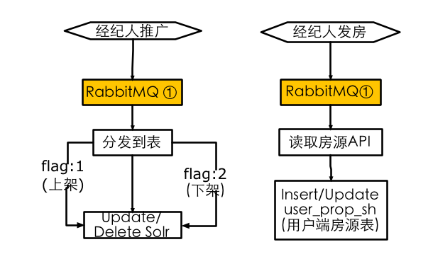

## 二手房规划方案

####数据流概览

####后台推广同步系统
* 数据流：

* 降级方案：
    * ①RabbitMQ
        * 存在的问题：数据丢失，中间件集群坏了怎么办 
        * 研究中：针对RabbitMQ中间件坏了，切到新到中间件上
        * TODO: 提供site-api(php内网api)，针对客户端仅仅是地址的变化

####展示系统
* 列表页
    * 数据流：
         
    * 容灾方案
        * ① 分词服务(Check): 设置超时20ms即可，不成功就不分词
        * ② Mss服务(Check): 设置超时50ms即可，不成功不调用，直接关键字搜索
        * ③ Solr服务：
            * Solr服务容灾(TODO): 即如果某一级solr挂了，启用备份solr，LB上直接切过去，这样可以做到无缝，可以保证所有用到solr的平台，但数据可能有所延迟
            * 不用Solr检索(TODO): 即发现solr服务彻底不能用，列表页直接显示最新房源，Limit去分页,但这样做只能每个展示端自己去实现，且没办法筛选和搜索
        * ④ 读取房源表(Done):读取用户端property表，没有再读取经纪人商property表，但目前只有pc有这样逻辑，其他频道还没有
    
* 单页
    * 数据流：
         
    * ① 客户端房源API:
        * 目前由于经纪人信息还要从该API读取，所以该api还是每次都在调用，此API不可用时，单页基本挂死
        * 要将此API仅在我们隔离数据表异常时才调用，所以要接入经纪人隔离的服务（TODO）
         
####监控系统（TODO）

* 精选房源数量
   * 前台展示曝光监控(刘锐)
   * 后台solr在线的数量监控 
    
* 套餐房源数量
   * 后台solr在线的数量监控
    
* 房源上下架推广监控
    * 房源推广量监控
    * 队列延迟监控
    * 中间件数量监控
    * 房源推广数量异常监控 
