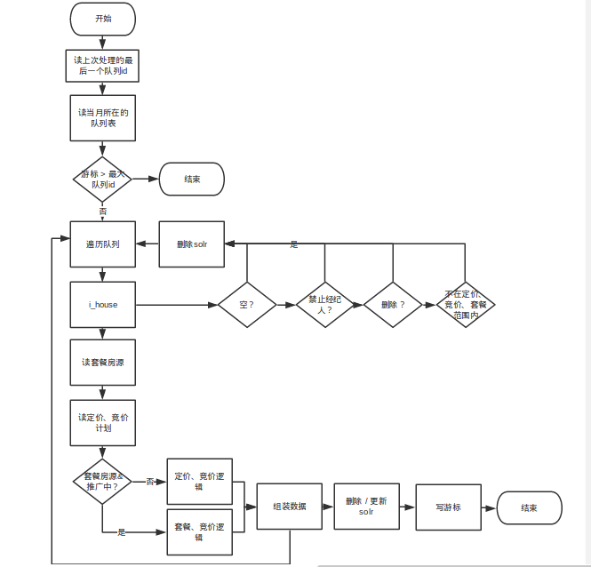

#作用
- 更新金铺（写字楼租售、商铺租售）套餐房源相关solr
- 更新基于客户端的通知

#老的流程图

##重新设计

#改进后的流程图

#主要数据来源

表描述|表名|备注|
:---------------|:---------------|:---------------|
套餐推广更新的队列表|jp_combo_queue_{年月}|用于更新套餐房源的solr的队列表
 竞价推广更新的队列表|jp_auction_queue_{年月}|用于更新竞价房源的solr的队列表
 套餐房源表|e_house_combo_relation_jp|
 房源索引表|i_house|所有房源均在此表
 房源详情表|e_office_rent|
 |e_office_sale|
 |e_shop_rent|
 |e_shop_sale|
 房源图片表|e_office_sale_img_v2|
 |e_office_rent_img_v2|
 |e_shop_rent_img_v2|
 |e_shop_sale_img_v2|
 板块表|d_block|
 区域板块对应表|d_district_block|
 区域表|d_district|
 商圈板块对应表|d_new_business_block_map|
 商圈表|d_new_business|
 新区域表|d_new_district|
 价格段表|d_filter_daily_rent|写字楼和商铺（shop）各有一套数据
 |d_filter_monthly_rent|
 |d_filter_unit_price|
 |d_filter_total_price|
 面积段表|d_filter_area_rent|写字楼和商铺（shop）各有一套数据
 |d_filter_area_sale|
 房源rank信息|e_house_rank|
 dw表的房源rank信息|hu_rank_jp_all_score_rank_list|jp_dw_stats库中
 经纪人相关信息|e_member_ext|		
 物业经纬度|e_map_property|
 物业的地铁公交信息表|e_building_traffic|
 房源的点击数|jp_house_click_num|
 计划表|e_spread|
 在线竞价信息表|e_spread_bid_online|

#SOLR字段含义

字段|描述|值|
:---------------|:---------------|:---------------|
id|房源id|
building_id|房源所在楼盘id|
building_name|房源所在楼盘名称|
building_level_id|房源所在楼盘等级id    |
member_id|经纪人id|
city_id|城市id|
district_id|房源所在区域id|
district_name|区域名称|d_district.name
block_id|房源所在版块id|
block_name|版块名称|d_block.name
title|房源标题|
floor_id||此值暂未更新
area|房源面积|
monthly_rent|月租金|房源详情表.monthly_rent
daily_rent|日租金|房源详情表.daily_rent
img_num|该房源下的总的图片数|房源图片表
is_quality||房源详情表
is_exquisite|精品房源|房源详情表
create_time|房源创建时间|房源详情表.list_time
publish_date|发布时间|房源详情表.create_time       
publish_time|发布时间|房源详情表.create_time
final_score|分数|房源rank信息表.final_score
random_score|分数|房源rank信息表.random_score
stage|分段|房源rank信息表.stage
sub_stage|分组|房源rank信息表.sub_stage
monthly_rent_id|月租金所在价格段id|
area_id|面积所在段id|
blat|房源所在物业的纬度|e_map_property.lat 
blng|房源所在物业的经度|e_map_property.lng
match_building|物业的名称|
company_id||e_member_ext.company_id
store_id||e_member_ext.store_id
new_district_id|房源新区域id|
new_district_name|区域名称|
new_business_id|房源新商圈id|
new_business_name|商圈名称|
is_developer|废弃|
house_metro|是否是地铁房|所在楼盘500米之内是否有地铁
house_grade_a|是否是甲级楼房|
house_high_level|是否是高区|房源详情表.floor_id=3
house_new_complete|是否是新竣工楼房|  
house_heat|是否是人气楼房|昨天点击数是否在前500
rent_sort||<房源详情表.rent_sort/td></tr>
address|房源地址|
list_time|开始展示的时间|参考e_spread.no_budget_date
bid_rank|推广出价|房源详情表.spread_offer
bid_time|推广出价时间|房源详情表.spread_offce_time
bid_ratio|竞价系数|e_spread_bid_online.spread_ratio
roll_ratio|综合系数|e_spread_bid_online.show_ratio
combo_spread|套餐推广|1-是，0-否
auction_spread|竞价推广|1-是，0-否

#类设计
- 现有房源类型
 - 竞价，套餐
 - 分2个job处理不同的房源类型

- 针对以上情况类的设计

 - BuildHouseSync
入口类，两个参数，一个参数区分读哪个队列，一个参数是游标（可选）
 - AbstractHouseService
抽象服务，将定价、竞价、套餐的公共部分抽象出来，个性部分留接口 
 - PricingHouseService
定价service，继承AbstractHouseService    
 - AuctionHouseService
竞价service，继承AbstractHouseService    
 - ComboHouseService
套餐service，继承AbstractHouseService 
 - AmqpQueueToDB
读消息中间件数据到队列表，一个参数来区分读哪个消息中间件

#命令
- 房源更新solr监控程序

>
    php launcher.php Spread_BuildHouseSync

#详细信息
- 日志文件

>
    /home/www/logs/result/result_spread_update.package.log

- 配置
 - common.php

>
    //写字楼和商铺solr地址
    $config['house_update_solr_url'] = array(
        'xizhilou_zu' => 'http://solr.anjuke.test:8983/jp-xiezilou-zu/update/',
        'xizhilou_shou_v2' => 'http://solr.anjuke.test:8983/jp-xiezilou-shou-v36/update/',
        'shangpu_zu' => 'http://solr.anjuke.test:8983/jp-shangpu-zu/update/',
        'shangpu_shou' => 'http://solr.anjuke.test:8983/jp-shangpu-shou/update/'
    );

 - amqp.php

>
    $config['nydus_mq_l1']=array(
        'host' => '192.168.1.56',
        'port' => '5676',
        'login' => 'guest',
        'password' => 'guest',
        'vhost' => '/'
    );

 - amqp_ex.php

>
    //套餐房源实时更新amqp
    $config['combo_state'] = array(
        'exchange' => 'nydus.42.sp_prop_package_updown',
        'queue' => 'Spread_ComboAmqpToDB',
        'routingkey' => 'prop.package.updown.#',
    );
    $config['auction_state'] = array(
        'exchange' => 'nydus.43.sp_prop_auction_updown',
        'queue' => 'Spread_ComboAmqpToDB',
        'routingkey' => 'prop.auction.updown.#',
    );