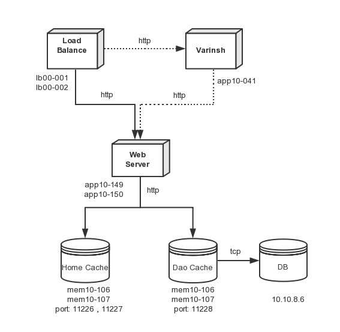
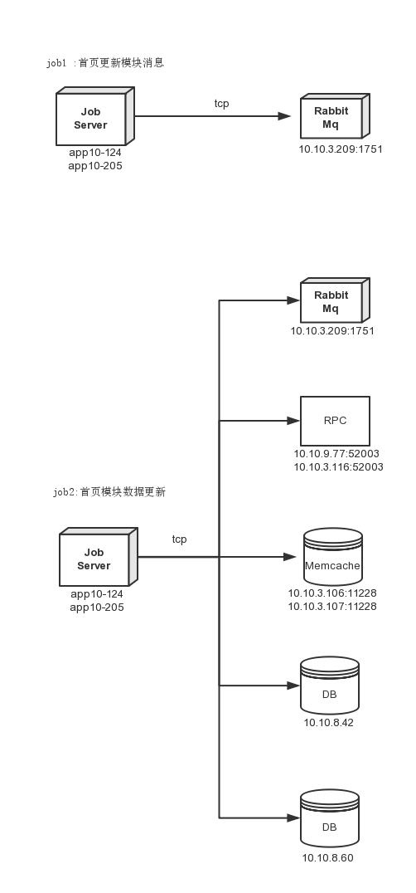

## 首页蓝皮书

* 部署图
* 服务监控
* server服务与启动
* 问题与处理方法
* 数据流

### 部署图


### 1. 服务监控

1.1 . [二手房首页PV监控](http://knowing.corp.anjuke.com/chart/12613)

```
监控目标: 监控首页的流量走势
申请权限: OA权限 
查看步骤:
    1. 监控->用户事业部->二手房频道
    2. 查看首页每日pv走势
    3. 对比前日走势 
监控流程: 
    1. 如果PV大于昨日100% 或者低于昨日50% 属于异常 
    2. 如果大于100% 检测服务器资源配置,查看memcahe,ops监控平台,根据监控流程处理
    3. 如果小于50% 检测首页全国首页能正常访问 
```

1.2 . [前端速度监控](http://prism.corp.anjuke.com/showpages/)

```
监控目标: 监控首页渲染的时间
申请权限: OA权限
查看步骤：
    1. Home->Page
    2. 选择 site:ershoufang->pageName:首页->数据类型:天->日期:指定日期
    3. 看页面耗时图表 
监控流程: 
    1. 如果kpi_onload_time>16000ms 后端服务慢
    2. 查看首页ideliver监控,根据监控流程处理 
    3. 如果kpi_dom_time>3000ms 前端dom加载慢 js加载影响页面渲染速度
    4. 将js加载放置页面渲染之后 
```

1.3 . [speed速度监控](http://speed.qa.anjuke.com/speed/128/details?time=2015-2-26)

```
监控目标: 监控后端相应速度
申请权限: OA权限
查看步骤:
    1. 速度监控->Home->编号:128->查看
    2. 查询指定指定日期的speed数度
    3. 观察页面速度 
监控流程: 
    1. 如果速度大200ms 
    2. memcache平台查看 根据监控流程处理
    3. 查看二手房首页PV监控服务 
```

1.4 . [ideliver首页速度监控](http://ideliver.corp.anjuke.com/php/)

```
监控目标: 监控代码服务运行状态
申请权限: OA权限
查看步骤:
    1. 工具->php运行监控 -> 点击安居客首页 
    2. 查看服务运行的详细速度数据 
监控流程: 
    1. 如果首页服务响应速度大于100ms 点击大于100ms的记录点 查看首页服务运行中耗时明细
    2. 获取memcache数据耗时大于60ms 监控memcache服务,根据监控流程处理
    3. 优化脚本,提高响应速度
```

1.5 . [首页pool服务器监控](http://ops.corp.anjuke.com/cmdb/pool/detail/201)

```
监控目标: 监控首页服务器状态
申请权限: OA权限
查看步骤: 
    1. POOL管理->LB10(外部) user-anjuke-home
监控流程: 
    1. 监控 CPU 内存 硬盘 端口 满载率
    2. 满载率大于70% 考虑添加服务器
    3. cpu过高 找到影响过高的进程 对其优化
```

1.6 . [Memache 监控](http://mc.corp.anjuke.com/memcacheds)

```
监控目标: 监控memcahce服务
权限申请: OA权限
查看步骤：
    1. Memcaches -> user_home_page -> 10.10.3.106:11228
    2. 查看 group：user_home_page
    3. 10.10.3.107:11228 服务查看 http://mc.corp.anjuke.com/memcached-129 
    4. 10.10.3.106:11228 服务查看 http://mc.corp.anjuke.com/memcached-130 
监控流程: 
    1. 查看hit_range命中率 
    2. 如果命中率 < 50%, 查看可用空间 如果资源不够扩容
```

1.7 . [DB监控](http://dbo.corp.anjuke.com/dbquery)

```
监控目标: 在memcache异常时
申请权限: OA权限
查看步骤： 
    1. 点击查看数据库 选择 -> db:user_prop_db table:cityhome_mcache 
监控流程: 
    1. 根据城市ID 模块ID 查看模块数据, 解析出模块数据
    2. 如果模块没有数据, 监控日志服务
```

1.8 . [Rabbit Mq监控](http://app10-069.i.ajkdns.com:1850/#/queues/%2F/site_home_model_queue)

```
监控目标: 保证首页数据是最新数据
申请权限: OA权限 用户名:nydus 密码:nydus
查看步骤： 
    1. queues -> site_home_model_queue
监控流程:
    1. 查看 exchanges name site_home_model_queue 队列 
    2. 观察total总数 
    3. 如果total过大 查看首页消费job 考虑job消费太慢
    4. 如果total总算一直为0 考虑job1不能运行
    5. 观察deliver/get数量  数目 < 10 考虑job2运行异常， 查看job2监控模块，据此处理
```

1.9 . [Nginx日志查看](http://ops.corp.anjuke.com/logger/)

```
监控目标: 保证首页web请求正常
申请权限: ops平台申请,主管审批
查看步骤:
    1. 点击标题连接
监控流程: 
    1. 登录跳板机器 ssh -A user@10.10.9.100 ssh evans@app20-008
    2. 登录服务器 ssh app10-136
    3. nginx 日志查看 tail -f /var/log/syslog
    4. 在实时日志中输入 查询主机（首页服务所在主机 app10-149、app10-150）
    5. 监控首页首页服务对应的controller名 Ershou_Web_Home_HomeController Ershou_Job_Home_UpdateDataSource
    6. 找到报错的地方修复问题
```

1.10 . [job1 生成首页模块消息](http://drone.corp.anjuke.com/scheduler/job/163/view)

```
监控目标: 正常生成更新通知
权限申请: OA 权限
查看步骤:
    1. 点击标题连接
监控流程:
    1. 查看脚本的运行状态
    2. 如果不能运行 hadoop查看job运行日志查看 根据监控流程解决
    3. 问题修复后启动服务
```

1.11 . [job2 更新首页模块](http://drone.corp.anjuke.com/daemon/job/66/view)

```
监控目标: 更新首页模块
申请权限: OA 权限
监控步骤:
    1. 点击标题连接
监控流程:
    1. 查看脚本的运行状态
    2. 如果不能运行 hadoop查看job运行日志查看 根据监控流程解决
    3. 问题修复后启动服务
```

1.12 . [hadoop查看job运行日志查看](http://10.10.6.99/)

```
监控目标: 保证首页数据正常更新
申请权限: OA权限
查看步骤：
    1. 以此点击 hdfs home->Browse the filesystem->applog->anjuke.home.get_aifang_aps_data 
监控流程:
    1. 查看日志中的错误,修复解决
    2. rabbit 队列挤压太大 考虑api接口请求慢查看 anjuke.home_curl_info 
    3. 找出响应慢的API, 修复解决 
```

### 2. Server服务与启动
* 2.1 db 

```

databse: user_prop_db
table: cityhome_mcache
ip: 10.10.8.60 
owner: 兰春(必须)
```

* 2.2 rabbit mq

```
server: nydus.a.ajkdns.com
queue: site_home_model_queue
exchange: nydus.20.anjuke_home
owner: 石兆媛(必须)
```

* 2.3 php

```
ip: app10-149 app10-150
启动命令: service anjuke-php-fpm reload
owner: 倪建强(非必须,根据情况可自行重启)
```

* 2.4 varnish 

```
现状: varnish 不可用
ip: app10-141
owner: 暂无
```

* 2.5 memache

```
group: service_home_page_cache
ip: 10.10.3.106:11228 10.10.3.107:11228

group: dao_cache_group
ip: 10.10.3.106:11226 10.10.3.107:11226 10.10.3.106:11227 10.10.3.107:11227 
启动命令: /usr/local/memcached/bin/memcached -p 11234 -m 4096 -u memcached -c 5000 -t 4 -f 1.12 -o slab_reassign slab_automove -d
owner: 马明(必须)
```

* 2.6 nginx

```
ip: app10-149 app10-150
启动命令: /usr/local/nginx/sbin/nginx -s reload 
owner: 倪建强（非必须,更加请求可自行重启）
```


## 3. 问题与处理方法

* 3.1 表象： 首页服务502

```
3.1.1 
分析: 查看首页konwing监控 观察PV量是否大于昨日同时PV量
      1. 是 请求量过大,服务器性能达到瓶颈
      2. 查看首页pool监控, 根据监控流程分析,处理问题
      3. 查看memcahce监控, 根据监控流程分析,处理问题 
原因: 服务器资源不够

3.1.2 
分析: memcache不能正常服务
      1. memcahce服务不能连接
      2. 重启memcache服务 
      3. 查看memcahce连接数
      4. 连接数过大 修改最大连接数, 增强服务器并发量
原因: memcache不能正常服务

3.1.3 
分析: php不能正常服务
      1. php-fpm服务不存在
      2. 重启php-fpm进程 
      3. 查看php-fpm进程数量 命令: ps aux | grep 'php-fpm' | wc -l
      4. php-fpm进程数过大,修改最大连接数,增强服务器并发量 
原因: php不能正常服务

3.1.4 
分析: 代码运行错误,查看nginx日志
      1. 找到报错的位置,修复解决
原因: 代码错误

3.1.5 
分析: 服务器资源被异常服务耗尽
      1. 登陆到服务运行命令 top查看 资源消耗最多的服务,将其暂停并修复
原因: 异常服务耗尽资源,服务器不能正常服务 

```

* 3.2 表象：上海二手房房源精选模块空白，其他模块显示、更新都正常

```
3.2.1 
分析: BI删除了二手房数据来源
      1. 查看数据库:dw_stats -> 表:kant_web_homepage_hot_tags是否有数据
      2. 如果没有数据找BI负责人，让其恢复数据 重新运行job1 监控消息对列， 观察效果
      3. 如果有数据观察job日志,找出导致错误的地方修改 重新运行job1 监控消息对列， 观察效果
原因： 数据源被删
      
3.2.2 
分析: 数据库连接失败,不能正常服务
      1. 查看db配置 确认可以正常连接
原因: 不能正常连接数据库 

```

* 3.3 表象： 新房的数据更新不生效， job运行状态正常，rabbit mq 对列消费正常

```
3.3.1 
分析： memache hash算法不一致
      1. 查看php.ini 和贴出的配置比较 不一样修改其
            extension=memcache.so
            memcache.hash_function = "crc32"
            memcache.hash_strategy = "consistent"
      2. 重启memache
      3. 重启php
      4. 重启nginx 
原因: php配置不一样

3.3.2 
分析: 脏数据导致
     1. 运行job2 删除脏数据
原因: 脏数据
```

### 4. 数据流

