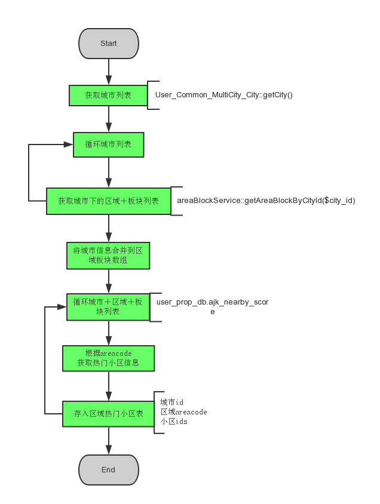

## SEO房价改版

### 项目背景
* 房价有2套，老房价及SEO房价频道，如论从页面用户体验还是SEO收录流量效果都很差，新房房价排名第一，流量也比较高。二手房房价价值潜力大，做好了流量价值很大。
* 详情见->`http://p.corp.anjuke.com/project/detail?id=25537`

### 项目需求
* 详情见->`http://p.corp.anjuke.com/project/detail?id=25537`

### 数据调研

* 城市选择tab
    * 公共component`User_Component_Header_CitySelectorNew`
    * a的title可以作为一个参数进行控制

* 区域板块数据获取
    * 数据来源：`anjuke_db.ajk_commtype`
    * 获取城市下所有的区域
    
       ```
    公共方法：Community_Core_City_Service_AreaBlockService::getAreaByCityId()
    查询条件：cityId
    ```

    * 获取区域下所有的板块
    
        ```
    Community_Core_City_Service_AreaBlockService
    getBlockByAreaId($cityId, $areaId, $order = array())
    ```
	
    * 所有板块：根据拼音获取首字母，并按照首字母分组排序


* 趋势图数据获取（是否要job提前生成数据）
    * 城市／区域／板块数据来源:`ajk_dw_stats.price_trend_areacode_monthly`
    
        ```
	 公共方法：Ershou_Core_Service_PriceService::getRegionPriceMonthly()
	 查询条件：
	 	 areacode=?
	 	 period>?
	 	 period<?
        ```

	* 小区数据来源:`ajk_dw_stats.price_trend_comm_monthly`
 
 	     ```
	 公共方法：Ershou_Core_Service_PriceService::getCommPriceMonthlyList()
	 查询条件：
		 comm_id=?
		 period>?
		 period<?
	 ```

* 环比同比数据获取
    * 环比数据获取
    
	 ```
	 获取当前月份的数据，来源同趋势数据获取：mid_change
	 ```

    * 同比数据获取
    
 	 ```
	 1.获取当前月份的数据
	 2.获取去年对应月份的数据
	 同比计算公式：（今年－去年）/ 去年
	 Biz_Public_Price_PriceBiz::calPreYearRate()
	 ```

* 价格找房价格区间数据获取
    * 数据来源：`anjuke_db.ajk_saleprice`
    
        ```
    公共方法：Ershou_Core_Service_Dict_SalePriceService::getSalePrice()
    ```

* 小区搜索api
   
    ```
	http://shanghai.anjuke.com/v3/ajax/indexautocomplete/?	c=11&n=10&g=2&t=1&kw=he+ping
	 ```

* 小区列表获取
    * 数据来源：`user_prop_db.ajk_nearby_score`
    * sql语句：`SELECT * FROM ajk_nearby_score WHERE area_code = ? AND item=5 ORDER BY stars DESC LIMIT 15`;
    * TODO：
        * 1.给相关表增加areacode字段(现有表中没有城市／区域／板块信息，所以没办法根据这些条件进行筛选)
            * DW数据库`ajk_dw_stats`修改如下：
            
                ```
            ALTER TABLE `ajk_nearby_score` Add `area_code`  varchar(20)  NOT NULL DEFAULT ''
COMMENT '城市、区域、版块area_code'；
            SART详情见：http://ibug.corp.anjuke.com/ticket/detail?ticket_id=51341
            ```

            * 我们自己的数据库`user_prop_db`修改如下：
            
                ```
            ALTER TABLE `ajk_nearby_score` Add `area_code`  varchar(20)  NOT NULL DEFAULT ''
COMMENT '城市、区域、版块area_code'；
            ALTER  TABLE  `ajk_nearby_score` ADD INDEX areacodeanditem (`area_code`,  `item`, `stars`)
            SART详情见：http://ibug.corp.anjuke.com/ticket/detail?ticket_id=51343
            ```

        * 2.DW数据同步脚本修改：

            ```
        修改脚本，同步数据的时候同步areacode字段的信息
        脚本详情见：http://drone.corp.anjuke.com/scheduler/job/231/view
        ```

* 内链＋友链 

### 项目设计流程图
* 总流程图


* 定时更新热门小区表job流程图



* 定时更新小区房源表


### 数据表设计
* 热门小区表
    * 表结构
    
		| column        | comment               |
		| ------------- |-------------          |
		| id            | 自增id                 |
		| city_id       | 城市id                 |
		| area_code      | 城市／区域／板块areacode |
		| comm_ids      | 15个小区id，用','分割    |
		| create_time   | 入库时间                |
		| update_time   | 更新时间                |    
 
    * 入库方式：job定时更新
    * 表大小评估：城市区域板块总共为5300条数据
    * 更新频率：每周更新一次（参考小区热门度表是每周更新一次）
    * TODO：申请SART创建表
    	
    	```
		CREATE TABLE `ajk_hot_community` (
            `id` int(11) unsigned NOT NULL auto_increment,
            `area_code` varchar(20) NOT NULL default '' COMMENT '城市、区域、板块的typecode',
            `comm_ids` varchar(200) NOT NULL default '' COMMENT '热门小区id,以,分割',
            `update_time` timestamp NOT NULL default CURRENT_TIMESTAMP on update CURRENT_TIMESTAMP COMMENT '更新时间',
        PRIMARY KEY  (`id`),
        KEY `areacode` (`area_code`)
        ) ENGINE=InnoDB DEFAULT CHARSET=utf8 COMMENT='热门小区表';
    	```
    * 用到的sql：SELECT comm_ids FROM ajk_hot_community WHERE area_code = 0001;

* 热门小区房源表
    * 表结构
    
    | column           | comment           |
    | -----------------|-------------      |  
    | id               | 自增id             |
    | comm_id          | 小区id             |
    | comm_name        | 小区名字            |
    | mid_price        | 小区本月均价         |
    | mid_change       | 小区价格环比         |
    | prop_ids         | 4个房源id,用','分割 |
    | comm_trend       | 小区最近6个月的房价数据，json数据 |
    | create_time      | 入库时间           |
    | update_time      | 更新时间           |
     
    * 入库方式：job定时更新
    * 表大小评估：5300*15=8w条数据
    * 更新频率：一天（待定）
    * TODO：申请SART创建表
    	
    	```
		CREATE TABLE `ajk_hot_community_props` (
            `id` int(11) unsigned NOT NULL auto_increment,
            `comm_id` int(10) unsigned NOT NULL default 0 COMMENT '小区id',
            `mid_price` int(10) unsigned NOT NULL default 0 COMMENT '小区本月均价',
            `mid_change` float NOT NULL default 0 COMMENT '小区价格环比',
            `prop_ids` varchar(50) NOT NULL default '' COMMENT '房源id,以,分割',
            `comm_trend` varchar(200) NOT NULL default '' COMMENT '小区6个月的走势信息',
            `update_time` timestamp NOT NULL default CURRENT_TIMESTAMP on update CURRENT_TIMESTAMP COMMENT '更新时间',
        PRIMARY KEY(`id`),
        UNIQUE KEY `comm_id`(`comm_id`)
        ) ENGINE=InnoDB DEFAULT CHARSET=utf8 COMMENT='热门小区房源表';
    	```

### 具体实现
* 小区列表数据格式

```
    小区数据格式：
    array(
        comm_id => array(
            comm_id => 11,
            comm_name => 60,
            mid_price => 11,
            mid_change => 11,
            price_trend_list => array(
         	      '201401' => 11,
         	      '201402' => '1234567890',
         	      '201403' => '1234567890',
         	      '201404' => '1234567890',
         	      '201405' => '1234567890',
         	      '201406' => '1234567890',
            ),
            'prop_list' => array(
                1419239140 => array(
                    'prop_img' => '', 
            		   'title' => 120,
            		   'prop_url' => '',
            		   'area_name' => '浦东',
            		   'block_name' => '北蔡',
            		   'price' => 11,
            		   'area_num' => 11,
            		   'room_num' => 1,
            		   'hall_num' => 1,
        		   ),
            ),
        ),
    );
```

```
ALTER TABLE ajk_hot_community_props MODIFY `prop_ids` varchar(250) NOT NULL default '' COMMENT '房源id,以,分割';
```