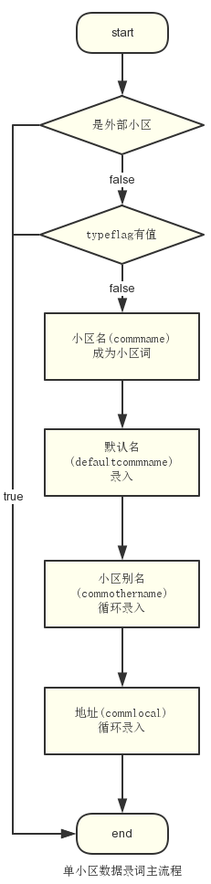
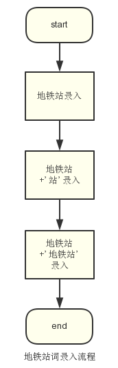
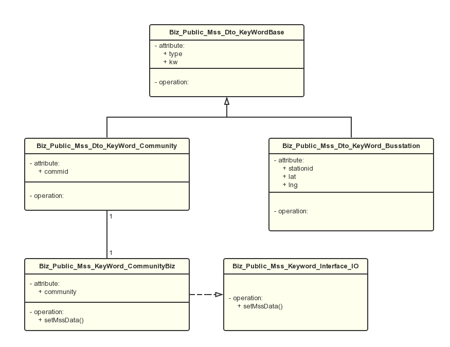

### Mss搜索关键词更新job详细设计

---
#### 项目背景

* 搜索关键词匹配服务，主要用于用户在网站搜索时，当输入的词有特殊词性，则搜索结果会附带有对应词性的相关业务逻辑

* 本项目为旧仓库中更新词到关键词辞典的job在usersite仓库的实现，搜索词辞典服务由mss系统提供，项目主要实现关键词的录入

* 相关文档
    * search概设[传送门](http://gitlab.corp.anjuke.com/_site/docs/blob/master/DesignDoc/Fangyuan/Zufang/Search_Site_20140822/search%E6%A6%82%E8%AE%BE.md)
    * mss接口[传送门](http://gitlab.corp.anjuke.com/_incubator/mss/blob/master/doc/AdminHTTP.md)
    * 旧仓库job主文件[传送门](http://gitlab.corp.anjuke.com/_site/anjuke/blob/master/app-jobs/bin/tools/update_search_dict.php)

---
#### 辞典命名

* 命名规则 

```
anjuke_{city_id}_{dict_name}
```


**本文中辞典命名以上海(11)为例**

更新的搜索词类型 | 辞典名
--- | ---
小区 | anjuke_11_community
区域/版块 | anjuke_11_region
户型 | anjuke_11_housemodel
房屋类型 | anjuke_11_usetype
公园 | anjuke_11_park
学校 | anjuke_11_school
医院 | anjuke_11_hospital
景点 | anjuke_11_viewport
地址词 | anjuke_11_address
公交线 | anjuke_11_busline
公交站 | anjuke_11_busstation
地铁线 | anjuke_11_metroline
地铁站 | anjuke_11_metrostation


---
#### 各关键词类的json值约定

* 小区词(对应辞典anjuke_11_community)

键 | 类型 | 说明
--- | --- | ---
type | string | 固定值为**"community"**
kw | string | 小区词
commid | int | 小区id


* 区域(对应辞典anjuke_11_area)

键 | 类型 | 说明
--- | --- | ---
type | string | 固定值为**"area"**
kw | string | 区域词
code | string | 区域code
region_id | int | 区域id


* 版块(对应辞典anjuke_11_block)

键 | 类型 | 说明
--- | --- | ---
type | string | 固定值为**"block"**
kw | string | 版块词
code | string | 版块code
region_id | int | 版块id


* 户型(对应辞典anjuke_11_housemodel)

键 | 类型 | 说明
--- | --- | ---
type | string | 固定值为**"housemodel"**
kw | string | 户型词
housemodel | int | 户型id


* 房屋类型词(对应辞典anjuke_11_usetype)

键 | 类型 | 说明
--- | --- | ---
type | string | 固定值为**"usetype"**
kw | string | 房屋类型词
usetype | int | 房屋类型词id


* 公园(对应辞典anjuke_11_park)

键 | 类型 | 说明
--- | --- | ---
type | string | 固定值为**"park"**
kw | string | 公园词
lat | float | 北纬
lng | float | 东经


* 学校(对应辞典anjuke_11_school)

键 | 类型 | 说明
--- | --- | ---
type | string | 固定值为**"school"**
kw | string | 学校词
schoolid | int | 学校id


* 医院(对应辞典anjuke_11_hospital)

键 | 类型 | 说明
--- | --- | ---
type | string | 固定值为**"hospital"**
kw | string | 医院词
lat | float | 北纬
lng | float | 东经


* 景点(对应辞典anjuke_11_viewport)

键 | 类型 | 说明
--- | --- | ---
type | string | 固定值为**"viewport"**
kw | string | 景点词
lat | float | 北纬
lng | float | 东经


* 地址(对应辞典anjuke_11_address)

键 | 类型 | 说明
--- | --- | ---
type | string | 固定值为**"address"**
kw | string | 地址词


* 公交线(对应辞典anjuke_11_busline)

键 | 类型 | 说明
--- | --- | ---
type | string | 固定值为**"busline"**
kw | string | 公交线词
busid | int | 公交线id


* 公交站(对应辞典anjuke_11_busstation)

键 | 类型 | 说明
--- | --- | ---
type | string | 固定值为**"busstation"**
kw | string | 公交站词
stationid | int | 公交站id
lat | float | 北纬
lng | float | 东经


* 地铁线(对应辞典anjuke_11_metroline)

键 | 类型 | 说明
--- | --- | ---
type | string | 固定值为**"metroline"**
kw | string | 地铁线词
metroid | int | 地铁线id


* 地铁站(对应辞典anjuke_11_metrostation)

键 | 类型 | 说明
--- | --- | ---
type | string | 固定值为**"metrostation"**
kw | string | 地铁站词
stationid | int | 地铁站id


---
#### 相关数据库

* 小区词/地址词

**anjuke_db.ajk_communitys**
```mysql
SELECT * FROM ajk_communitys WHERE commid >= $p_intstart AND commid < $p_intend;
```

* 区域/版块

**anjuke_db.ajk_commtype**
```mysql
SELECT * FROM ajk_commtype WHERE typeid >= $p_intStart AND typeid < $p_intEnd;
```

* 户型

**anjuke_db.ajk_housemodel**
```mysql
SELECT * FROM `ajk_housemodel` WHERE hmflag=0;
``` 

* 房屋类型

**anjuke_db.ajk_usetype**
```mysql
SELECT * FROM `ajk_usetype`;
```

*  公园

**user_prop_db.place_info**
```mysql
SELECT * FROM place_info WHERE id > $p_intstart AND type_id = 5 AND is_del = 0 ORDER BY id ASC LIMIT $limit;
```

*  学校

**user_prop_db.upp_schools**
```mysql
SELECT * FROM upp_schools WHERE id > $p_intstart ORDER BY id ASC LIMIT $limit;
```

*  医院

**user_prop_db.place_info**
```mysql
SELECT * FROM place_info WHERE id > $p_intstart AND type_id = 1 AND is_del=0 ORDER BY id ASC LIMIT $limit;
```

*  景点

**user_prop_db.place_info**
```mysql
SELECT * FROM place_info WHERE id > $p_intstart AND type_id = 6 AND is_del = 0 ORDER BY id ASC LIMIT $limit;
```

* 公交线

**user_prop_db.bus_line**
```mysql
SELECT * FROM bus_line WHERE id > $p_intstart AND status = 1 ORDER BY id ASC LIMIT $limit;
```

* 公交站

**user_prop_db.bus_stations**

**bus_stations**
```mysql
SELECT * FROM bus_stations WHERE id > $p_intstart ORDER BY id ASC LIMIT $limit;
```
* 地铁线

**anjuke_db.sw_metros**
```mysql
SELECT * FROM sw_metros WHERE id > $p_intstart ORDER BY id ASC LIMIT $limit;
```

* 地铁站

**anjuke_db.sw_metro_stations**
```mysql
SELECT * FROM sw_metro_stations WHERE id >= $p_intstart AND id < $p_intEnd;
```


### job代码设计

#### 录词流程

* 小区词和地址词(主流程)



* 小区词和地址词(子流程 - 默认名录词流程)


* 小区词和地址词(子流程 - 地址录词流程)


* 小区词和地址词(子流程 - 别名录词流程)


* 户型词


* 地铁线词


* 地铁站词



* 区域/版块词


* 其他


#### 主要类及关系设计



#### 主job设计

```
<?php

class Public_Job_Mss_UpdateSearchDict extends User_Common_Job_AbstractJob {
    protected $keyword_type;
    protected $page_size;
    public function launch() {
        $this->setKeywordType();
        $this->setPageSize();
        $this->updateSearchDict($this->getKeywordType(), $this->getPageSize());
    }
    public function getOptArgs(){
        return array(
            'kw:', // 关键字类，默认为全部关键词类，多类型时用','分割，如: --kw=park,viewport,hospital,school
            'ps:', // 请求数据库分页大小，默认为200
        );
    }
    public function updateSearchDict($keyword_type=array(), $page_size=200) {
        // 循环keyword_type调用相应Biz的setMssData方法
    }
}
?>
```
