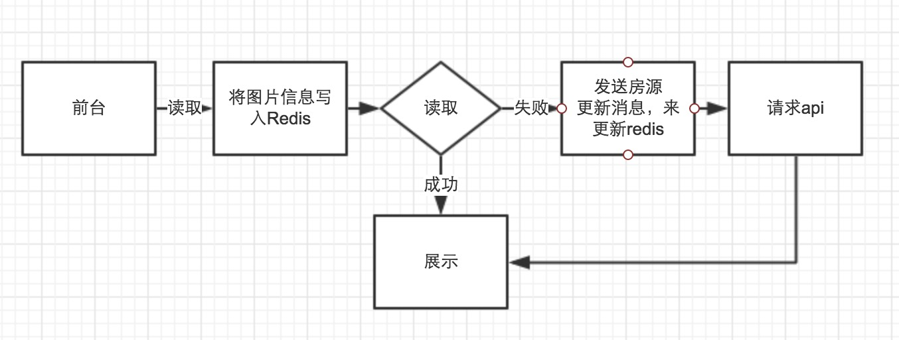

# 房源隔离图片数据

## 现状

- 房源与图片的关系

	单个图片信息存在image_db中，按prop_id 分200张表

	房源与图片的关系存在ajk_propertys的sideother字段中，逗号分隔为3段，分别为小区图、房源图、房型图
	
- 列表页取图片逻辑

    ajk_property_data -> t_attachment_xxx(用户设置的默认图、室内第一张图、经纪人上传的小区第一张图、经纪人勾选的小区第一张图、小区默认图、房型图) -> 无

	参考[WIKI](http://wiki.corp.anjuke.com/Anjuke-Sale#.E5.88.97.E8.A1.A8.E9.A1.B5.E9.BB.98.E8.AE.A4.E5.9B.BE.E9.80.BB.E8.BE.91)
	
- 单页取图片逻辑

	室内图直接读取api
	
	室外图先读api，不足10张的，从小区图片中补充
	
# 用户房源图片数据设计

## 目标

- 简化默认图逻辑，提前算好，页面展示的时候直接读取图片信息

- 房源图片数据隔离，只获取有用的数据，如filename，host_id


## 存储方案

- 采用 Redis Master + 双Slave Sentinel的模式, AOF持久化

- 内存暂估5G
    
    200万房源 × 15张图片 × 100byte ～ 2G

- 采用Hashs存储

	key ：prop_id
	
	value ：图片信息

## 消息处理

- 列表页获取默认图

	直接读房源扩展表

- 单页图片处理逻辑

	图片的信息和默认房源信息发生变化时，需要发送消息，相关api参考[房源拆分消息接口](http://gitlab.corp.anjuke.com/_site/docs/blob/master/DesignDoc/Public/UserArchitecture/prop_msg_api.md)

	
	
- 单页图片展示逻辑

	
	

## 数据格式

- 房源默认图

    作为xxx_property_extend中extend_field里的一个字段，考虑到默认图片有多个来源，需要加一个type字段加以区分。type取值为def,image,community

```
{
    id : 
    prop_id : 房源id
    host_id : 
    filename : 
    type : 图片来源，def,image,community
    updated : 更新时间
}
```

- 房源图片Redis,其顺序和sideother中保持一致
    
```
[
    {
        host_id : 1,
        filename : 'xxxxxxxxx',
        datatype : 1        
    },
    ...
]
```
filename能存hash存hash，取不出来的就存原始值