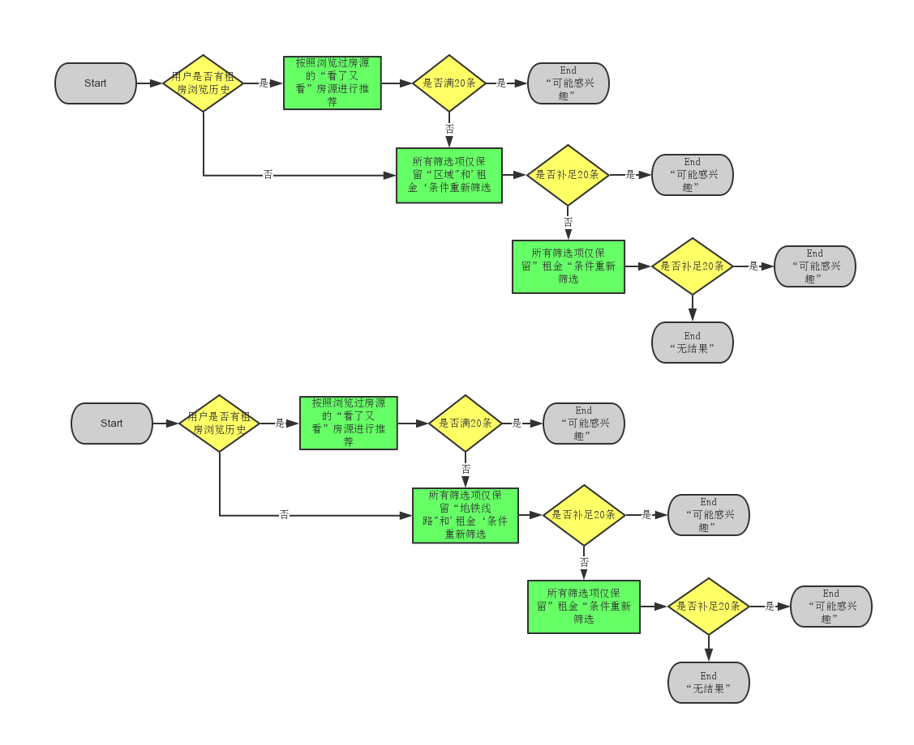

## 租房列表页筛选零少结果推荐

### 需求背景
* 目前租房整体房源量偏少，用户在列表页进行筛选后出现零少结果的概率较高，为减少用户流失，提升用户搜索和筛选的用户体验，针对搜索和筛选后做房源推荐
* 详细参考PRD：http://p.corp.anjuke.com/project/detail?id=25033

### 需求细化分解
* 需求流程图

    

* 零少结果定义：当筛选的房源结果少于等于5套房源时；
* 需要修改的页面：
    * 区域找房列表页：http://sh.zu.anjuke.com/fangyuan/minhang-fx5-zj286/
        * 全部列表页
        * 品牌公寓列表页
        * 经纪人房源列表页
        * 个人房源列表页
    * 地铁找房列表页：http://sh.zu.anjuke.com/ditie/dt10-fx5-zj286/
        * 全部列表页
        * 品牌公寓列表页
        * 经纪人房源列表页
        * 个人房源列表页
* 推荐方案：
    * 基于用户浏览历史的推荐：@周文宗接口`http接口`
        * api地址
        
           ```
        http://xapp20-076.i.ajkdns.com:8080/users/9D23F843-CC26-604F-BDB4-CX020411360/recommendations?limit={$limit}
        ```
        * 返回数据格式
        
           ```
        {
        	'pro_id_tj':1,
        	'pro_type_tj':1,
        }
        ```
        * 接口数据来源说明
        
            ```
        由于内网无法模拟产生真正的历史推荐数据，所以数据是伪造的
        1.每次随机线下solr取一定条数的数据
        		线下solr地址参考：
        			http://solr.anjuke.test:8983/hz-list-11/select?					fl=pro_id_tj:id,pro_type_tj:from
					&q=*:*&start=0&rows=10
					&wt=json
					&fq={!frange%20l=1%20u=1}exists(from)
					&fq=from:(0%20OR%201%20OR%2013%20OR%203)
					&sort=tmp_random_5s2423%20asc`
        2.为了便于测试用例的实现，数据返回的条数规则如下：
        	根据guid最后一位判断：
		 		1.如果最后以为是奇数，返回0条数据
		 		2.如果最后一位是偶数，返回limit条数据
				3.如果最后一位为字母，返回（0～1limit）条数据
        ```
    * 房源类型说明：(与租房solr存储和数据表查询的分类一致)
    
        	|房源类型    |prop_type|
        	|-------   |------    |
        	|个人房源    |0        |
        	|经纪人房源  |3        |
        	|大业主房源  |13       |
        
    * 数据补充方案：不满足20条，使用`退条件方案`
        * 所有筛选项仅保留“区域”（或者“地铁”）和租金
        * 所有筛选项仅保留“租金”
        * 可能出现的情况列举：
        
		 ```
		 1.以下情况，退条件到区域（地铁）＋租金
		 		区域（地铁）＋租金＋其他
		 		板块（站点）＋租金
		 2.以下情况，退条件到区域（地铁）
		 		区域（地铁）＋其他
		 		板块（站点）
		 3.以下情况，退条件到租金
		 		区域（地铁）＋其他
		 		租金＋其他        
        ```

### 概要设计
* 流程图

    

### 详细设计

* url设计
    * 与前端交互方式：ajax异步实现 
    * 列表页零少结果推荐
    
        ```
    http://sh.zu.anjuke.com/v3/ajax/recommend/?type={$type}&guid={$guid}
    ```
    * 入参说明
    
        |参数名称     | 是否必须|说明|
        |-------     |------|------    |
        |type        |是|推荐页面类型，list代表列表页，view代表单页 |
        |list_type   |是|列表页类型，area代表区域列表页，metro代表地铁列表页 |
        |guid        |是|用户唯一标识，推荐数据来源依据，根据用户guid推荐   |
        |num         |否|需要的推荐数量，默认为20条 |
        |area_id     |否|区域id，仅当筛选了区域或者板块的时候需要|
        |block_id    |否|板块id，仅当筛选了板块的时候需要|
        |metro_id    |否|地铁id，仅当筛选了地铁或者站点的时候需要|
        |station_id  |否|站点id，仅当筛选了站点的时候需要|
        |price_lower |否|最低价格，仅当手动填写了最低价格的时候需要|
        |price_upper |否|最高价格，仅当手动填写了最高价格的时候需要|
        |price_id    |否|价格段id，仅当筛选了价格段的时候需要|
        |other_id    |否|其他id，仅当筛选了其他非区域板块租金的筛选项时需要|
    
    * 结果说明
    
        |参数名称    | 是否必须|说明|
        |-------   |------|------    |
        |total      |是|总条数 |
        |rec_list   |是|推荐列表 |
        |add_list  |是| 补充列表    |
    
    * 列表结构说明
    
    	|参数名称    | 是否必须|说明|
        |-------   |------|------    |
        | id        |是 | 房源id |
        | title      |是|房源标题 |
        | type      |是|房源类型 |
        | img       |是|房源图片 |
        |url  |是|   房源链接    |
        | room_num |是|室|
        | hall_num |是|厅|
        | rent_type_name |是|租房类型|
        | fitment_name |是|装修类型|
        | floor |是|所在楼层|
        | floor_num |是|总楼层|
        | price |是|租金|
        | comm_name |是|小区名称|
        | area_block_name |是|区域＋板块名称[区域-板块]|
        | comm_address_str |是|板块名称|
        | broker_name |是|经纪人名字或者个人名字，没有就是个人房源|
        | desc |是|地铁房或者空|
        | icon_class |是|前端使用：icon的class|
        | icon_name |是|前端使用：icon的名字，品牌公寓／多图／个人|
        | logo_class |是|前段使用：仅当为品牌公寓时，有100%真实房源logo|
        | from |是|BI统计使用：来自推荐平台为list_select_recommend，来自补充为list_select_addition|
    
* route

    ```
    //房源推荐接口（新框架）
    $config['mappings']['Zufang_Web_Ajax_Rent_PropRecommend'] = array(
        '^/v3/ajax/recommend/?$'
    );
    ```
* 代码位置
    
    ```
    业务层代码controller:
        user-site/app-zufang-web/controller/zufang/web/ajax/rent/PropRecommend.php
        
    推荐底层服务:
        user-site/app-public-core/classes/public/core/recommend/bll/RentRecommendBll.php
    ```
* 数据处理说明
    * 过滤推荐数据是否在线：
    
        ```
        经纪人房源和个人房源：通过租房房源表中的status字段判断，非1都是不正常房源，会被过滤掉；
        大业主房源：通过index索引表判断
    ```
    * 批量获取房源信息
        
        ```
        Biz_Zufang_Rent_RentListBiz::getPropsAndImagesInfo()
        ```

### TODO
* 目前推荐平台会推荐出其他城市的房源，对这类房源，批量获取房源信息时由于城市id给的不准确，回导致一些问题

    ```
    1.不能准确的获取装修类型
    2.url是当前城市的，不是房源对应城市的
    3.个人房源url跳转不准确，导致页面展示部分信息无法获取
```
        