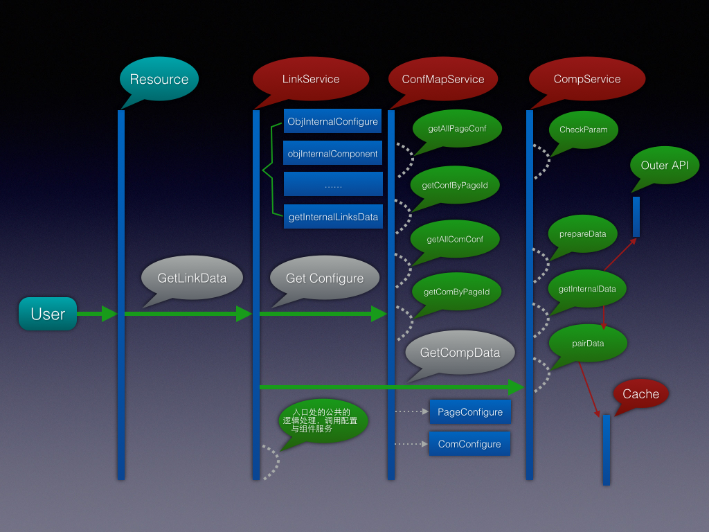
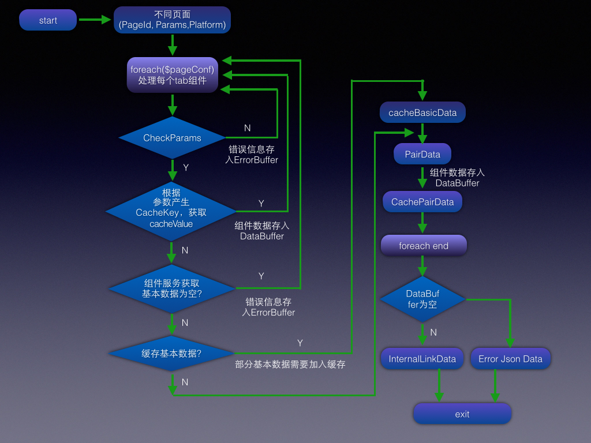

# *SEO新版内链设计文档 - 2015.04.24*
## 1. 设计目的
---
> 为了提升整站内链开发效率，并满足SEO业务需求的前提下，我们设计了一套通用的内链开发模板。目前仅仅提供内链服务，不提供接口，job不可调用，只是给web使用的。

## 2. 内链设计序列图
---

## 3. 流程图
---

## 4. 每个组件内容定义(由产品确定)
* **热门城市**：上海 北京 广州 深圳 杭州 重庆 武汉 南京 天津 苏州
* **25城市**：北京 上海 杭州 广州 成都 合肥 青岛 深圳 重庆 苏州 天津 三亚 厦门 昆明 中山 济南 大连 武汉 沈阳 南昌 西安 南京 郑州 长沙 石家庄

|组件编号|组件tab名称|组件name定义|组件内容推荐逻辑|url举例|
|:--- | :--- |:--- |:--- |:--- |
|A01|热门城市二手房|城市+二手房|固定10个城市＋二手房|http://shanghai.anjuke.com/sale/|
|A02|二手房区域|区域or板块+二手房|该城市下所有区域＋业务名，以及该页面所在区域下所有板块＋业务名（全部展示)|http://shanghai.anjuke.com/sale/pudong/，http://shanghai.anjuke.com/sale/biyun/|
|A03|区域二手房|区域+二手房|该城市先下所有区域＋业务名|http://shanghai.anjuke.com/sale/pudong/|
|A04|板块二手房|板块+二手房|该城市先下所有板块＋业务名|http://shanghai.anjuke.com/sale/biyun/|
|A07|小区单页|小区名称|取当前板块下所有的小区，将其分为10组，每组最多20个，如不足10组，凑满10组.单页ID与10取模，固定展示一组小区|http://shanghai.anjuke.com/community/view/106|
|A08|二手房小区|小区名称|取当前板块下所有的小区，将其分为10组，每组最多20个，如不足10组，凑满10组。单页ID与10取模，固定展示一组小区|http://www.anjuke.com/shanghai/cm356307/|
|A10|小区信息|(名称示例)|当前房源所在小区的所有tab（小区概况页、小区二手房TAB页，小区租房TAB页、价格行情TAB页、实景图TAB页、房型图TAB页、生活配套TAB页、问答TAB页）【价格行情和问答部分城市没有】|上海康城（一至四期）http://shanghai.anjuke.com/community/1670,上海康城（一至四期）二手房http://shanghai.anjuke.com/community/props/sale/1670,上海康城（一至四期）租房http://www.anjuke.com/shanghai/rent/1670,上海康城（一至四期）价格行情http://shanghai.anjuke.com/community/trends/1670
上海康城（一至四期）房型图http://shanghai.anjuke.com/community/photos/model/1670
上海康城（一至四期）实景图http://shanghai.anjuke.com/community/photos2/b/1670
上海康城（一至四期）生活配套http://shanghai.anjuke.com/community/round/1670
上海康城（一至四期）问答http://shanghai.anjuke.com/community/qa/1670  |
|A13|城市二手房|城市+二手房|固定25个城市＋二手房|http://shanghai.anjuke.com/sale/|
|A15|二手房信息|小区名称|取当前板块下所有的SEO频道，将其分为10组，每组最多20个，如不足10组，凑满10组。单页ID与10取模，固定展示一组小区。|http://shanghai.anjuke.com/esf/fang-dapuqiaodanshen-d4943/|
|A16|二手房板块直达|区域+二手房|当前城市所有区域及版块+二手房（点击对应区域才会出对应板块）|http://shanghai.anjuke.com/sale/pudong/|
|F09|小区房价|小区名称+房价|当前页面同一个版块下的小区将其分为10组，每组最多20个，如不足10组，凑满10组。当前页面ID与10取模，固定展示一组小区房价|http://shanghai.anjuke.com/community/trends/8446|
|A34|同板块小区|小区名称|当前PK页面2个小区中第一个小区同一个版块下的50个小区单页|http://shanghai.anjuke.com/community/view/106|
|A35|小区对比|小区aPK小区b|两个PK小区同板块下随机30个小区（每个小区取同板块15个）|http://shanghai.anjuke.com/duibi/123-234/|
|B01|热门城市二租房|城市+租房|固定10个城市＋租房|http://sh.zu.anjuke.com/|
|B02|租房区域|区域+租房，板块+租房，|该城市下所有区域＋业务名，以及该页面所在区域下所有板块＋租房（没有数量限制）|ttp://shanghai.anjuke.com/sale/pudong/|
|B03|区域租房|版块+租房|该区域下的板块＋租房|http://sh.zu.anjuke.com/fangyuan/zhangjiang/|
|B12|租房小区|小区名称+租房|取当前板块下所有的小区，将其分为10组，每组最多20个，如不足10组，凑满10组。单页ID与10取模，固定展示一组小区|http://www.anjuke.com/shanghai/cm7192-zu/|
|B13|城市租房|城市+租房|固定25个城市＋租房|http://sh.zu.anjuke.com/|
|B19|校园租房|学校名称+租房|取当前城市所有的校园租房页面，将其分为40组，每组最多20个，如不足40组，凑满40组。单页ID与40取模，固定展示一组小区。|http://sh.zu.anjuke.com/zt/college/10218.html|
|B23|租房信息|小区名称|取当前板块下所有的租房SEO频道，将其分为10组，每组最多20个，如不足10组，凑满10组。单页ID与10取模，固定展示一组小区。|http://shanghai.anjuke.com/zf/fang-dongwuyuangongy-d128136/|
|F11|城市房价|城市+房价|25城Market房价|http://cs.anjuke.com/market/|
|F03|区域房价|区域+房价|该城市下所有区域＋房价|http://shanghai.anjuke.com/market/pudong/|
|F03|板块房价|板块+房价|该区域下所有版块＋房价|http://shanghai.anjuke.com/market/biyun/|
|F24|房价直达|区域+房价，版块+房价|取当前城市下所有的区域和版块房价（点击对应区域出板块）|http://shanghai.anjuke.com/market/zhangjiang/|
|F25|城市房价排行榜|城市+房价排行榜|北京 上海 成都 南京 合肥 杭州 武汉 郑州 深圳 长沙 苏州 西安 青岛 重庆 天津 济南 广州 无锡 大连 福州 昆山 三亚 惠州 佛山|http://shanghai.anjuke.com/market/phb/
|G|特色找房|XXX|XXX|XXX|
|C05|楼盘信息|固定10个城市＋新房房|新房提供接口|xxx|
|C01|热门城市新房|城市+新房|10个固定城市的新房|http://sh.fang.anjuke.com/|

## 5. 每个组件需要参数(NULL表示不许传递参数)
---
|组件编号|组件参数|
|:----- |:----- |
|A01|NULL|
|A02|city_id(城市id),area_id(区域id)【或者real_area_id,解决area_id冲突】|
|A03|city_id(城市id)|
|A04|暂时未做|
|A07|city_id,areacode(小区所在区域板块areacode),id(小区id,为了分组)|
|A08|city_id,areacode(小区所在区域板块areacode),id(小区id,为了分组)|
|A10|city_id,comm_id(小区id)|
|A13|NULL|
|A15|city_id,areacode,id(小区id)|
|A16|city_id|
|F09|city_id,areacode|
|A34|city_id, areacode|
|A35|city_id, first_areacode(需要pk的第一个小区所在区域、板块areacode)|
|B01|NULL|
|B02|city_id,area_id(页面所在区域id)|
|B03|city_id,area_id(页面所在区域id)|
|B12|city_id,areacode,id(小区id)|
|B13|NULL|
|B19|暂时未做|
|B23|city_id,areacode,id(当前小区id)|
|F11|NULL|
|F03|暂时未做|
|F24|city_id|
|F25|NULL|
|G|city_id|
|C05|city_id,area_id|
|C01|NULL|
|xxx|NULL|
|**注意**|58给安居客问答的内链,没有在产品文档的编号中|

## 6. 页面标识定义
      路径：user-site/app-ershou-core/classes/ershou/core/const/InternalLinks.php

      /**
      * 二手房房源单页PAGE_ID配置 ［平台］［业务类型］［单页/列表］［区域/板块］，每个两位
      *                         [平台]     01: PC
      *                         [业务类型]  01: 二手房 02: 房价 03: 租房 04:问答
      *                         [单页/列表] 01: 单页 02：列表
      *                         [区域/板块] 01:
      */
     Ershou_Core_Const_InternalLinks::PAGE_ESF_FANGYUAN_DEFAULT = '01010101'; //二手房－房源－默认列表页
     Ershou_Core_Const_InternalLinks::PAGE_ESF_FANGYUAN_AREA    = '01010102'; //二手房－房源－区域列表页
     Ershou_Core_Const_InternalLinks::PAGE_ESF_FANGYUAN_BLOCK   = '01010103'; //二手房－房源－区域列表页
     Ershou_Core_Const_InternalLinks::PAGE_ESF_XIAOQU_DEFAULT   = '01010104'; //二手房－小区－默认列表页
     Ershou_Core_Const_InternalLinks::PAGE_ESF_XIAOQU_AREA      = '01010105'; //二手房－小区－区域列表页
     Ershou_Core_Const_InternalLinks::PAGE_ESF_XIAOQU_BLOCK     = '01010106'; //二手房－小区－版块列表页
     Ershou_Core_Const_InternalLinks::PAGE_ESF_Broker_DEFAULT   = '01010107'; //二手房－经纪人－默认列表
     Ershou_Core_Const_InternalLinks::PAGE_ESF_Broker_AREA      = '01010108'; //二手房－经纪人－默认列表
     Ershou_Core_Const_InternalLinks::PAGE_ESF_Broker_BLOCK     = '01010109'; //二手房－经纪人－默认列表
     Ershou_Core_Const_InternalLinks::PAGE_ESF_FANGYUAN_DANYE   = '01010110'; //二手房－房源单页
     Ershou_Core_Const_InternalLinks::PAGE_ESF_COMMUNITY_ESF    = '01010111'; //二手房小区-二手房tab页面
     Ershou_Core_Const_InternalLinks::PAGE_ESF_COMMUNITY_ZF     = '01010112'; //二手房小区-租房tab页面
     Ershou_Core_Const_InternalLinks::PAGE_XIAOQU_PK            = '01010113'; //二手房小区pk
     Ershou_Core_Const_InternalLinks::PAGE_ESF_COMMUNITY_DANYE  = '01010114'; //二手房小区-二手房单页页面

     Ershou_Core_Const_InternalLinks::PAGE_NEW_MARKET           = '01020201'; //改版后的房价页面
     Ershou_Core_Const_InternalLinks::PAGE_RATES_RANK_LIST      = '01020202'; //房价排行榜

     Ershou_Core_Const_InternalLinks::PAGE_SUBLESSOR_DANYE      = '01030101'; //租房-大业主房源单页
     Ershou_Core_Const_InternalLinks::PAGE_JJR_FANGYUAN_DANYE   = '01030102'; //租房-经纪人房源单页
     Ershou_Core_Const_InternalLinks::PAGE_PPGY_FANGYUAN_DANYE  = '01030103'; //租房-品牌公寓房源单页
     Ershou_Core_Const_InternalLinks::PAGE_RR_FANGYUAN_DANYE    = '01030104'; //租房-个人g房源单页
     Ershou_Core_Const_InternalLinks::PAGE_C_FANGYUAN_DANYE     = '01030104'; //租房-c房源单页

## 7. 组件标识
    /**
     * 定义每个数据源组件ID
     * 前面的两位是业务类型，最大每组支持9999个小组件
     *                  01 二手房
     *                  02 租房
     */
    Ershou_Core_Const_InternalLinks::COMPONENT_ESF_AREA               = '010001';  // 二手房区域      A02
    Ershou_Core_Const_InternalLinks::COMPONENT_ESF_COMMUNITY          = '010002';  // 二手房小区      A08
    Ershou_Core_Const_InternalLinks::COMPONENT_ESF_RELATIVE_LOUPAN    = '010003';  // 楼盘信息        C05
    Ershou_Core_Const_InternalLinks::COMPONENT_CITY_ZU                = '010004';  // 城市租房        B13
    Ershou_Core_Const_InternalLinks::COMPONENT_SPECIAL_SEARCH         = '010005';  // 特色找房        G (G01)
    Ershou_Core_Const_InternalLinks::COMPONENT_COMMUNITY_DANYE        = '010006';  // 小区单页        A07
    Ershou_Core_Const_InternalLinks::COMPONENT_COMMUNITY_INFO         = '010007';  // 小区信息        A10
    Ershou_Core_Const_InternalLinks::COMPONENT_CITY_PRICE_MARKET      = '010008';  // 城市房价        F11
    Ershou_Core_Const_InternalLinks::COMPONENT_ZU_AREA                = '010009';  // 租房区域        B02
    Ershou_Core_Const_InternalLinks::COMPONENT_ZF_COMMUNITY           = '010010';  // 租房小区        B12
    Ershou_Core_Const_InternalLinks::COMPONENT_ESF_ZHIDA              = '010011';  // 二手房直达      A16
    Ershou_Core_Const_InternalLinks::COMPONENT_HOT_CITY_ESF           = '010012';  // 热门城市二手房   A01
    Ershou_Core_Const_InternalLinks::COMPONENT_HOT_CITY_HOUSE_PRICE   = '010013';  // 热门城市房价     F01
    Ershou_Core_Const_InternalLinks::COMPONENT_HOT_CITY_ZU_FANG       = '010014';  // 热门城市租房     B01
    Ershou_Core_Const_InternalLinks::COMPONENT_HOT_CITY_XIN_FANG      = '010015';  // 热门城市新房     C01
    Ershou_Core_Const_InternalLinks::COMPONENT_COMMUNITY_HOUSE_PRICE  = '010016';  // 小区房价         F09
    Ershou_Core_Const_InternalLinks::COMPONENT_AREA_ESF               = '010017';  // 区域二手房        A03
    Ershou_Core_Const_InternalLinks::COMPONENT_FIXED_CITY_ESF         = '010018';  // 城市二手房        A13
    Ershou_Core_Const_InternalLinks::COMPONENT_SEO_CHANNEL_ESF_INFO   = '010019';  // 二手房信息(SEO频道)                     A15
    Ershou_Core_Const_InternalLinks::COMPONENT_ESF_AREA_REAL          = '010020';  // 二手房区域 {解决area_id和block_id冲突}   A02
    Ershou_Core_Const_InternalLinks::COMPONENT_HOUSE_PRICE_ZHIDA      = '010021';  // 房价直达                               F24
    Ershou_Core_Const_InternalLinks::COMPONENT_CITY_PRICE_RANK        = '010022';  // 城市房价排行榜                          F25
    Ershou_Core_Const_InternalLinks::COMPONENT_AREA_ZU_FANG           = '010023';  // 区域租房                               B03
    Ershou_Core_Const_InternalLinks::COMPONENT_AREA_FANGJIA           = '010024';  // 区域房价                               F03
    Ershou_Core_Const_InternalLinks::COMPONENT_SAME_BLOCK_COMMUNITY   = '010025';  // 同板块小区                             A34
    Ershou_Core_Const_InternalLinks::COMPONENT_XIAOQU_PK              = '010026';  // 小区对比                               A35
    Ershou_Core_Const_InternalLinks::COMPONENT_SEO_CHANNEL_ZF_INFO    = '010027';  // 租房信息                               B23
    Ershou_Core_Const_InternalLinks::COMPONENT_ZF_AREA_REAL           = '010028';  // 租房区域 {解决area_id和block_id冲突}    B02
    Ershou_Core_Const_InternalLinks::COMPONENT_RELATIVE_QA_FOR_58     = '010029';  // 相关问答   **** 没有编号 为老的问答页面服务

## 8. 如何使用内链
    >以二手房房源城市列表页为例:
    controller: user-site/app-ershou-web/controller/ershou/web/property/list/Filter.php
    page: user-site/app-ershou-web/page/ershou/web/property/list/Search.php
    phtml: user-site/app-ershou-web/page/ershou/web/property/list/Search.phtml

    >内链service:
        /**
         * @var Ershou_Core_Seo_Service_InternalLinkingService
         */
        protected $internalLinkingService;

    >调用内链服务前准备:
        1. controller引入内链service
        2. page引入组件 User_Component_Seo_SeoRecommend
        3. page的use_component函数中必须赋值 APF::get_instance()->get_request()->set_attribute("seo_type", 1);// 必须在use_component中设定内链样式 1:列表 2:友链 0:table样式

    >调用服务：
     /**
     * 调用新版内链框架
     */
    private function setInternalLinksData(){
        $result = $this->internalLinkingService->getPcInternalLinkingData(Ershou_Core_Const_InternalLinks::PAGE_ESF_FANGYUAN_DEFAULT, array('city_id'=>intval($this->city_id)));
        if (isset($result['status']) && $result['status'] == Ershou_Core_Const_StatusCode::SUCCESS_STATUS_RET) {
            $this->request->set_attribute('new_seo_footer_recommend_data', $result['data']);
        }
    }
    你需要改动的仅仅是页面标识（Ershou_Core_Const_InternalLinks::PAGE_ESF_FANGYUAN_DEFAULT），和传递的参数数组array('city_id'=>intval($this->city_id))，其他地方不需要做任何改动！

## 9. 如何创建一个新的内链组件component？
   <1>在user-site/app-ershou-core/classes/ershou/core/const/InternalLinks.php添加定义常量const {Your_Component_Define}

   <2>如果是新页面，则还要在上述文件中定义新页面标识符号

   <3>在user-site/app-ershou-core/config/internallinks.php中添加对应的配置

   <4>在user-site/app-biz/classes/biz/seo/internallink/目录下创建对应的组件，仿照该目录下其他组件的创建过程即可

## 10. 目前内链服务存在不足
> * memcache申请大小不足，导致每次加入cache时候不断的剔除过期的，使得每次加入时候时间过长，目前设计的缓存是以组件tab级别做的缓存，有的也会缓存基本数据源，甚至缓存分组前的数据

> * seo产品需求方提出的业务太过繁琐，而且每个页面要加入组件数量过多，最坏的情况下有四到五个取数据过程就比较耗时的组件，这样整个页面在未中cache情况下会很慢，内链就会拖慢服务200ms左右
