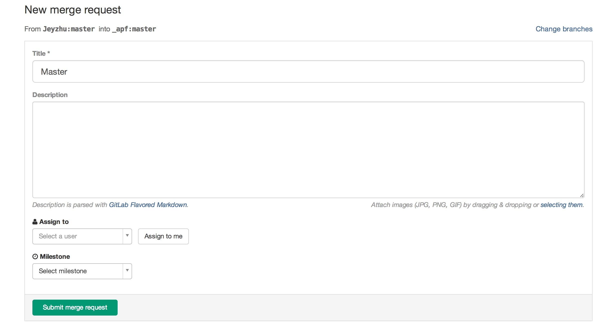
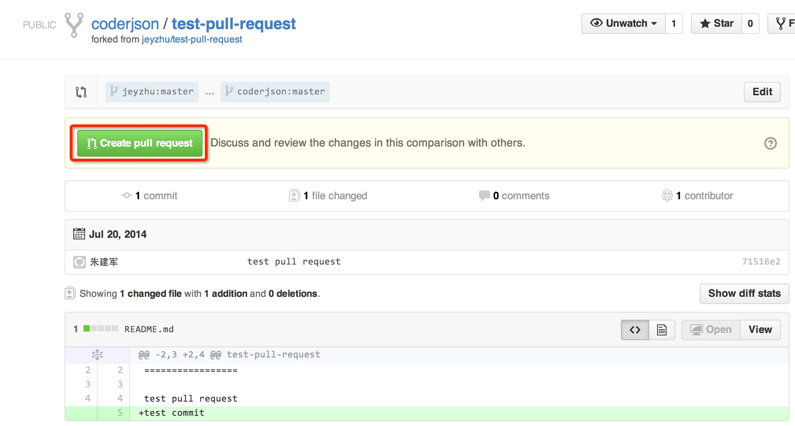
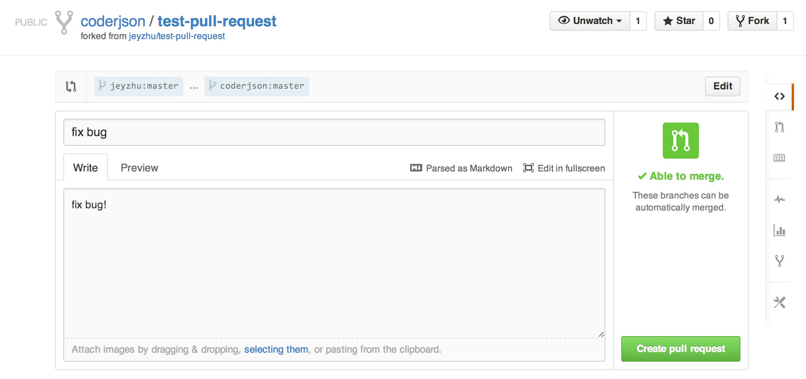
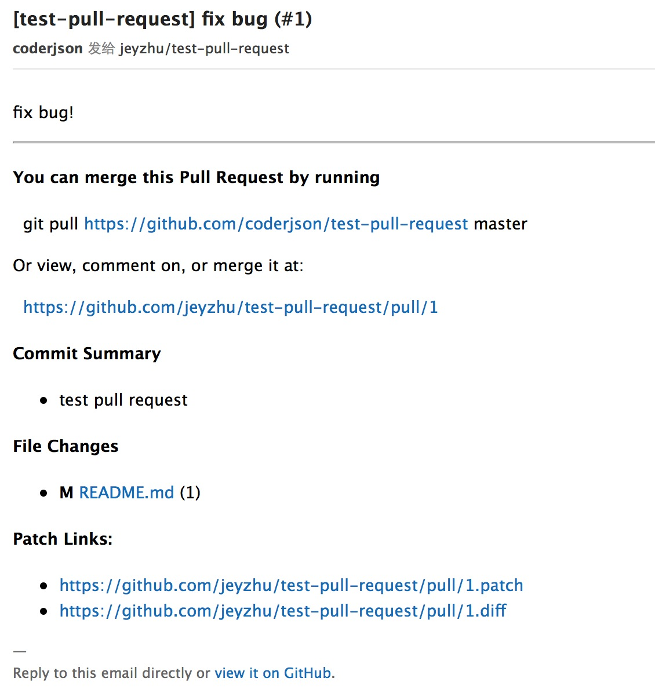
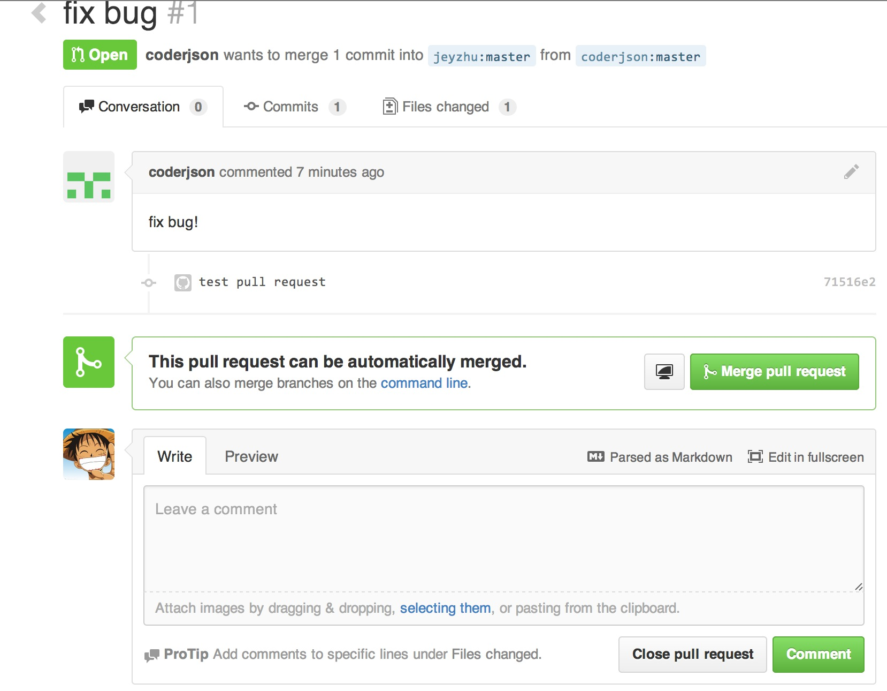

## pull request 那点事  （gitlab and github）
### 前言 
	本教程只为新手提供 大神请忽略 谢谢！
### why need pull request
	当我们想为框架或开源项目做贡献时 就需要用到 pull request 了
### 传送门
	1.gitlab 篇
	2.github 篇
### Gitlab 篇
	
### 如何贡献自己的力量
>
	1.申请帐号 首先你得有gitlab帐号 这个就不介绍了
	2.fork 找到自己想要贡献的项目 并 fork 具体如下图

```
3.clone自己的fork 项目至本地，修改错误并提交 push 至自己fork后的仓库  (以system-ext为例)
git clone git@gitlab.corp.anjuke.com:Jeyzhu/system-ext.git  [clone 自己fork后的仓库]
git add .
git commit -m 'XXX'
git push origin master:master  [提交至自己fork后的仓库]
```
```
4.代码提交了 如何让项目管理者知道自己的请求？ 
```

```
5.点击New merge request 进入如下图的页面
```

```
6.点击Compare branches 进入下图
```

```
7.填完表单 提交  然后 管理者就会收到你的请求通知邮件啦 至此pull request 就完成啦
```

### question 如果原项目有变动该如何更新?
```
1.git remote add init git@gitlab.corp.anjuke.com:_apf/system-ext.git [原项目地址]
2.git pull --rebase init master:master [从原项目仓库拉最新代码]
3.git push origin master [提交至自己fork的仓库]
```

### 管理者在合并 pull request 冲突该如何解决？
```
1.git checkout -b merge-request-test master  [从master创建一个新分支 并切换到新分支]
2.git pull git@gitlab.corp.anjuke.com:Jeyzhu/system-ext.git master [将需要合进来的分支代码拉到该分支]
3.这时应该会有冲突 直接在该分支解决冲突
4.git checkout master
5.git merge --no-ff merge-request-test [把分支合进来]
6.git push origin master
```
##Github 篇
## 具体步骤
1.点击fork按钮  派生该项目 如下图所示


2.你将会在自己的仓库中看到该项目的派生 如下图所示


3.该派生项目与原项目几乎相同，标识了该项目派生之前的原路径 如下图所示


4.clone自己的派生项目至本地，修改错误并提交 push 
	
```
git clone https://github.com/coderjson/test-pull-request.git
git add 
git commit 
git push
```

5.访问该派生项目页面 会看到自己在master的提交如下图所示


##Pull Request
	那么如何能够让作者 原始项目的创建者知道这个派生项目及新的提交呢？请点击Pull Request按钮 如下图所示


	你将见到如下图所示的界面 将显示你更改的内容 确认修改无误后请点击 Create pull request 按钮


	填写pull request 的标题和内容 完成 pull request 创建 如下图所示


	当pull request 发出后，项目的开发才将会收到通知邮件，如下图所示


	点击邮件中的URL链接，并以项目管理者身份登录，看到如下图所示


	你可以查看该申请者的修改内容 可以添加评论 or close pull request or 把该修改merge进对应分支

