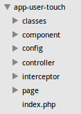

## 我们为什么要做版本控制？

* 我们的图片是存储在CDN上的
    
    * 什么是CDN？
    * CDN的全称是Content Delivery Network
    * 在网络各处放置节点服务器
    * 实时地根据网络流量和各节点的连接、负载状况以及到用户的距离和响应时间等综合信息将用户的请求重新导向离用户最近的服务节点上
    * 目的是使用户可就近取得所需内容，解决 Internet网络拥挤的状况，提高用户访问网站的响应速度

* eg1：http://pages.ajkcdn.com/touch/img/global/2/propView_b.png（touch-web）

## 版本控制的实现方式

* 以touch-web为例，在pages/touch/img/global/下修改一个之前已经存在的图片propView_b.png

    * 查看该图片目前的最高版本，如下图，目前最高版本为2
        * 
        
    
    * 升级版本，即复制一份2为3，目前的最高版本为3
    ```
    cp 2 3 -R
    ```
    * 在3中替换图片propView_b.png
        
    * 修改图片的全局配置变量
    
        * 修改位置: 
        ```
        app-user-touch/classes/user/touch/util/PageHelper.php
        ```
        
        * 原来配置：
        ```javascript
            const VERSION_TOUCH_GLOBAL    = '/img/global/2';//touch频道
        ```
        * 修改后配置：
        ```javascript
            const VERSION_TOUCH_GLOBAL    = '/img/global/3';//touch频道
        ```
        
## 项目目录说明

* 
* controller:程序逻辑，后端同学维护
* page:页面逻辑，前后端同学共同维护
* component:组件逻辑，前后端同学共同维护
* classes:公共处理
* config:配置文件
* interceptor:拦截器处理

* Page
```
eg:app-user-touch/page/user/touch/anjuke/property/View.phtml
```
    
    ```javascript
<?php
    //头部topbar
    $this->component('User_Touch_Common_Header_PropertyTopBar', array(
                "comm_name" =>$prop_base->comm_name,
                "return_url" => $return_url
    ));
    //房源图片
    $this->component('User_Touch_Property_Photo', array(
                "image_list"=> $image_list,
                "contact_phone" =>$broker_base->user_mobile?:$prop_base->owner_mobile,
                "content_400" => $propview->property->mobile400,
                'device_type' => $device_type,
    ));
?>
    ```

* Component
```
eg:app-user-touch/component/user/touch/common/header/PropertyTopBar.phtml
```

    ```javascript
<div class="H" style="display:none">
    <a class="back" id="prop_view_header" href="<?=$return_url?:'javascript:history.back();'?>">返回</a>
    <span class="commiName"><?php echo $comm_name ; ?></span>
</div>
    ```