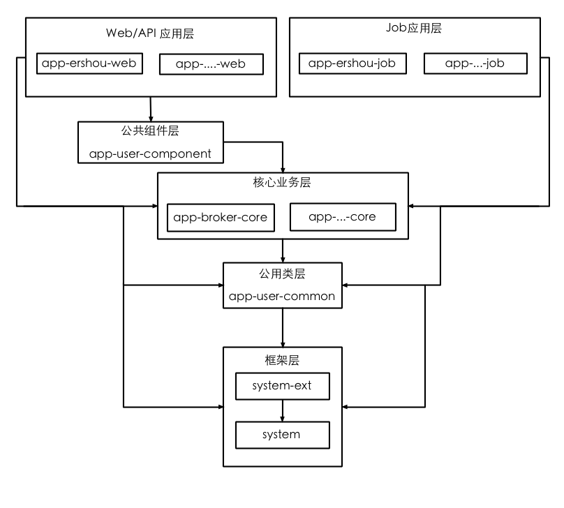

## 用户端代码结构说明

#### 层次关系

* 下层不可调用上层：
    * 调用层次依上图剪头方向，不可逆向调用，例如，core不可调用应用层任何类，包括配置
* 应用层内部不可互相调用
    * 例如app-ershou-web不可调用app-zufang-web内容

#### 各app列表

* Web/Api应用层：
    * app-chat-web 
    * app-ershou-web
    * app-member-web
    * app-site-api
        * 提供内网相关的API，如源房api 
    * app-zufang-web
    * app-shangpu-web
    
* 公共组件层
    * app-user-component
        * 放罢web公用组件，比如页面的Header和Footer 
    
* Job应用层
    * app-ershou-job
    * app-shangpu-job
    * app-zufang-job
    * app-public-job
    * app-member-web
    * app-public-job
    * app-shangpu-job

* 核心业务层
    * app-broker-core
    * app-comunity-core
    * app-ershou-core
    * app-zufang-core
    * app-member-core
    * app-shangpu-core
    * app-qa-core
    * app-maifang-core
    * app-public-core
    * app-shangpu-core

* 公用类层
   * app-user-common 
       * 存放公用服务，基本上跟产品业务没有关系，比如关键词处理类，监控类等. 

* 框架层
   * system-ext
   * system 

#### 其它的app说明

* 废弃的（新代码不要写在如下里面）
   
	   * app-user-api
	   * app-user-core
	   * app-user-job
	   * app-user-util
	   
* 待迁移（新代码不要写在如下里面）
	   * app-biz
	   * app-dao
	
* 暂不要提交（移动api团队之前使用的） 
	   * app-mobile-api
	   * app-mobile-core
	   * app-mobile-web
	   
* 待改名的
	   * app-user-pad(欲改名为：app-pad-web)
	   * app-user-touch(欲改名为：app-touch-web)

#### app-core内部结构

* 每个app-core下面的业务必须有Bll和Service，即遵循以下原则：
	* 每个Service尽量对应一个Dao
	  * 如有扩展表和基本表，就有基本service和extendService 
	* Bll只能调用Service
	  * 如果既要获得基本信息和扩展信息，写在Bll里 
	
* 以房源举例说明如下：
	 * property
	     * bll
	         * PropertyBll 
	             * M:getPropertyAndExtendAndImages(获得房源和扩展和图片信息)
	     * service
	         * ProertyService
	            * M:getPropertyInfo(房源基本信息)
	         * PropertyExtendService
	            * M:getPropertyExtendInfo(房源扩展信息)
	         * PropertyImageService 
	            * M:getPropertyImages(房源图片信息)
	     * dao
	         * PropertyDao
	         * PropertyExtendDao
	         * PropertyImageDao 
	     * model 
	         * PropertyDao
	         * PropertyExtendDao
	         * PropertyImageDao 

