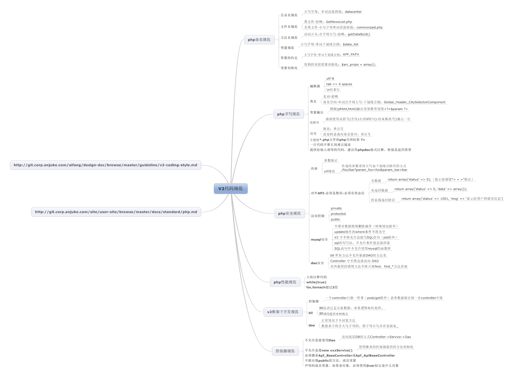

## V2框架介绍

### V2框架相关文档

*	[PHP代码规范](http://gitlab.corp.anjuke.com/_site/user-site/blob/master/docs/standard/php.md)

*	[JOB规范](http://gitlab.corp.anjuke.com/_site/user-site/blob/master/docs/standard/job.md)

*	[DB规范](http://gitlab.corp.anjuke.com/_site/user-site/blob/master/docs/standard/db.md)

*	[canotDo 高压线](http://gitlab.corp.anjuke.com/_site/user-site/blob/master/docs/standard/canotDo.md)

*	[V2框架使用介绍PPT](http://gitlab.corp.anjuke.com/_site/docs/blob/master/ToNewMember/RayV2%E5%88%86%E4%BA%AB.pptx) 刘锐分享
*	[V2中的软件设计](http://git.corp.anjuke.com/_user_site/doc/issues/2) 董菲分享
*	[system-ext新特性](http://gitlab.corp.anjuke.com/_xinfang/system-ext/blob/master/docs/feature.md) 宋武斌分享

###  
#### 导图

