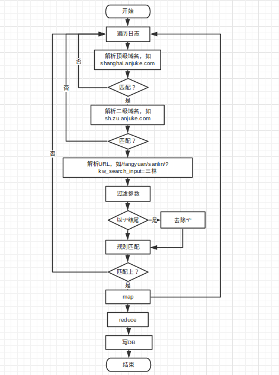

#作用
- 监控网站在每天整点的速度，并统计80、85、90、95分界线的数据

#字段含义
- hadoop日志
<table>
    <tr><th>字段名称</th><th>备注</th></tr>
    <tr><td>hour</td><td>小时</td></tr>
    <tr><td>year</td><td>年</td></tr>
    <tr><td>day</td><td>日</td></tr>
    <tr><td>month</td><td>月</td></tr>
    <tr><td>hostname</td><td>域名</td></tr>
    <tr><td>method</td><td>请求方式（get/post）</td></tr>
    <tr><td>request_uri</td><td>请求的url</td></tr>
    <tr><td>http_code</td><td>请求返回码</td></tr>
    <tr><td>bytes_sent</td><td>发送的字节数</td></tr>
</table>

#解析流程
- 方法：匹配上就返回结果，不会继续匹配

#例子
- url

>

    http://sh.zu.anjuke.com/afangyuan/28614416?from=Filter_1

- 域名匹配

>

    以“zu.anjuke.com”结尾

- 处理后的url

>

    /afangyuan/28614416?from=Filter_1

- route.php对应的正则

>

    /gfangyuan/([0-9]+)-([0-9]+)
    /gfangyuan/([0-9]+)

- 调整url，使其符合speed系统匹配

>   

    ^(/gfangyuan/([0-9]+)-([0-9]+))|(/gfangyuan/([0-9]+))$
备注： 
 1. 上面两个正则的前后顺序会影响结果，为什么？请戳[这里](https://www.google.com.hk/) 
 2. 正则不用匹配url结尾的“/”

# 最后的最后
如有疑问，请找 马景云 协助解决

